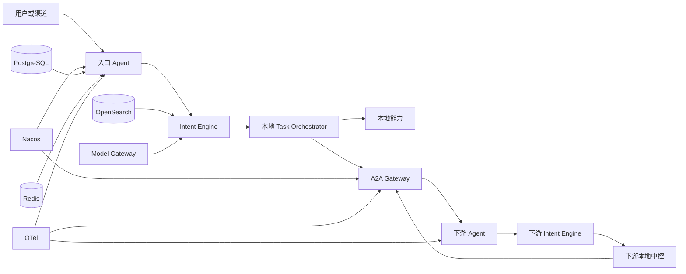

# Agent 平台总体架构草案

> **已被 [v0.5](./Agent平台总体架构草案_v0.5.md) 取代为讨论基线。** 本文保留作 v0.1 演进痕迹与历史对照，勿再当现行规范改。
>
> 状态：归档（原讨论稿）
>
> 目的：记录“意图引擎可复用、每个 Agent 可拥有独立中控、Agent 间通过 A2A 网关发现和调度”的总体设计。
>
> 本文先固定职责和边界，不固定最终工程名、Maven 坐标和物理拆仓方式。（目录目标态已收进 v0.4 §10。）

## 0. 已确认的要求

本文必须满足以下前提：

1. 工小智只是使用平台的一个 Agent，不代表整个意图引擎平台。
2. 账户、支付、理财等领域 Agent 也可以拥有自己的意图引擎和本地中控，而不是只能作为被动执行器。
3. 意图引擎必须单独定义为一级模块，供所有 Agent 引用。
4. 不同 Agent 之间必须通过 A2A 网关进行能力发现、实例发现和调用调度，不能由 Agent 之间直接维护地址并互调。
5. 现有考虑的 PostgreSQL、Redis、OpenSearch、Nacos、模型网关、OpenJiuwen 和 OTel/Jaeger 等中间件继续保留，通过适配层接入，不因引入 A2A 而被替换。
6. 本文先记录总体方案，暂不直接改造现有代码和最终目录命名。

## 1. 总体判断

平台不是一个单独的“工小智系统”，而是一套可以被多个 Agent 复用的运行框架。

工小智、账户、支付、理财、基金等都是 Agent 节点。每个节点都可以使用同一套意图引擎，并拥有自己的：

- 意图识别和规划
- 上下文管理
- 任务中控
- 护栏和幂等
- 本地能力执行
- A2A 下游委托
- 回复编排

意图引擎是平台中的一级独立模块，供所有 Agent 使用；它不是工小智专属代码，也不负责业务任务执行。

## 2. 运行时关系



一次调用中有两种调度：

1. Agent 本地中控决定“是否委托、委托哪个能力、顺序、条件和确认要求”。
2. A2A 网关决定“目标 Agent 的哪个版本和实例接收这次委托，以及如何投递”。

A2A 网关不参与业务意图判断和业务事务，不替代 Agent 中控。

## 3. 独立意图引擎

建议将意图引擎作为独立模块 `intent-engine`。所有 Agent 依赖它，具体 Agent 只提供能力资产和扩展实现。

### 3.1 对外入口

```java
public interface IntentEngine {
    IntentResult recognize(IntentRequest request);
}
```

请求至少包含：

```text
tenantId
agentId
sessionId
userId
query
channel
scene
context
attributes
```

返回至少包含：

```text
decision
reasonCode
selectedCapabilityId
candidates
slots
intentPlan
templateHint
diagnostics
```

### 3.2 意图引擎负责的内容

- 输入改写和归一化
- 强规则判断
- 能力召回、融合和重排
- 模型仲裁及规则回退
- 槽位抽取和缺槽判断
- 多意图拆分
- 慢路径计划生成
- 条件计划表达
- 意图决策 trace 和诊断信息

### 3.3 意图引擎不负责的内容

- 创建和迁移业务任务
- 生成或持有交易幂等凭据
- 执行领域能力
- 调用 A2A 网关
- 保存完整会话历史
- 业务护栏最终裁决
- 最终回复渲染

意图引擎通过 SPI 使用模型、召回、缓存和资产目录，不直接绑定 OpenSearch、Redis 或某个模型厂商。

## 4. Agent 节点

每个 Agent 都是一个完整的 `AgentNode`：

```text
AgentNode
├── ContextManager
├── IntentEngine
├── TaskOrchestrator
├── GuardrailChain
├── LocalCapabilityExecutor
├── A2aDispatcher
└── ResponsePlanner
```

公共门面：

```java
public interface AgentNode {
    AgentResponse handle(AgentRequest request);
}
```

标准调用顺序：

```text
入口
 → 编译本地上下文
 → IntentEngine.recognize
 → 本地中控创建或恢复任务
 → 护栏检查
 → 本地能力执行或 A2A 委托
 → 保存结果和审计
 → 回复编排
```

每个 Agent 的领域扩展放在 Agent 自己的代码和资产中。例如“第几张卡”“转一半”等银行业务语义不进入通用意图引擎，而作为对应 Agent 的扩展规则或工作记忆解析器。

## 5. A2A 网关

A2A 网关是所有 Agent 间调用的统一入口。Agent 不直接保存其他 Agent 的地址，也不直接互相调用。

### 5.1 网关职责

- AgentCard 注册和发现
- 能力和 Schema 匹配
- 租户级授权
- Agent 版本和实例选择
- 健康检查、限流、熔断和负载路由
- 同步、异步、流式投递
- 委托幂等、状态查询和回调
- 跨 Agent trace 和审计

### 5.2 网关不负责

- 解释用户意图
- 代替目标 Agent 创建业务任务
- 执行目标 Agent 的护栏
- 修改目标 Agent 的任务状态
- 参与跨 Agent 数据库事务

### 5.3 两种委托模式

```text
GOAL：把目标交给下游 Agent，由下游重新理解、规划和编排
TASK：已经确定能力和参数，由下游执行一笔明确任务
```

委托标识建议包含：

```text
tenantId
sourceAgentId
targetAgentId
rootTaskId
parentTaskId
sourceTaskId
delegationId
traceId
deadline
```

每个 Agent 只拥有自己的本地任务真值。父 Agent 通过 `delegationId` 关联子 Agent 的结果，不直接修改子 Agent 的任务。

## 6. AgentCard

每个 Agent 发布自己的 AgentCard，描述可发现的能力：

```yaml
agentId: payment-agent
version: 1.0.0
protocolVersion: a2a-v1
capabilities:
  - capabilityId: cap.payment.transfer
    riskLevel: R2
    sideEffects: true
    inputSchema: payment-transfer-input-v1
    outputSchema: payment-transfer-output-v1
    modes: [sync, async]
```

AgentCard 的业务内容由 Agent 自己维护；A2A 网关只负责发布、缓存、匹配和路由。

## 7. 中间件职责

| 中间件 | Agent 内部职责 | A2A 网关职责 |
|---|---|---|
| PostgreSQL | 任务、计划、历史、审计 | 委托和投递状态 |
| Redis | 决策缓存、锁、亲和、热点上下文 | 限流、路由缓存、投递幂等 |
| OpenSearch | 本 Agent 的能力卡和意图检索 | 默认不参与实例路由 |
| Nacos | 配置中心、实例注册、健康发现 | 网关读取实例信息 |
| Model Gateway | embedding、rerank、仲裁、规划 | 网关原则上不调用模型 |
| OpenJiuwen | Agent 内部图、工作流、DeepAgent | A2A 协议或远程 Agent 适配 |
| OTel/Jaeger | 本地决策、执行和审计 trace | 跨 Agent 链路串联 |
| MQ | 长任务和异步事件，按需接入 | 异步投递和结果通知 |

Nacos 和 A2A 网关不重复：Nacos 解决“实例在哪里”，AgentCard 解决“Agent 能做什么”，A2A 网关解决“这次调用交给谁”。

## 8. 上下文与状态归属

这是平台的核心边界：

> 意图引擎不持有上下文和业务状态；上下文引擎负责组装工作集；任务中控负责状态真值；A2A 网关只负责委托状态。

### 8.1 上下文由 Agent 自己管理

每个 Agent 都有自己的 `context-engine`：

```text
Agent
└── context-engine
    ├── TurnStore
    ├── ContextLeaseCompiler
    ├── WorkingContext
    └── ContextEnvelope
```

上下文不是完整历史，而是本轮编译出来的最小工作集：

```java
public record ContextLease(
        String agentId,
        String tenantId,
        String sessionId,
        String goal,
        Map<String, Object> confirmedFacts,
        List<PendingItem> pendingItems,
        List<ToolConclusion> recentConclusions,
        long stateVersion,
        boolean trustworthy,
        Instant expiresAt
) {}
```

意图引擎只接收 `IntentContext` 和 `ActiveIntentState`，不能直接查询数据库、缓存或完整会话历史。

上下文分为四种：

| 上下文 | 所有者 | 是否跨 Agent 传递 |
|---|---|---|
| 用户会话历史 | 当前 Agent | 默认不传递 |
| 本 Agent 已确认事实 | 当前 Agent | 只传白名单事实 |
| 当前任务待办和澄清项 | 当前 Agent | 以委托摘要传递 |
| 下游 Agent 结果 | 下游 Agent 产生 | 以结构化事实返回 |

跨 Agent 调用使用受限的 `ContextEnvelope`，不能把完整聊天历史直接传给下游 Agent。

### 8.2 业务状态由 Agent 本地中控管理

每个 Agent 的 `task-orchestrator` 只管理本 Agent 的任务真值：

```text
payment-agent
└── task-orchestrator
    ├── TaskRepository
    ├── IntentPlanRepository
    ├── TaskStateMachine
    ├── GuardrailChain
    └── IdempotencyRepository
```

跨 Agent 任务是父子关系：

```text
工小智 task-gxz-001
└── 支付 Agent task-pay-001
    ├── 账户 Agent task-account-001
    └── 风控 Agent task-risk-001
```

父 Agent 不能直接修改子 Agent 的任务表，只能通过 A2A 委托结果推进自己的任务。

### 8.3 A2A 网关只管理委托状态

A2A 网关保存的是投递事实，而不是业务任务事实：

```text
delegationId
sourceAgentId
targetAgentId
rootTaskId
sourceTaskId
targetTaskId
deliveryStatus
receipt
deadline
retryCount
```

典型状态为：

```text
CREATED → ROUTED → DELIVERED → ACCEPTED → SETTLED
                                      ├→ PARTIAL
                                      └→ UNKNOWN
```

Agent 中控回答“业务现在处于什么阶段”；A2A 网关回答“这次委托投递到哪里以及是否有回执”。两者不能共用一张业务任务表。

### 8.4 存储真值

```text
Agent 本地 PostgreSQL  → 会话轮次、任务、计划、幂等、审计
A2A 网关 PostgreSQL     → 委托、投递、回调状态
Redis                   → 缓存、锁、亲和、限流、快速去重
OpenSearch              → 能力资产检索索引
Nacos                   → 配置、实例注册和健康发现
OpenJiuwen Workspace    → 推理草稿和临时文件，不是业务真值
```

Redis、OpenSearch 和 Workspace 都不能作为任务状态的权威来源。

### 8.5 一轮请求的标准顺序

```text
AgentNode 接收请求
 → ContextEngine 读取本 Agent 上下文
 → 编译 ContextLease
 → IntentEngine 识别和规划
 → TaskOrchestrator 创建或恢复本地任务
 → 本地护栏判断
 → 本地执行或 A2A 委托
 → 下游 Agent 创建自己的本地任务
 → 返回结构化事实
 → 父 Agent 保存子任务摘要并推进任务
 → ResponseEngine 生成回复
```

## 9. 数据隔离

所有 Agent 共享基础设施时，数据键必须包含 Agent 作用域：

```text
tenantId + agentId + sessionId
tenantId + agentId + taskId
tenantId + agentId + capabilityId
```

建议：

- PostgreSQL 使用独立 schema 或至少使用 `agent_id` 复合约束。
- Redis 使用 Agent 前缀和租户前缀。
- OpenSearch 使用 Agent 独立索引或索引前缀。
- Workspace 使用 `agentId/sessionId` 子目录，不能所有会话共用固定根目录。
- A2A 网关的委托表与 Agent 的业务任务表分开。

## 10. 现有模块映射

```text
gxz-contracts              → agent-contracts
gxz-fastpath + gxz-slowpath → intent-engine
gxz-context                → context-engine
gxz-orchestrator           → task-orchestrator
gxz-response               → response-engine
gxz-capability-registry    → capability-registry
gxz-model-gateway          → adapters/model-openai-compatible
gxz-nacos                  → adapters/discovery-nacos
gxz-oj-adapters            → adapters/openjiuwen
gxz-app                    → applications/gongxiaozhi-agent
```

当前实现不必立即整体重命名。第一步只需要把 `ChatService` 中的通用 Agent 流水线抽成 `agent-runtime`，再增加 `intent-engine` 的公共门面和 A2A 客户端/网关。

## 11. 目标目录与迁移边界

目标根工程表达的是 Agent 平台，不再把整个 Reactor 命名为工小智。最终名称和坐标仍待确认，但最终开发者视角的目录分层如下：

```text
agent-platform/
├── framework/                         # 平台团队维护
│   ├── agent-bom/
│   ├── agent-contracts/
│   ├── agent-stability/
│   ├── agent-obs/
│   ├── intent-engine/
│   ├── agent-runtime/
│   ├── context-engine/
│   ├── task-orchestrator/
│   ├── response-engine/
│   ├── agent-starter/
│   ├── agent-tck/
│   └── agent-testkit/
│
├── infrastructure/                    # 基础设施团队维护
│   ├── a2a/
│   │   ├── a2a-contracts/
│   │   ├── a2a-client/
│   │   ├── a2a-server/
│   │   ├── a2a-gateway/
│   │   └── a2a-inprocess-adapter/
│   ├── model-openai-compatible/
│   ├── persistence-jdbc/
│   ├── cache-redis/
│   ├── search-opensearch/
│   ├── discovery-nacos/
│   ├── openjiuwen/
│   └── observability-otel/
│
├── agents/                            # Agent 开发者主要工作区
│   ├── gongxiaozhi/
│   ├── account/
│   ├── payment/
│   ├── creditcard/
│   ├── wealth/
│   └── fund/
│
├── agent-template/                    # 新 Agent 模板
├── tools/
├── samples/
├── console/
└── docs/
```

目录边界：

- `framework` 是平台团队维护的可复用库；`intent-engine` 是其中供所有 Agent 使用的独立一级能力。
- `infrastructure` 是基础设施和协议实现；A2A 网关是可独立部署的服务，不是某个 Agent 的内部类库。
- `agents/<agent>` 是最终开发者的完整工作区，包含应用入口、领域能力、Agent 扩展、资产和测试。
- `agent-template` 是创建新 Agent 的唯一模板入口，不要求开发者复制工小智目录。
- `a2a-inprocess-adapter` 只用于单进程测试和本地演示；生产 Agent 通过 `a2a-client` 访问网关。
- 业务资产由对应 Agent 持有：`agents/<agent>/assets/`。平台根目录不再放具体 Agent 的能力卡和业务模板。
- Mock、Workflow 和 OpenJiuwen 是实现方式，应归入 `infrastructure` 或 `samples`，不和业务 Agent 并列。

每个 Agent 的开发目录保持完整闭环：

```text
agents/payment/
├── pom.xml
├── src/main/java/com/company/agent/payment/
│   ├── PaymentAgentApplication.java
│   ├── entry/
│   ├── intent/
│   ├── orchestration/
│   ├── capability/
│   ├── delegation/
│   ├── guardrail/
│   └── configuration/
├── src/main/resources/
│   ├── application.yml
│   └── agent/
│       ├── agent-card.yaml
│       ├── capabilities/
│       ├── rules/
│       ├── templates/
│       └── flows/
├── src/test/
└── README.md
```

Agent 开发者只依赖 `framework` 的 Starter 和 `infrastructure` 的适配器，不直接依赖意图引擎内部的 fastpath/slowpath、A2A 网关内部实现或数据库客户端。

当前迁移中的目录已经完成大部分物理分组，但仍需注意：

1. `applications/gongxiaozhi-agent` 应迁移为 `agents/gongxiaozhi`，让一个 Agent 的代码、资产和测试归于同一开发目录。
2. `domains/account` 应迁入 `agents/account` 的领域扩展；`domains/mock`、`domains/oj`、`domains/workflow` 应迁入 `infrastructure` 或 `samples`。
3. `a2a-gateway` 当前仍包含本地节点包装和本地节点注入逻辑，需要拆出远程 Transport 与独立 Gateway。
4. `intent-engine-api` 已经是轻量门面，但应用仍直接依赖 `intent-fastpath` 和 `intent-slowpath`，需要增加隐藏实现细节的 `intent-engine` 聚合实现或 Starter。
5. `IntentRequest` 不应长期暴露应用侧 `RequestContext`，应转换为引擎自己的 `IntentScope`、`IntentContext` 和 `ActiveIntentState`。
6. `agent-contracts` 中的 A2A、意图、任务、领域执行契约最终应按稳定边界拆成 `intent-engine-api`、`task-contracts` 和 `a2a-contracts`。
7. 根目录与根 `artifactId` 已收口为 `agent-platform`（见 v0.4 D5）；`groupId` 仍为 `com.gxz`，发布平台版时再中性化。

## 12. 必须坚持的边界

1. 意图引擎只产出意图和计划，不执行任务。
2. 每个 Agent 的中控只管理自己的任务真值。
3. Agent 间只能通过 A2A 网关调用。
4. 每一层 Agent 都重新执行自己的护栏。
5. 跨 Agent 不做数据库事务，使用父子任务和委托幂等衔接。
6. 有副作用的调用在结果不确定时不得盲目重试。
7. 业务资产属于具体 Agent，通用框架只提供 Schema、加载和扩展机制。
8. 租户、Agent、会话和任务作用域必须进入持久化、缓存和亲和键。

## 13. 待定项

以下内容在确认组织和部署方式后再定：

- 根工程和 Maven 坐标的正式命名
- A2A 网关使用独立仓库还是同仓库独立应用
- AgentCard 存 Nacos 元数据、数据库，还是专用注册服务
- 异步 A2A 是否接入行内统一消息中间件
- 各 Agent 使用独立数据库还是共享 PostgreSQL 集群
