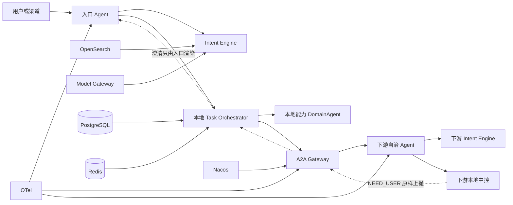

# Agent 平台总体架构草案 v0.2

> 状态：归档。**讨论基线已由 [v0.4](Agent平台总体架构草案_v0.4.md) 取代**（中间经 v0.3）；本文保留作修订溯源。
>
> 本版只动三类地方：把 v0.1 里未声明的契约变更挑明并要求走 ADR；把两处会直接导致
> 资金差错的空洞填上；把「已经是这样」与「打算做成这样」分开写。
>
> **两项产品决策已确认并已并入本版**：GOAL 模式保留（不再是待定项）；面客话术要为
> 生成式直接对客做好准备（§8）。后者反转了 WP8 当初拒绝自由文本面客的决定，
> 须记 ADR-006。
>
> 没动的部分——分层职责、网关边界、中间件分工——是把现状写清楚，v0.1 已经对了。
>
> 仍然不固定最终工程名、Maven 坐标与物理拆仓方式。

## 0. 与 v0.1 的差异

| # | v0.1 | v0.2 | 为什么改 |
| --- | --- | --- | --- |
| 1 | 每个 Agent 拥有自己的中控和任务真值，当作分层的自然延伸带过 | 挑明这动了设计约束 7。解法是把执行侧分成两类角色（§5.2）：`DomainAgent` 纯执行器契约**原样保留**，自治 Agent 走新增的 `AgentNode`。仍须记 ADR-005 界定适用范围 | 契约与 TCK 现在写着「领域 Agent 不持有任务真值、不得自行决定重试」。不说清适用范围，行内实现方会拿到两份互相矛盾的承诺面 |
| 2 | §5.1 列了「委托幂等」，没定基准 | `delegationId` 是下游唯一去重依据，落进下游任务表做唯一约束；本地幂等键只对本地子任务有效（§6.2） | 下游各自发键的话，上游重投一次就是两笔各自「合规」的转账 |
| 3 | 跨 Agent 澄清无描述 | 单独一节定死：只有入口 Agent 与用户对话，下游不持跨轮挂起态（§7） | 现有澄清机制的前提是只有一个中控、且它贴着渠道。多层之后不定规则，就会出现三层挂起任务和一个回不去的问题 |
| 4 | 无委托深度、环路与超时预算规则 | 落成边界第 10、11 条（§6.3） | 超时上限现在由主控强制施加，跨 A2A 后必须逐层收缩；环路要到压测才暴露 |
| 5 | `gxz-fastpath + gxz-slowpath → intent-engine` | 拆开：fastpath 可以并，slowpath 先还债（§4.4） | `gxz-slowpath` 的 pom 依赖 `gxz-orchestrator`，`CapabilityTool` 直接 import 了 `TaskOrchestrator`。照原映射合并，intent-engine 当场依赖 task-orchestrator，违反本文自己的 §4.2 |
| 6 | 「意图引擎不直接绑定 OpenSearch、Redis」 | 改写成目标，并列出实际耦合与欠账（§4.3） | 写成既成属性，会让后面的人以为这块不用干活 |
| 7 | AgentCard 业务内容由 Agent 自己维护 | 由能力卡投影生成，禁止手写，CI 校验一致（§10） | 60 张能力卡里已有 `riskLevel` / `sideEffects` / `timeoutMs`。再抄一份必然漂移，最危险的方向是本地 R2、卡片写成 R1 |
| 8 | 第一步「抽 agent-runtime + intent-engine 门面 + A2A 客户端/网关」 | 拆成五阶段，GOAL 与生成式各自排后，每阶段各有门禁（§13） | 单 Agent 版本还办不了一笔真业务时铺开分布式面，是拿一个已经能证伪的链路去换一个大得多的面 |
| 9 | 未提面客话术形态，隐含沿用全模板 | 新增 §8：三档渲染，从模板到生成式逐档放开，事实与数字恒定确定 | 产品决策。监管严不等于只能念模板，但「模型直接对客」与「模型决定说什么数」是两件事，只放开前者 |
| 10 | GOAL 与生成式各自的风险已分别写明 | §8.6 补两者叠加时的注入面 | 下游自由文本进入入口的生成 prompt，等于把提示注入面接到了面客文本上，这是任何一侧单独看都看不见的 |

## 1. 前提

沿用 v0.1 §0 那六条，补两条：

7. **本文不改变任何已通过验收的功能点判定。** A2A 与自治 Agent 是新增范围，
   按切片计划的变更规则续编号；编号不回收，也不重写既有条目。
8. **每个新增字段都要在 §14 指出消费点。** 变更规则第 5 条是栽了三次同一个跟头之后
   加的：配置齐全、代码跑通、校验通过、指标正常，功能实际不工作，且不会让任何用例变红。

## 2. 总体判断

平台不是一个「工小智系统」，而是一套可被多个 Agent 复用的运行框架。工小智、账户、支付、
理财都是 Agent 节点，都可以用同一套意图引擎。

但**「可以有自己的中控」不等于「都该有」**。这是 v0.1 没有区分的一件事，而它决定工作量：

| 角色 | 有没有本地中控 | 契约 | 典型 |
| --- | --- | --- | --- |
| 纯执行器 | 无。任务真值在委托方 | `DomainAgent`（现状不变） | 声明式办理流程、单笔划转、查询类能力 |
| 自治 Agent | 有。持有自己那层的任务真值 | `AgentNode`（新增） | 账户 Agent 要自己识别「第几张卡」并规划多步办理 |

绝大多数领域能力是第一类。第二类的成本是一整套中控加护栏加澄清回传，只有当这个领域
**自己就要面对复合诉求**时才值得。默认按第一类接入，升级为第二类要有具体理由。

这一分法让设计约束 7 不必被推翻，只需界定适用范围：`DomainAgent` 那条线上它照旧成立，
`AgentNode` 不在它的射程内。

## 3. 运行时关系



一次调用里有两种调度，加一条回程：

1. 本地中控决定「是否委托、委托哪个能力、顺序、条件、确认要求」。
2. A2A 网关决定「目标 Agent 的哪个版本和实例接收、怎么投递」。
3. **缺信息一律沿委托链原样上抛到入口**，由入口与用户对话（§7）。

网关不参与业务意图判断，不参与业务事务，不替代任何一层中控。

## 4. 独立意图引擎

### 4.1 对外入口

```java
public interface IntentEngine {
    IntentResult recognize(IntentRequest request);
}
```

`IntentRequest` 至少含 `tenantId` `agentId` `sessionId` `userId` `query` `channel`
`scene` `context` `attributes`；`IntentResult` 至少含 `decision` `reasonCode`
`selectedCapabilityId` `candidates` `slots` `intentPlan` `templateHint` `diagnostics`。

两处不能省，理由是现在代码里已经吃过教训：

- **`candidates` 必须带融合分与证据**，不能只给 id。仲裁前的候选排名是查「一条写宽了的
  规则抢了谁的活」的唯一依据，只给 id 时那份对照就废了。
- **`intentPlan` 在多意图出口上不得为空**。这条在缓存路径上失守过一次：一级缓存存的是
  `ArbitrationDecision`，契约里没有拆解字段，命中时被写成 null，于是同一句多意图在
  TTL 的十分钟里次次退化成一句列不出选项的澄清，而出口、原因码、短路层级三个指标全都正常。
  门面化之后这个约束要写进 `IntentResult` 的契约，不能只活在 `FastPathSteps` 里。

### 4.2 负责与不负责

负责：改写归一、强规则、召回融合重排、模型仲裁与规则回退、槽位抽取与缺槽判断、
多意图拆分、慢路径计划生成、条件计划表达、决策 trace 与诊断。

不负责：建任务与迁状态、生成或持有幂等凭据、执行领域能力、调 A2A 网关、
保存完整会话历史、护栏最终裁决、最终回复渲染。

### 4.3 SPI 化是目标，现状有欠账

v0.1 写「不直接绑定 OpenSearch、Redis 或某个模型厂商」。实测现状：

| 项 | 现状 | 欠账 |
| --- | --- | --- |
| 决策缓存 | `DecisionCache` 已是扩展点，`RedisDecisionCache` 是基线实现 | 基本到位。搬走时注意键由 `DecisionCacheKey` 生成，实现方不得自行简化 |
| 模型 | `ModelGatewayClient` 已是扩展点 | 到位。注意 `BudgetAwareModelGateway` 必须包在最外层 |
| 资产与检索 | `gxz-fastpath` 有 16 个文件 import `com.gxz.registry`，registry 直接依赖 opensearch-java | **主要工作量在这里。** 要先抽出「资产目录」与「候选检索」两个 SPI |
| Redis | fastpath pom 直接依赖 redisson | 缓存搬到 SPI 之后这条依赖应当消失，届时用 `ModuleDependencyTest` 钉住 |

第三行不做完，`intent-engine` 只是改了个名字的 `gxz-fastpath`：任何依赖它的 Agent
都会被拖进 OpenSearch。

### 4.4 slowpath 要先还债

`gxz-slowpath` 的 pom 依赖 `gxz-orchestrator`，`CapabilityTool` 直接 import 了
`TaskOrchestrator` / `OrchestrationRequest` / `OrchestrationOutcome`。照 v0.1 的映射把
fastpath 与 slowpath 一起并进 `intent-engine`，intent-engine 就依赖 task-orchestrator，
当场违反 §4.2。

ADR-004 说 DeepAgent 只挂 `ProposalTool`（只提案不执行），那三个 import 是上一轮的残留。
**清掉它是阶段 0 的活，不是重命名能解决的。**

还有一项代价要写出来：把慢路径规划整体放进可复用库，等于把 ADR-004 的进程级 Workspace
与 FP-66 实例亲和要求摊派给每一个依赖 intent-engine 的 Agent。若不希望如此，
`intent-engine` 只收规则拆解与条件表达，DeepAgent 规划留在具体 Agent 里。

## 5. Agent 节点

### 5.1 组成与顺序

```text
AgentNode
├── ContextManager
├── IntentEngine
├── TaskOrchestrator
├── GuardrailChain
├── LocalCapabilityExecutor   // 内部持有若干 DomainAgent
├── A2aDispatcher
└── ResponsePlanner
```

```java
public interface AgentNode {
    AgentResponse handle(AgentRequest request);
}
```

调用顺序：编译本地上下文 → `IntentEngine.recognize` → 本地中控建档或恢复 → 护栏 →
发幂等键 → 本地执行或 A2A 委托 → 落结果与审计 → 回复编排。

**幂等键仍在护栏之后发**，每一层都是。这条在多层之后更要紧：未过护栏却已有可执行凭据的
中间态，在单进程里能靠数据库 CHECK 兜住，跨进程之后没有任何东西兜得住。

### 5.2 两类执行侧角色，两份契约

| | `DomainAgent`（不变） | `AgentNode`（新增） |
| --- | --- | --- |
| 任务真值 | 不持有，在委托方 | 持有自己那层 |
| 去重依据 | 随任务下发的幂等键 | 入站 `delegationId`（§6.2） |
| 能否自行重试 | 不能 | 不能（重试资格仍由委托方判） |
| 能否自行改状态 | 不能 | 只能改自己那层 |
| 缺信息 | 回 `NEED_USER` | 回 `NEED_USER`，原样上抛（§7） |
| TCK | 现有 `DomainAgentContract` | 待定，见 §15 |

**`DomainAgent` 的 javadoc 与 TCK 一个字都不改。** v0.1 的问题不是「让 Agent 自治」这个
方向错了，而是它顺手把一条有 TCK 守着的承诺改了却没说。现在改法是加一条新契约，
不是改旧的。

设计约束 7 相应重述为：**每笔任务恰有一个中控持有其真值；跨 Agent 不做分布式事务，
只用父子任务加委托幂等衔接。** 落成 ADR-005，同时修订 README 设计约束 7 的措辞
——「唯一事务边界」这句话在多 Agent 下读不出主语是谁。

领域语义留在各自 Agent：「第几张卡」「转一半」这类不进通用意图引擎，作为该 Agent 的
扩展规则或工作记忆解析器存在。

## 6. A2A 网关

职责：AgentCard 注册与发现、能力与 Schema 匹配、租户级授权、版本与实例选择、
健康检查与限流熔断与负载路由、同步异步流式投递、委托幂等与状态查询与回调、跨 Agent trace。

不负责：解释用户意图、代替目标 Agent 建任务、执行目标 Agent 的护栏、改目标 Agent 的
任务状态、参与跨 Agent 数据库事务。

### 6.1 两种委托模式，风险不对等

```text
TASK：已确定能力与参数，下游执行一笔明确任务
GOAL：把目标交给下游，由下游重新理解、规划、编排
```

**GOAL 的回执校验必须比 TASK 更严，不是更松。** 它正好复活了 OJ 接入时踩过的那个坑：
若把中控错配到一个通用对话 Handler 上，它会把自由文本喂给大模型，而模型很可能回一句
「已为您转账 1000 元」——看起来完全正常，中控会把一笔从未发生的转账记为成功，
没有异常、没有告警，账实不符要等对账才发现。

所以 GOAL 的回执一律走强制信封：缺信封或版本不符即整单 `FATAL`，宁可拒绝也不猜。
现成的先例是 `OjEndToEndTest.AgainstGenericChatHandler`——真起一个只会回自然语言的
Handler，验这条线守得住。A2A 的端到端要照这个形状再来一遍。

**GOAL 保留**（已确认，不再是待定项）。它的价值在于下游领域方比上游更懂自己那摊事——
账户 Agent 知道「第几张卡」怎么解，把这类语义推给上游枚举，上游就得替每个领域维护一份
它并不掌握的知识。代价是把「下游会不会编一段话」变成常态路径，因此上面那条强制信封
不是可选项，而是 GOAL 成立的前提。

配套要求两条：

- **GOAL 的回执里，事实必须结构化。** 下游可以自由地决定怎么办这件事，但回给上游的
  「办成了什么」是受控字段，不是一段叙述。自由文本只能作为诊断信息存在，不得进入
  上游的事实集（§8.6）。
- **GOAL 委托的下游必须是自治 Agent**（§5.2 第二类），因为它要自己识别、自己规划。
  纯执行器收到 GOAL 一律拒绝，而不是尽力猜一个能力去执行。

### 6.2 委托幂等：`delegationId` 是唯一基准

这是 v0.1 最要紧的一处空洞。委托标识含：

```text
tenantId sourceAgentId targetAgentId rootTaskId parentTaskId
sourceTaskId delegationId traceId deadline delegationPath
```

规则四条，缺一条就会出现重复转账：

1. **入站 `delegationId` 是下游唯一的去重依据。** 下游本地幂等键只对它自己的子任务与
   更下层的调用有效，不参与入站去重。
2. **`delegationId` 落进下游任务表并做唯一约束。** 服务层判重会被绕过——绕过服务层直改库
   这件事，FP-25 就是靠数据库 CHECK 兜住的，这里照同一个思路。
3. **同一 `delegationId` 二次到达返回首次结果，不重新建档、不重跑护栏。** 包括首次结果是
   `PARTIAL` 的情况。
4. **`PARTIAL` 不允许上游自动重试。** 沿用设计约束 11：中断线程撤不回一笔已发出的转账，
   有副作用的能力超时后判「结果未知」而非失败，且不给重试引导。

不定第 1 条的后果具体是这样：上游重投一次委托，下游走两遍完整流程、发两把各自合法的
本地幂等键，两笔转账都「合规」。两侧日志都正常。

### 6.3 深度、环路与超时预算

v0.1 的字段清单里有 `deadline`，但没有规则。补三条：

| 项 | 规则 | 不定的后果 |
| --- | --- | --- |
| 深度 | 委托深度上限可配，建议默认 3。超限即 `FATAL`，不静默截断 | 无界递归，要到压测才暴露 |
| 环路 | 信封带 `delegationPath`（agentId 序列），路径上出现重复 agentId 即拒绝 | A→B→A 自环。用 agentId 序列而不是「禁止自委托」，是因为同一 Agent 不同能力互相委托是合法的 |
| 超时 | `deadline` 是绝对时刻，逐层**只能缩小**：`min(上游 deadline − 回传预留, 本地上限, 卡上声明)` | 现在超时上限由主控强制施加（`min(卡上声明, 主控上限)`），跨 A2A 后若每层各取本地上限，总时长是各层之和，用户端就是一次没有反馈的久等 |

### 6.4 R2 确认跨层怎么办

每一层都重新执行自己的护栏（边界第 4 条），确认要求也是每层自己判：

- 上游已取得的确认作为**事实**随信封下发（谁、何时确认了什么），下游拿它当证据，不再问一遍。
- 但下游本地护栏若判风险更高，**可以**回 `NEED_USER` 要求入口再确认一次。这不是缺陷。
- **上游不得依据 AgentCard 上的 `riskLevel` 决定跳过确认。** 确认要求由本地能力卡与本地
  护栏决定；AgentCard 只用于发现与 Schema 匹配（§10）。

## 7. 跨 Agent 澄清回传

v0.1 完全没写这一段，而它是多 Agent 对话系统最难的部分。现有机制的前提是**只有一个中控、
且它贴着渠道**：`NEED_USER` → 中控迁 `CLARIFY_PENDING` → `expectedAnswers` 存进任务 →
下一轮事件分类认出「用户回的是刚才给的选项」。多层之后这套前提全部不成立。

五条规则：

1. **只有入口 Agent 与用户对话。** 下游不得自行追问——它没有面客通道，也没有话术资产。
2. **`NEED_USER` 是本次委托的终态，不是挂起态。** 下游不保留跨轮对话状态。补齐参数后是
   一次**新的委托**，带新的 `delegationId`。代价是下游要重新规划一遍；在慢路径上这个代价
   可以接受，而换来的是「三层各挂一个任务、谁负责取消」这个问题根本不存在。
3. **缺什么必须结构化回传**，不能回自然语言：缺失槽位名、候选答案、原因码。这与 FP-28 的
   口径一致——历史轮里的工具执行结果用受控枚举编码，不塞自然语言描述。
4. **话术由入口渲染。** 下游给的是「缺 `payee`，候选 [A, B]」，不是「请问您要转给谁？」。
   让下游生成面客文本等于留了一条绕过入口模板与护栏直接面客的路径，与「流式被明确拒绝」
   同一个理由。
5. **`clarifyRounds` 与澄清上限只在入口计数。** 只有入口知道究竟问了用户几次。下游各自
   计数会让「问三次就转人工」这条规则在多层链路上失效。

中间层的义务只有一条：**收到下游的 `NEED_USER` 原样上抛，不得自行填默认值。**
自行填默认值是这条链路上最坏的一种失败——它把「不知道收款人是谁」变成了「按某个默认收款人转账」。

## 8. 生成式面客话术

产品决策：要为「模型直接对客」做好准备。这反转了 WP8 当初的判断（拒绝流式，理由是
「留一个能流式输出自由文本的口子等于留了一条绕过模板与护栏直接面客的路径」），须记 ADR-006。

**反转的是那半句「绕过模板」，不是「绕过护栏」。** 这两件事当初被合并成一条禁令，
现在要拆开：模型可以决定**怎么说**，不能决定**说什么数**。

### 8.1 三档渲染

| 档 | 文本从哪来 | 数字与事实 | 适用 |
| --- | --- | --- | --- |
| T0 模板 | Freemarker 确定性渲染（现状） | 模板变量 | R2 确认、护栏拒绝、额度与费率告知、监管话术 |
| T1 改写 | 模型改写 **T0 已渲染出的那句话** | 仍来自 T0，模型不新增 | 查询结果、澄清提问、多意图列项 |
| T2 生成 | 模型据事实集生成 | 事实集内闭 | 知识问答、操作指引、兜底引导 |

分档而不是一刀切，是因为「同一句话在两个入口不能不一样」这条口径在 R2 场景上是硬的，
而在「怎么去开通手机银行」这种问题上根本不需要。T0 永久保留，不是过渡态。

**档位由能力卡与出口共同决定，写在资产里，不由模型自选。** `riskLevel ≥ R2`、
护栏拒绝、以及 FP-36 判定的合规敏感话题一律锁 T0。

### 8.2 事实集：数字不经模型，这条不放开

T1/T2 的输入是一个显式事实集，来自 `TaskResult.resultPayload` 与已确认槽位——
也就是现在 `mergeForRendering` 拿到的那份东西。

模型看不到事实集之外的任何数据，且**输出里出现的每一个数字、账号、金额、日期都必须能在
事实集里逐字找到**。这是设计约束 8「金额不经模型」的自然延伸：那条约束当初针对的是入参
（中文数字确定性转换、读不准返回空），现在同样要覆盖出参。

不做这条封闭校验的后果不是「话术不够准」，是模型会补一个看起来完全合理的余额。

### 8.3 校验器：`AnswerAudit` 从直通变成必经

这个扩展点已经在 `gxz-response` 里，当初就是为「B 线润色一开就是缺口」预留的，
且刻意挂在 `TemplateRenderer` 内部而不是更外层，好让**兜底文本也过审**——
§2.7.8 记的教训是负向边界只写在正常路径上不够，兜底一脚就能踏空。

T1/T2 开启时它不再允许是 `passThrough`，要串这几道，顺序即优先级（代价低的先跑）：

| 校验 | 判什么 | 不过怎么办 |
| --- | --- | --- |
| 事实闭包 | 输出里的数字/账号/日期是否都在事实集内 | 落回 T0 |
| 不新增承诺 | 有没有声称做了系统没做的事、许诺了未提供的能力 | 落回 T0 并告警 |
| 合规红线 | 投资建议、产品推荐、收益承诺（阻断项 2b 的清单） | 落回 T0 |
| 隐私 | 他人信息、超范围的账户信息 | 落回 T0 并告警 |
| 口径一致 | 与标准问答库冲突（同一句话两个入口不能不一样） | 用标准答案，不用生成的 |

两条实现纪律沿用现有 javadoc：**必须确定性、不得抛异常**；审核器自己崩了不能成为放行的
理由，抛出的异常按拒绝处理。

「不新增承诺」这一道是从 OJ 接入那次教训直接搬来的：模型回一句「已为您转账 1000 元」
看起来完全正常，而那笔转账从未发生。当时防的是下游回执，现在防的是面客文本，
失败形状一模一样——没有异常、没有告警，账实不符要等对账才发现。

### 8.4 上线方式：先影子，后放量

T1/T2 不直接切流。先跑影子：模型生成、校验器判、**只落库不面客**，面客仍是 T0。

积累到能回答这三个问题再放量：校验器拦下率是多少、拦下的都是什么原因、
人工抽检里「T0 与生成版哪个更好」的胜率。

这个手法是仓库里现成的：快路径上图时保留 `SequentialFastPath` 做逐字段比对，
理由是「口径是纯重构，证明方式要比现有用例全绿更硬——现有用例只覆盖跑到过的分支」。
话术这边同理，而且更需要，因为话术的正确性没有唯一答案，只能靠分布对照。

放量按档位与场景灰度，不按流量比例：T2 先开知识问答，T1 先开查询结果类。

### 8.5 流式：可以开，但要逐句校验

流式是这套东西的目的之一（首帧时延），但边出边校才是难点：token 已经发出去就撤不回。

因此流式只允许**逐句缓冲**——攒满一个完整句子，过一遍校验器，再放出去。首帧时延因此
不等于首 token 时延，这个差值要单独打点（外部样本里 `firstFrameRcvTime` 与
`firstTokenRcvTime` 就是分开记的，正是为了区分「网关慢」和「模型慢」）。

**T0 锁档的场景不开流式。** R2 确认话术边生成边发，等于在用户读到一半时还没校验完。

### 8.6 与 GOAL 叠加：一个只在两者同时开启时存在的注入面

GOAL 模式下下游回自由文本，生成式面客又要把上游手里的材料喂进 prompt。两件事各自看都有
边界，叠起来就出现一条新路径：**下游 Agent 的自由文本进入入口 Agent 的生成 prompt**。

下游若被攻破或只是被诱导，它回的那段话就是入口模型的指令输入。而入口模型的输出直接面客。

所以定死一条：**下游的自由文本永不进入入口的生成 prompt。** 事实集只接受 GOAL 回执里的
结构化字段（§6.1 那条配套要求就是为此），自由文本只能进诊断与审计，不能进渲染。

这条与「解码必须验信封」是同一个道理的延伸：那条防的是把编出来的执行结果当真，
这条防的是把编出来的文本当指令。

### 8.7 审计

生成式面客的审计要求比模板高一档：模板输出可以只记模板键与变量，生成输出必须能回答
「为什么当时说了这句话」。每条面客文本落档位、事实集、prompt 版本、模型版本、
校验器结论与是否落回 T0。

这不只是合规要求，也是唯一能事后判断「校验器拦对了没有」的依据。

## 9. 中间件职责

| 中间件 | Agent 内部 | A2A 网关 |
| --- | --- | --- |
| PostgreSQL | 任务、计划、历史、审计 | 委托与投递状态（独立表） |
| Redis | 决策缓存、锁、会话亲和、热点上下文 | 限流、路由缓存、投递幂等 |
| OpenSearch | 本 Agent 的能力卡与意图检索 | 默认不参与实例路由 |
| Nacos | 配置中心、实例注册、健康发现 | 读取实例信息 |
| Model Gateway | embedding、rerank、仲裁、规划 | 原则上不调模型 |
| OpenJiuwen | Agent 内部图、工作流、DeepAgent | A2A 协议或远程 Agent 适配 |
| OTel/Jaeger | 本地决策、执行、审计 trace | 跨 Agent 链路串联 |
| MQ | 长任务与异步事件，按需 | 异步投递与结果通知 |

三者不重复：Nacos 答「实例在哪里」，AgentCard 答「Agent 能做什么」，网关答「这次交给谁」。

## 10. AgentCard 由能力卡投影生成

```yaml
agentId: payment-agent
version: 1.0.0
protocolVersion: a2a-v1
capabilities:
  - capabilityId: cap.payment.transfer
    riskLevel: R2
    sideEffects: true
    inputSchema: payment-transfer-input-v1
    outputSchema: payment-transfer-output-v1
    modes: [sync, async]
```

v0.1 说「业务内容由 Agent 自己维护」。改掉：**AgentCard 从能力卡投影生成，禁止手写，
CI 校验一致。**

60 张能力卡里已经有 `riskLevel`、`sideEffects`、`requiredSlots`、`timeoutMs`。手写一份就是
两份真值，而漂移的方向最危险：本地是 R2、卡片上写成 R1，上游据此跳过两段式确认。
`DomainAgent.advertisedCapabilities` 的注释已经为同类问题纠结过一次
——「路由真值仍然是 `supports`，不是这个清单」，理由是「清单里有、真派过去没人接」的空转。
AgentCard 是同一个问题的放大版，因为它跨进程。

两条推论：

- 路由真值仍在下游。网关按 AgentCard 匹配到候选，**投过去被拒绝是正常结果**，不是故障。
- `inputSchema` / `outputSchema` 与能力卡的槽位声明必须对齐，且这个对齐要在 CI 里判。
  能力卡声明了必填槽位，等于领域方交出了「这些参数叫什么、缺了要问」的口径；
  Schema 与它不一致时，缺槽判断和护栏判断会用两套字段名。

## 11. 数据隔离

共享基础设施时，作用域必须进键：`tenantId + agentId + sessionId` / `+ taskId` / `+ capabilityId`。

- PostgreSQL：独立 schema，或至少 `agent_id` 复合约束。
- Redis：Agent 前缀 + 租户前缀。
- OpenSearch：Agent 独立索引或索引前缀。
- Workspace：`agentId/sessionId` 子目录。ADR-004 现在用的是进程级固定目录，
  多 Agent 共用一个根目录会让 FP-66 亲和判定失去意义。
- 网关委托表与 Agent 业务任务表分开。

**决策缓存键要特别说一句：加 `agentId` 是在现有六个维度之上加，不是重设一套。**
现有键含渠道、页面、用户状态、资产版本、embedding 模型版本、指令模板版本，
少一个维度就会把改版前的结论返给改版后的请求，而这种脏读极难在测试里复现。
`X-Space-ID` 进缓存键的理由同样适用于 `agentId`：不参与的话，两个 Agent 问同一句话会共用
一条缓存记录，而这种串味在单 Agent 的测试环境里永远复现不出来。

## 12. 必须坚持的边界

1. 意图引擎只产出意图与计划，不执行任务。
2. 每笔任务恰有一个中控持有其真值。
3. Agent 间只能通过 A2A 网关调用。
4. 每一层 Agent 都重新执行自己的护栏。
5. 跨 Agent 不做数据库事务，用父子任务与委托幂等衔接。
6. 有副作用的调用在结果不确定时不得盲目重试（`PARTIAL` 不自动重投）。
7. 业务资产属于具体 Agent，通用框架只提供 Schema、加载与扩展机制。
8. 租户、Agent、会话、任务作用域必须进持久化、缓存与亲和键。
9. **幂等键在护栏通过之后生成，每一层都是。**
10. **入站 `delegationId` 是下游唯一去重依据，并有数据库唯一约束兜底。**
11. **委托深度有上限，`delegationPath` 上不得出现重复 agentId，`deadline` 逐层只能缩小。**
12. **只有入口 Agent 与用户对话；下游的 `NEED_USER` 结构化上抛，中间层不得自行填默认值。**
13. **面客文本里的数字与事实一律出自事实集**，模型决定怎么说，不决定说什么数。
14. **T1/T2 开启时 `AnswerAudit` 不得为直通**，且任一档校验不过一律落回 T0，不得降级放行。
15. **下游 Agent 的自由文本永不进入入口的生成 prompt**，只进诊断与审计。
16. **R2 确认、护栏拒绝与合规敏感话题锁 T0，且不开流式。**

## 13. 落地次序

v0.1 的「第一步」把纯重构与分布式改造混在一句话里。拆成五阶段，每阶段各有门禁。

**生成式话术（阶段 G）与 A2A 那条线互不阻塞**，可以并行推进：它只动 `gxz-response`，
不依赖 A2A 网关，也不依赖自治 Agent。唯一的耦合点是 §8.6 那条注入面，
而它只在 GOAL 与 T1/T2 同时开启时才存在——两者都开之前必须先落地那条规则。

### 阶段 0：纯重构，现在就能做

- 抽 `IntentEngine` 门面（`IntentRequest` / `IntentResult`）。
- 清掉 `gxz-slowpath` 对 `gxz-orchestrator` 的依赖（`CapabilityTool` 那三个 import）。
- 抽「资产目录」与「候选检索」两个 SPI，解开 fastpath 对 registry 的 16 处直接依赖。

**门禁**：口径是纯重构，所以证明方式要比「现有用例全绿」硬——现有用例只覆盖跑到过的分支。
现成的手段是 `FastPathParityTest`：门面前后两条实现在同一份语料上逐字段比对
`ArbitrationDecision`、融合分与短路层级，全等才算过。这套夹具直接复用。

无前置依赖，不等任何阻断项。

### 阶段 1：单 Agent 内作用域化

- 键、schema、索引前缀加 `agentId`；Workspace 按 `agentId/sessionId` 分。
- 此时仍只有一个 Agent，纯粹是为 A2A 铺路。

**门禁**：`TenantCacheIsolationTest` 扩一组 Agent 维度的用例。这条用例现在证的是
「两个租户问同一句话不共用缓存」，加 `agentId` 之后要证同一件事。

### 阶段 2：A2A 网关 + TASK 模式

- AgentCard 投影与 CI 一致性校验、网关注册发现路由、委托表、`delegationId` 去重。
- 只做 TASK 模式：能力与参数已确定，风险面小得多。

**门禁**：阻断项 2、3 关闭（R 分级口径、权威数据源）。在护栏还是桩、领域 Agent 里没有
真实账务逻辑的时候铺开跨进程委托，验的仍然只是「链路对不对」，而这一点单 Agent 版本
已经验过了。另需一条重投用例：同一 `delegationId` 投两次，下游只有一笔任务、一次执行。

### 阶段 3：GOAL 模式 + 下游自治中控

**门禁**：ADR-005、§7 澄清回传、§6.3 深度与预算三项全部落地并有用例。另需 GOAL 回执的
「通用 Handler 反例」用例，形状照 `OjEndToEndTest.AgainstGenericChatHandler`。

GOAL 已确认保留，所以这一阶段要做；但它排在最后，因为它的风险面最大而收益依赖前三阶段
已经跑通。

### 阶段 G：生成式话术（与上面并行）

分三小步，每步都能独立停下来：

| 步 | 做什么 | 门禁 |
| --- | --- | --- |
| G1 | 三档机制 + 事实集 + 校验器串联（`AnswerAudit` 从直通换成实装），**只跑影子** | 事实闭包与不新增承诺两道校验各有反例用例：喂一个事实集外的数字、喂一句「已为您转账」，都必须被拦下 |
| G2 | T1 放量（改写 T0 已渲染的句子），非流式 | 影子期数据能回答 §8.4 那三个问题；阻断项 2b 的合规敏感话题清单已就位 |
| G3 | T2 放量 + 逐句缓冲流式 | T0 锁档场景确实不走生成、不走流式，有用例；审计字段齐全（§8.7） |

**G1 之前先做一件小事**：把 `PassThroughAnswerAudit` 换成实装时，`TemplateRenderer` 里那个
挂载点不用动——它当初就挂在渲染器内部，为的是让兜底文本也过审。这件事现在能省下的改动量，
正是 FP-37 当初提前留位的收益。

## 14. 新增字段的消费点

按变更规则第 5 条，「字段已加、Schema 已校验」不构成完成的证据。逐项写明谁在读它、
读了之后行为有何不同：

| 字段 | 谁读 | 读了之后行为有何不同 | 怎么证明它真在工作 |
| --- | --- | --- | --- |
| `delegationId` | 下游中控建档前 | 已存在则直接返回首次结果，不建档不跑护栏 | 同一 id 投两次，库里只有一笔任务、领域侧只执行一次 |
| `delegationPath` | 网关投递前 | 出现重复 agentId 即拒绝 | 造一条 A→B→A 的委托，第二跳被拒 |
| `deadline` | 每层中控下发前 | 逐层收缩，取 `min(上游剩余, 本地上限, 卡上声明)` | 三层链路上断言第三层拿到的 deadline 严格小于第一层 |
| `agentId`（缓存键） | `DecisionCacheKey` | 两个 Agent 同一句话不共用缓存记录 | 照 `TenantCacheIsolationTest` 的形状 |
| AgentCard `riskLevel` | **不得用于确认判定** | 只用于发现与匹配 | 反向断言：把卡片改成 R1，本地 R2 的两段式确认照旧生效 |
| `IntentResult.intentPlan` | 回复层与多意图协调器 | 多意图出口必须能列出具体是哪几件 | 缓存命中路径上也不为空（现成用例：`RepeatedInputCostTest.cachedMultiIntentStillCarriesItsPlan`） |
| 渲染档位（T0/T1/T2） | `TemplateRenderer` 决定走不走模型 | R2 与合规敏感话题恒走 T0 | 把某张 R2 卡的档位配成 T2，渲染仍必须是模板输出 |
| 事实集 | 生成 prompt 与事实闭包校验 | 模型看不到集外数据，输出里的数字必须集内可查 | 反例：事实集里没有的余额数字出现在输出里，必须被拦下并落回 T0 |
| `AnswerVerdict` 拒绝原因 | 落回决策与告警 | 拒绝即落回 T0，且按原因分别打点 | 五道校验各造一条反例，看板上五个原因分别可见 |

`deadline` 这一行有前科：`UnifiedTask.deadline` 与能力卡 `timeoutMs` 曾经全仓库无人读取，
deadline 硬编码 30 秒，配置齐全而功能不工作。跨 A2A 之后这个字段的失效方式一样安静。

## 15. 待定项

| 项 | 为什么现在定不了 |
| --- | --- |
| ~~GOAL 模式是否需要~~ | **已确认保留**（§6.1）。配套要求：回执事实结构化、纯执行器收到 GOAL 一律拒绝 |
| T1/T2 各自开哪些场景 | 档位归业务与合规定，写在资产里。工程只交三档机制与校验器 |
| 生成式话术的评测集 | 正确性没有唯一答案，只能靠人工抽检加不变式（事实闭包、不新增承诺）。评测集归业务部，与 FP-52 分开 |
| 委托深度默认值 | 建议 3，但要看真实业务的委托形状 |
| 自治 Agent 的 TCK 形状 | `DomainAgentContract` 验的是「不持任务真值」，自治 Agent 反过来。要验什么得先有一个真实的自治 Agent |
| 根工程与 Maven 坐标命名 | 等组织与部署方式确认 |
| 网关独立仓库还是同仓库独立应用 | 同上 |
| AgentCard 存 Nacos 元数据、数据库还是专用注册服务 | 同上 |
| 异步 A2A 是否接行内统一 MQ | 等平台部 |
| 各 Agent 独立库还是共享 PostgreSQL 集群 | 等运维口径。§11 的隔离规则两种都成立 |

## 16. 需要配套的文档变更

本文若通过，以下几处要同步改，否则会出现互相矛盾的承诺面：

| 文档 | 改什么 |
| --- | --- |
| ADR-005（新） | 界定设计约束 7 的适用范围：`DomainAgent` 线上不变，`AgentNode` 不在射程内 |
| README 设计约束 7 | 「中控是唯一事务边界」改为「每笔任务恰有一个中控持有其真值」——原句在多 Agent 下读不出主语 |
| 切片计划 §3 | 新增功能点续编号（A2A 网关、委托幂等、澄清回传、AgentCard 投影），不改既有条目 |
| 切片计划 §6 | 阻断项加一条：A2A 上线依赖入口按 sessionId 粘滞（ADR-004 已要求，A2A 之后是硬前置） |
| ADR-006（新） | 生成式面客：反转 WP8「拒绝自由文本面客」。要写清反转的是「绕过模板」而不是「绕过护栏」，以及三档与事实集为什么是前提 |
| README「设计约束」 | 第 8 条「金额不经模型」补一句覆盖出参：面客文本里的数字同样出自事实集。新增一条「面客文本分档，R2 与合规敏感话题恒走 T0」 |
| README「模型接入」 | 补生成式话术那一段：档位、事实集、校验器、影子期 |
| 切片计划 §2.7.5 | 那里写着「A 线全模板输出时这个缺口不致命，B 线润色一开就是缺口」。现在缺口要真的补上，把 FP-37 从「只留接口与直通实现」推进为实装 |
| 切片计划 §6 | 阻断项 2b（合规敏感话题清单与话术口径）从「卡 FP-36 扩展判定」升级为**卡 G2 放量**。生成式话术会主动生成投资建议与产品推荐，这个清单不再是补充项 |
| `AnswerAudit` javadoc | 那里写着「A 线全模板输出，因此默认实现是直通」。默认值不变，但要补一句：T1/T2 开启时不允许是直通 |
| `DomainAgent` javadoc | **不改。** 列在这里是为了说明这是刻意的 |
