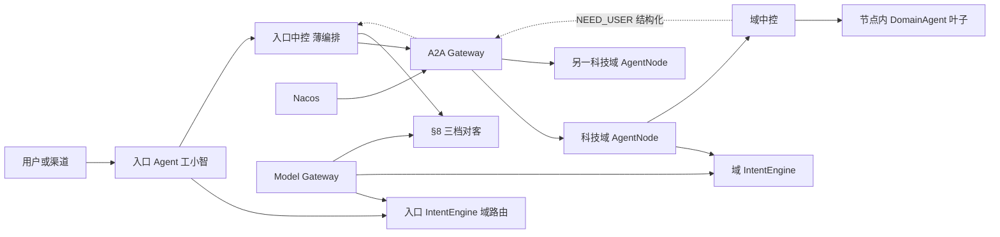

# Agent 平台总体架构草案 v0.3

> **已被 [v0.4](./Agent平台总体架构草案_v0.4.md) 取代为讨论基线。** 正文保留，勿再当现行规范改。
>
> 状态：归档。在已刷新的 v0.2 之上再修订；曾取代 v0.2 作为讨论基线。
>
> 本版只动四类产品立场（已确认）：
>
> 1. **附录 F 科技域 26 = AgentNode 26**（部署与自治边界，不是「可升级的纯执行器」）。
> 2. **入口 Agent（工小智）必须薄**：域路由、多域骨架、A2A 委托、澄清汇聚、对客呈现；
>    域内识别 / 规划 / 办理沉到对应科技域节点。
> 3. **生成式直接对客**沿用 v0.2 §8（三档 + 事实集 + 校验器），本版只改与薄入口、
>    26 节点相关的衔接表述。
> 4. **护栏是全行通用能力，各节点调用**，不是每域各写一套（§5.1）。
>
> 另补三处由上面四条推导出的边界：误投回执 `NOT_MINE`（§7.1）、零能力域不必立刻有中控
> （§12 第 17 条）、域路由阈值须单独标定（§12 第 21 条）。
>
> 资金安全相关规则（委托幂等、PARTIAL、跨层确认、澄清上抛、GOAL 强制信封）**一字不放宽**，
> 全部继承 v0.2。
>
> 仍然不固定最终工程名、Maven 坐标与物理拆仓方式。

## 0. 与 v0.2 的差异

| # | v0.2 | v0.3 | 为什么改 |
| --- | --- | --- | --- |
| 1 | 「可以有中控 ≠ 都该有」；默认 `DomainAgent`，升 `AgentNode` 要理由 | **默认每科技域一个 `AgentNode`**；`DomainAgent` 只做节点内叶子执行器 | 产品决策：附录 F 即自治边界。否则入口会继续替域内背语义 |
| 2 | 入口与领域节点对称地画成「完整 AgentNode」 | **入口职责收口**（§3、§5.3）：不做域内槽位深挖与域内多步规划 | 「主控不要干太多」；GOAL 才有地方落地 |
| 3 | 现有 Scaffold / `TechDomainAgent` 读成过渡执行器 | 明确读成 **26 个 AgentNode 的占位与替换槽**（§5.4） | 与仓库现状对齐，避免二次推翻 |
| 4 | 阶段 3 =「GOAL + 下游自治中控」笼统收尾 | 拆成：**先薄入口 + 首批域节点 GOAL，再按附录 F 铺满 26**（§13） | 26 套中控不能假装是一个里程碑 |
| 5 | §7.4「话术由入口渲染」易读成「只有模板」 | 改为：**只有入口接触渠道**；渲染走 §8 三档；下游只交结构化事实（及可选非面客诊断） | 与生成式决策一致，且不打开下游直连渠道 |
| 6 | 待定里仍有「自治 Agent 的 TCK 要等一个真实自治 Agent」 | 首个科技域节点（建议账户）即定义 `AgentNodeContract` 形状（§15） | 26 节点不能没有契约样板 |
| 7 | 未说护栏在 26 节点下怎么摆 | **护栏做成全行通用能力，各节点调用**（§5.1）；但调用时机仍留在 runtime 固定顺序里，不下放 | 已确认。引擎共享省掉 26 套实现且口径可热更；调用时机若也下放，「忘了调」就成立且乘以 26，而现在它是结构性前置（无键不可执行） |
| 8 | 无 | 新增 `NOT_MINE` 回执（§7.1），与 `DOMAIN_NOT_OPEN` 分开 | 薄入口会误投，而误投与未建成合并成一种失败后，入口判错会永远被计成域没做完 |
| 9 | 无 | 明确零能力域不必立刻有中控（§12 第 17 条） | 否则阶段 3b 要先给二十来个空域各建一套任务表 |
| 10 | §4 只说「两套资产视角」 | 补：域路由阈值须单独标定（§12 第 21 条） | 阻断项 1 因此是两套。现有融合参数按 TOOL 粒度调的，直接拿去做域路由会得到一个没人量过召回率的东西 |

v0.2 相对 v0.1 的改动（委托幂等、澄清回传、生成式三档、AgentCard 投影、slowpath 还债等）**全部保留**，下文不重复论证，只在衔接处引用。

## 1. 前提

沿用 v0.1 §0 六条 + v0.2 两条（不改已验收 FP；新增字段必须有消费点），再补三条：

9. **附录 F 的每一个科技域码，对应且仅对应一个可发现的 `AgentNode`（`agentId`）。**
   入口 Agent（工小智）是第 27 个节点：渠道面客入口，不占用附录 F 码。
10. **入口不得实现领域业务语义。** 「第几张卡」「转一半」、域内产品要素等只存在于
    对应科技域节点的扩展规则 / 工作记忆解析器中。
11. **生成式面客可以上，但数字与事实不经模型决定**（v0.2 §8 / ADR-006）。本版不重新打开
    「绕过护栏」的口子。

## 2. 总体判断

平台是一套可被多个 Agent 复用的运行框架。工小智是入口 Agent；账户、转账、基金……是
附录 F 上的领域 Agent。每个节点复用同一套 `intent-engine` + `agent-runtime`。

### 2.1 默认拓扑：1 入口 + 26 科技域节点

```text
gongxiaozhi-agent     # 入口：薄路由 + 对客
agent.account         # 科技域：账户管理
agent.transfer        # 科技域：转账服务
agent.fund_service    # 科技域：基金服务
…                     # 其余附录 F 科技域，共 26
```

`agentId` 与科技域码对齐（历史例外如 `agent.creditcard` ↔ `creditcard_service` 用投影表钉死，
禁止再增生）。菜单导航 `agent.nav` 归并进 `finance_assistant` 节点的本地能力，
**不单独占一个附录 F 外的领域节点**（避免第 28 个灰区）。

### 2.2 两种契约仍然并存，但默认角色对调

| 角色 | 有没有本地中控 | 契约 | 在本版中的位置 |
| --- | --- | --- | --- |
| 自治 Agent | 有。持有本层任务真值 | `AgentNode` | **附录 F 每域一个 + 入口一个** |
| 纯执行器 | 无。真值在所属 AgentNode | `DomainAgent`（契约/TCK 不改） | **仅存在于某个 AgentNode 进程内部**（本地 TOOL / 工作流叶子） |

v0.2 写「绝大多数是第一类」——按产品决策作废。跨进程主形态是第二类；第一类不再作为
「领域接入的默认形态」，只作为节点内实现细节。

设计约束 7 仍按 v0.2 重述（ADR-005）：**每笔任务恰有一个中控持有其真值**；
`DomainAgent` 线上「不持真值」照旧；`AgentNode` 不在该句射程内。

### 2.3 入口必须薄

入口 Agent 允许做的事：

```text
渠道上下文编译
 → 域级 / 多域意图识别（Top-K 科技域 + 是否 GOAL/多域）
 → 多域计划骨架（顺序、条件、对比）
 → A2A 委托（TASK 或 GOAL）
 → 汇聚 NEED_USER / 结果事实
 → §8 三档对客呈现
```

入口 Agent **禁止**做的事：

- 解析「第几张卡」「转一半」等域内指代（交给账户 / 转账节点）
- 填满域内必填槽位后再 TASK（缺域内信息应 GOAL 下去，或结构化澄清上抛后再新委托）
- 替领域维护产品知识、办理流程、领域话术资产
- 本地执行附录 F 各域的业务能力（本地只保留入口自身能力：会话、拒办、转人工、导览类）

薄入口不是省事，是避免「26 个节点的语义又在工小智里抄一份」。

## 3. 运行时关系



一次调用里：

1. **入口**决定委托哪些科技域、TASK 还是 GOAL、多域顺序与条件骨架。
2. **网关**决定实例与投递。
3. **域节点**决定域内怎么理解、怎么规划、怎么执行本地叶子。
4. **缺信息原样上抛到入口**，只由入口与用户对话（§7）。
5. **对客文本只由入口发出**（§8）；域节点不接触渠道。

## 4. 独立意图引擎

对外门面、负责/不负责、SPI 欠账、slowpath 还债：**整节继承 v0.2 §4**。

本版只补一条使用约定：

- **同一套 `intent-engine`，两套资产视角。**
  - 入口实例：科技域路由资产 + 多域/对比/多意图骨架规则；召回粒度是域与跨域模式。
  - 域节点实例：本域能力卡 + 本域槽位与负向边界；召回粒度是本域 TOOL。
- DeepAgent / 重规划默认装在**域节点**；入口慎装。把 ADR-004 Workspace 亲和摊到入口会
  把「薄入口」重新做胖。

阶段 0 清掉 `CapabilityTool`→orchestrator 依赖仍然是硬前置（v0.2 §4.4）。

## 5. Agent 节点

### 5.1 组成与顺序

同 v0.2 §5.1（`AgentNode` 七件套 + `handle` 顺序 + 护栏后发幂等键）。

**护栏是通用能力，各节点调用，不是每域各写一套**（已确认）。26 个节点不各自实现限额、
黑名单、适当性判定；判定引擎与全行口径集中一处，节点调用它。

这比「基线实现 + 本域增量覆写」更好的地方在于**热更**：合规口径变更不必重新部署 26 个节点，
而合规口径恰恰是最需要热更的那一类。

但下面三条是它成立的前提，缺一条这个集中化就会变成新的风险面：

| 前提 | 为什么 |
| --- | --- |
| **「调护栏」留在 `agent-runtime` 的固定顺序里**，不由节点自行决定调不调 | 现在的保证是结构性的：建档 → 护栏 → 发幂等键，没有键执行不了，而键在护栏表态前不存在（数据库 CHECK 约束兜底）。**「调用」可以忘，「前置条件」忘不了。**改成各节点自己调之后，忘了调、调了不看结论都成立，且乘以 26。26 个节点本来共用同一个 runtime 中控，把这一步留在那里不额外花成本 |
| **服务不可达一律 fail-closed** | 护栏拿不到结论时放行，等于护栏形同虚设，而这种放行不会让任何用例变红 |
| **静态口径本地缓存，只有实时项走实时调用** | 护栏成为 26 个节点所有有副作用操作的硬依赖，fail-closed 正确但意味着护栏挂了全行办不了业务。R 分级表这类静态数据该缓存，实时风控评分那类才必须每次调 |

TCK 里要有一条：**拿不到护栏结论就拿不到幂等键。** 这是把上面第一条从约定变成可验证的东西。

**集中引擎不减少口径工作量。** 阻断项 2（R 分级清单与适当性口径）省下来的是 R 分级那一套
全行共用的部分；转账限额、基金适当性、贵金属、保险各域的口径仍由各自业务 Owner 写，
26 个域的内容一条不少。这是组织成本不是工程成本，因此它仍然卡在业务部与合规，
不因护栏集中而缓解。

### 5.2 契约对照

同 v0.2 §5.2 表；强调：

- 跨 A2A 的接收方必须是 `AgentNode`。
- `DomainAgent` 只挂在某个节点的 `LocalCapabilityExecutor` 下，**不得**再作为中控进程里
  「按域分治的对外主接口」——那是现状过渡，不是目标态。

### 5.3 入口节点 vs 科技域节点

| | 入口（工小智） | 科技域节点（×26） |
| --- | --- | --- |
| `agentId` | `gongxiaozhi`（或现网入口名） | `agent.<tech_code>` |
| Intent 主责 | 域路由、多域/对比/多意图骨架 | 本域能力识别、槽位、本域计划 |
| 中控主责 | 委托骨架、澄清计数、会话粘滞 | 本域任务真值、本域护栏、本地叶子执行 |
| 对客 | 唯一渠道出口（§8） | 无 |
| 典型委托 | 对域发 GOAL / TASK | 对其他域偶发 TASK（深度计入 §6.3） |

### 5.4 与仓库现状的映射

| 现状 | 目标态读法 |
| --- | --- |
| `assets/domains/tech-domains.yaml` 26 码 | AgentNode 清单真源 |
| `assets/capabilities/agents/*.yaml` | 各节点父卡 / AgentCard 投影输入 |
| `TechDomainAgent` + 可执行 Mock | 节点内 `DomainAgent` 叶子的过渡实现 |
| `ScaffoldDomainAgent`（空宣称） | **未建成的 AgentNode 占位**：目录可见、GOAL/TASK 应明确失败，不得假成功 |
| 进程内 `AgentInvoker` 选 Bean | 过渡期总线；目标态改为 A2A（同进程也可走网关回环，避免两套派单） |

Scaffold 在目标态不是「永远空着的执行器」，而是「节点尚未交付」的显式状态；
面客碰到未开放域，走能力未开放 / 转人工，不走假数据。

## 6. A2A 网关

职责、不负责、TASK/GOAL、`delegationId`、深度环路超时、R2 跨层确认：**整节继承 v0.2 §6**。

本版补强：

- **GOAL 是薄入口的主委托模式**（域内未明参数、域内多步、域内指代）。TASK 留给
  「入口或上游已具备完整能力 ID + 参数」的短路径（含域节点互调）。
- 纯执行器（节点内 `DomainAgent`）不出现在 A2A 路由表。AgentCard 只为 1+26 个 `AgentNode` 生成。
- 入口粘滞（按 `sessionId`）是阶段 2 硬前置（继承 v0.2 §16）。

## 7. 跨 Agent 澄清回传

继承 v0.2 §7 五条，改写第 4 条措辞以对齐生成式：

1. **只有入口与用户对话。** 域节点无面客通道。
2. **`NEED_USER` 是本次委托终态。** 补参后新 `delegationId`。
3. **缺槽结构化上抛**（槽位名、候选、原因码），不回面客自然语言。
4. **只有入口接触渠道并做 §8 渲染。** 域节点可返回结构化缺失信息与办理事实；
   **不得**返回供入口直接展示的成稿话术，也不得让自由文本进入入口生成 prompt（§8.6）。
5. **`clarifyRounds` 只在入口计数。**

中间层仍禁止对 `NEED_USER` 填默认值。

### 7.1 误投：薄入口带来的一类新失败（本版新增）

上面五条覆盖的是「域内信息不全」。薄入口另外带来一类失败：**入口把请求投到了错的域**。
这不是缺信息，是委托给错了人，而 `NEED_USER` 表达不了它。

因此 GOAL / TASK 回执要多一类结局：

| 结局 | 含义 | 入口怎么处置 |
| --- | --- | --- |
| `NOT_MINE` | 这件事不属于本域 | 可按域路由 Top-K 改投下一个域，**改投一次**，计入 §6.3 委托预算 |
| `DOMAIN_NOT_OPEN` | 属于本域，但本域尚未建成（现有 Scaffold 行为） | 不改投，走能力未开放 / 转人工 |

两者必须分开，理由是归因：合并成一种「失败」之后，**入口判错会永远被计成「域没做完」**，
而这两件事的 Owner 和修法完全不同——前者要调域路由资产与阈值，后者要交付节点。

改投上限是一次，不是遍历 Top-K。遍历等于让一次判错的代价变成 K 次委托的延迟与成本，
而第二次还错就说明域路由本身有问题，该走澄清问用户，不该继续猜。

## 8. 生成式面客话术

**整节继承 v0.2 §8**（三档 T0/T1/T2、事实集闭包、`AnswerAudit`、影子放量、逐句流式、
GOAL 叠加注入面、审计字段）。

与本版衔接的两点：

- 渲染只发生在**入口节点**的 ResponsePlanner / TemplateRenderer。
- 事实集来自入口本地结果 ∪ 各域委托回执的**结构化字段**；域节点诊断文本不进事实集。

ADR-006 照旧要记。

## 9. 中间件、AgentCard、数据隔离（继承 v0.2 §9–§11）

继承 v0.2 §9–§11。本版编号合并为 §9，下文引用 v0.2 时仍按 v0.2 原编号。

AgentCard 补一条投影规则：

- 每个附录 F 科技域 → 一张 AgentCard（`agentId = agent.<tech_code>`）。
- 入口单独一张 Card，capabilities 仅含入口自有能力（拒办、转人工、导览等），
  **不含**各域业务 TOOL。
- CI：`tech-domains.yaml` 的 26 码与 AgentCard 集合必须双射（加入口共 27）。

## 12. 必须坚持的边界

继承 v0.2 §12 全部 16 条，新增：

17. **附录 F 科技域与 AgentNode 一一对应**；不得用「业务簇合并进程」偷换自治边界
    （运维上可共集群，逻辑 `agentId` 不得合并）。**但节点组件按能力数量渐进交付**：
    零能力域只需一个 Card 可发现的身份与显式未开放，不需要中控——它没有任务真值可持有；
    中控随本域第一张能力卡一起长出来。「26 个 AgentNode」不等于「第一天 26 套任务表」。
18. **入口不得实现域内业务语义**；域内指代、域内规划、域内办理只在对应科技域节点。
19. **未建成的科技域节点必须显式失败**（能力未开放 / FATAL），禁止 Mock 假成功面客。
20. **护栏的判定逻辑与规则口径全行共享，调用时机不共享。** 护栏内容可以是远程共享服务；
    但「调护栏」这一步的位置留在 `agent-runtime` 的固定顺序里（建档 → 护栏 → 发幂等键），
    不下放给节点自行安排——护栏未表态则幂等键不存在，执行不了。共享服务不可达一律
    fail-closed（§5.1）。
21. **域路由与域内 TOOL 召回是两个问题，不共用同一套阈值。** 入口的 Top-K 域路由、融合权重、
    负向边界须单独标定，不得沿用某个域节点已调好的参数——召回对象的粒度不同，
    调好一个不代表另一个可用（阻断项 1 因此是两套，不是一套加一项）。
22. **入口误投的域与未建成的域必须可区分。** 域节点收到不属于自己的委托判 `NOT_MINE`，
    未建成的域判 `DOMAIN_NOT_OPEN`。两者的面客话术、看板归因、入口能否改投都不同；
    合并成一种失败，会让「入口判错」永远被计成「域没做完」。

## 13. 落地次序

生成式阶段 G 与 A2A 线并行，规则同 v0.2（GOAL+T1/T2 同时开之前必须落地 §8.6）。

### 阶段 0：纯重构（同 v0.2）

- `IntentEngine` 门面；清 slowpath→orchestrator；资产目录 / 候选检索 SPI。
- **门禁**：`FastPathParityTest` 全等。

### 阶段 1：作用域化（同 v0.2）

- 键 / schema / 索引 / Workspace 加 `agentId`。
- **门禁**：缓存 Agent 维隔离用例。

### 阶段 1.5：薄入口收口（本版新增，可与 1 并行）

- 从入口剥域内语义扩展（工作记忆域内解析下沉接口化；入口只保留域路由信号）。
- 入口 Intent 资产改为「域路由 + 多域骨架」为主；域内 TOOL 召回权重降到域节点。
- **门禁**：账户类「第几张卡」在入口资产关闭后仍能经账户节点 GOAL 办成
  （可用进程内假网关，不必真跨进程）；入口代码路径不得再出现该解析实现。

### 阶段 2：A2A + TASK

- 同 v0.2：Card 投影、委托表、`delegationId`、重投用例。
- 门禁加：**session 粘滞**；阻断项 2/3。
- 此阶段允许域节点仍先以「瘦 AgentNode（中控 + 本地 DomainAgent 叶子）」交付，
  域内 Intent 可先窄。

### 阶段 3a：GOAL + 首个科技域完整节点

- 选定首域（建议 `account`）：完整 Intent + 中控 + 叶子 + GOAL 回执信封。
- 入口对首域主路径改 GOAL。
- **门禁**：ADR-005、§7、§6.3、通用 Handler 反例；`AgentNodeContract` 首版用例绿。

### 阶段 3b：按附录 F 铺满 26

- 其余科技域从 Scaffold 占位升级为 AgentNode；每域达到「Card 可发现 + GOAL 或 TASK
  至少一条主路径 + 未开放能力显式失败」。
- **零能力域不在本阶段建中控**（§12 第 17b 条）：它交付的是身份与显式失败，
  升级触发条件是「本域第一张能力卡发布」。否则这一阶段会先给二十来个空域各建一套任务表。
- **门禁**：`tech-domains`↔AgentCard 双射 CI；26 域各有一条「未开放/已开放」冒烟；
  委托深度与环路用例在多域拓扑上重跑。

### 阶段 G：生成式话术（同 v0.2 §13 阶段 G）

G1 影子 → G2 T1 → G3 T2+流式；与上面并行，唯 §8.6 与 GOAL 耦合。

## 14. 新增字段的消费点

继承 v0.2 §14 全表，追加：

| 字段 / 开关 | 谁读 | 读了之后 | 怎么证明 |
| --- | --- | --- | --- |
| 入口「域路由结果」 | 入口中控 | 决定委托哪些 `agent.<tech>`、TASK/GOAL | 一句跨域对比必须打到两个域节点，而不是入口本地执行 |
| Scaffold / 未建成标记 | 网关或入口 | 对该 `agentId` 的委托直接未开放，不进假执行 | 对 `e_cny` 等未建成域发 GOAL，面客为未开放而非假成功 |
| 薄入口禁区清单 | 架构测试 | 入口模块不得依赖域内解析实现 | ArchUnit / 依赖测试：入口包不引用账户指代解析类 |
| 共享护栏服务地址 | runtime 中控的固定顺序段 | 护栏未表态则不发幂等键 | TCK：护栏服务不可达时，任务拿不到幂等键且不执行（fail-closed），不是拿到键后被拦 |

## 15. 待定项

| 项 | 为什么现在定不了 |
| --- | --- |
| ~~GOAL 是否需要~~ | 已确认保留（v0.2）；薄入口下更是主路径 |
| ~~科技域是否合并为更少 AgentNode~~ | **已确认不合并**：26 = 26 |
| ~~26 套护栏各自实现~~ | **已确认不各自实现**：护栏是全行通用能力，各节点调用（§5.1） |
| 共享护栏服务由谁提供 | 逻辑与口径归合规与安全；服务形态（行内已有风控中台，还是新建）等平台部与运维口径 |
| 各域护栏口径内容 | 阻断项 2 未缓解：引擎共享，26 个域的限额与适当性口径仍要各业务 Owner 写 |
| 首个完整域选谁 | 建议账户，待业务确认 |
| 26 节点的进程部署密度 | 逻辑 26 不变；物理上可共 JVM/共集群，但 `agentId` 隔离不取消 |
| T1/T2 开哪些场景 | 业务+合规写资产；工程只交机制 |
| 生成式评测集 | 归业务部 |
| 委托深度默认值 | 建议 3，看真实多域形状 |
| `AgentNodeContract` 细目 | 阶段 3a 随首域冻结 |
| 工程坐标 / 网关仓 / Card 存储 / MQ / 独立库 | 同 v0.2，等组织与运维 |

## 16. 需要配套的文档变更

在 v0.2 §16 清单之上追加：

| 文档 | 改什么 |
| --- | --- |
| ADR-005 | 写明：附录 F 每码一个 `AgentNode`；`DomainAgent` 仅节点内叶子 |
| ADR-007（新） | 薄入口：入口职责白名单 / 黑名单；与「主控不要干太多」对齐 |
| ADR-008（新） | 护栏做成共享能力：为什么引擎与口径共享而调用时机不共享；fail-closed 与静态口径缓存 |
| `GuardrailHook` javadoc | 现在写的是「各行合规口径不同且独立演进」，语义是每家行换一套实现。26 节点下要补：口径共享后这个 SPI 的实现方是那个共享服务的适配器，不是每个域节点各实现一遍 |
| 切片计划 §6 阻断项 2 | 补一句：护栏引擎集中不缓解本项。R 分级是全行一套，各域限额与适当性口径仍要各业务 Owner 写 |
| 本仓库 README 模块图 | 标明 1 入口 + 26 域节点目标态；Mock/Scaffold 为占位 |
| 切片计划 | 续编号：薄入口收口、AgentNode 双射 CI、按域升级冒烟；不改既有 FP 判定 |
| `Agent平台总体架构草案_v0.2.md` | 文首加「已被 v0.3 取代为讨论基线」一行，正文保留 |

---

## 附录 A：一句话对照

| 问题 | v0.2 | v0.3 |
| --- | --- | --- |
| 领域默认是什么 | 能执行器就别上中控 | **每科技域就是 AgentNode** |
| 工小智干什么 | 一个完整 Agent | **薄路由 + 委托 + 对客** |
| 复杂规划在哪 | 未强制 | **默认在域节点（GOAL）** |
| 生成式对客 | 已定三档 | **沿用；仅入口出网** |
| 现在的 26 Scaffold | 空执行器 | **未建成节点的显式槽位** |
| 护栏怎么摆 | 每节点一条 `GuardrailChain` | **通用能力，各节点调用；调用时机不下放** |
| 零能力域要中控吗 | 未说 | **不要。中控随第一张能力卡长出来** |
| 投错域怎么办 | 未说 | **`NOT_MINE`，改投一次；与未建成分开归因** |
