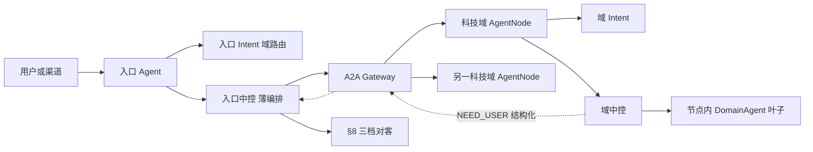

# Agent 平台总体架构草案 v0.4

> 状态：讨论稿。在 v0.3 之上合并「目录目标态」；**本版取代 v0.3 作为讨论基线**。
> v0.1（无版本号稿）/ v0.2 / v0.3 保留不删，文首指向本版即可。
>
> **产品立场（自 v0.3，已确认，本版不重开）：**
>
> 1. **附录 F 科技域 26 = AgentNode 26**（部署与自治边界）。
> 2. **入口 Agent（工小智）必须薄**：域路由、多域骨架、A2A 委托、澄清汇聚、对客呈现。
> 3. **生成式直接对客**沿用 v0.2 §8（三档 + 事实集 + 校验器）；仅入口出网。
> 4. **护栏是全行通用能力，各节点调用**；调用时机留在 `agent-runtime` 固定顺序里。
>
> **本版新增：**
>
> 5. **目录目标态冻结为** `framework / infrastructure / agents`（自无版本号稿 §11 修订）。
>    根目录与根 `artifactId` 为 `agent-platform`（D5）；`groupId`（`com.gxz`）仍待组织确认。
>
> 推导边界同 v0.3：`NOT_MINE`、零能力域不必立刻有中控、域路由阈值单独标定。
>
> 资金安全相关规则（委托幂等、PARTIAL、跨层确认、澄清上抛、GOAL 强制信封）**一字不放宽**，
> 全部继承 v0.2。

## 0. 与 v0.3 的差异

| # | v0.3 | v0.4 | 为什么改 |
| --- | --- | --- | --- |
| 1 | 「不固定物理拆仓方式」 | **冻结目录分层目标态**（§10）；坐标名可后定 | 仓库已完成一轮物理分组；再「不固定」会让目录与文档各说各话 |
| 2 | 无目录迁移阶段 | 落地次序增加 **D0 / D1**（§13） | 行为阶段与目录搬家分开验收，避免一次炸 reactor |
| 3 | 映射表仍偏逻辑 | §10–§11 写清现状路径 → `agents/<id>` | 回应「目录为何没调」；给可执行的下一步 |
| 4 | `fastpath+slowpath→intent-engine` 易读成合并 | **保留快慢分路模块**；对外只暴露 api / Starter | 与 v0.2 §4.4、仓库现状一致 |
| 5 | 未写迁移进度 | §13 标注 0 / 1 / 1.5 已基本完成 | 讨论基线要对齐代码，不是假装从零开始 |

v0.3 相对 v0.2 的产品改动（薄入口、26=26、护栏共享、`NOT_MINE` 等）**全部保留**。

## 1. 前提

沿用 v0.3 §1（含附录 F 双射、入口不得实现域内语义、生成式不经模型决定数字），再补一条：

12. **业务资产属于具体 Agent 目录**（`agents/<agentId>/assets/`）。平台根目录不得长期存放
    附录 F 各域的能力卡与业务模板；过渡期根 `assets/` 仅作搬家前兼容。

## 2. 总体判断

平台是一套可被多个 Agent 复用的运行框架。工小智是入口 Agent；账户、转账、基金……是
附录 F 上的领域 Agent。每个节点复用同一套 `intent-engine` + `agent-runtime`。

### 2.1 默认拓扑：1 入口 + 26 科技域节点

```text
gongxiaozhi            # 入口：薄路由 + 对客（agentId 现网名可映射）
agent.account          # 科技域：账户管理
agent.transfer         # 科技域：转账服务
agent.fund_service     # 科技域：基金服务
…                      # 其余附录 F 科技域，共 26
```

`agentId` 与科技域码对齐（历史例外如 `agent.creditcard` ↔ `creditcard_service` 用投影表钉死）。
菜单导航 `agent.nav` 归并进 `finance_assistant` 节点本地能力，不单独占第 28 个灰区节点。

### 2.2 两种契约

| 角色 | 本地中控 | 契约 | 位置 |
| --- | --- | --- | --- |
| 自治 Agent | 有，持本层任务真值 | `AgentNode` | 附录 F 每域一个 + 入口一个 |
| 纯执行器 | 无 | `DomainAgent` | **仅**某 AgentNode 进程内叶子 |

ADR-005：每笔任务恰有一个中控持有其真值。

### 2.3 入口必须薄

允许：渠道上下文编译 → 域级/多域意图 → 多域计划骨架 → A2A（TASK/GOAL）→ 汇聚 → §8 对客。

禁止：域内指代解析；替域填满槽位再 TASK；替域维护产品/流程/话术资产；本地执行附录 F 业务能力
（本地仅会话、拒办、转人工、导览类）。

## 3. 运行时关系



1. 入口决定委托哪些域、TASK/GOAL、多域骨架。  
2. 网关决定实例与投递。  
3. 域节点决定域内理解、规划、本地叶子执行。  
4. 缺信息结构化上抛，只由入口对话。  
5. 对客文本只由入口发出。

## 4. 独立意图引擎

对外门面、负责/不负责、SPI、slowpath 还债：**继承 v0.2 §4**（阶段 0 已基本落地）。

使用约定（自 v0.3）：

- **同一套引擎，两套资产视角**：入口 = 域路由 + 多域骨架；域节点 = 本域 TOOL + 槽位/负向。
- DeepAgent / 重规划默认在**域节点**；入口慎装。
- **模块形态**：仓库保留 `intent-fastpath` / `intent-slowpath` 分路；`intent-engine-api` 为门面；
  目标态由 `intent-engine` 聚合或 Starter **隐藏实现**，Agent 应用不直接依赖 fast/slow 内部包。

## 5. Agent 节点

### 5.1 组成与顺序

七件套与调用顺序同 v0.2 §5.1：**建档 → 护栏 → 发幂等键 → 执行/委托**。

护栏是全行通用能力（v0.3 §5.1）：引擎与口径可共享热更；**「调护栏」位置不下放**；
不可达 fail-closed；静态口径可缓存。TCK：拿不到护栏结论就拿不到幂等键。

### 5.2 入口节点 vs 科技域节点

| | 入口 | 科技域（×26） |
| --- | --- | --- |
| Intent | 域路由、多域骨架 | 本域能力、槽位、计划 |
| 中控 | 委托骨架、澄清计数、粘滞 | 本域任务真值、护栏调用、叶子 |
| 对客 | 唯一渠道出口 | 无 |
| 目录 | `agents/gongxiaozhi` | `agents/<tech>`（与附录 F 双射） |

### 5.3 现状读法

| 现状 | 目标态读法 |
| --- | --- |
| `tech-domains.yaml` 26 码 | AgentNode 清单真源 |
| Agent 父卡 YAML | AgentCard 投影输入 |
| `TechDomainAgent` / Mock | 节点内叶子过渡实现 |
| Scaffold | **未建成节点占位**：可发现、GOAL/TASK 显式失败 |
| 进程内 `AgentInvoker` | 过渡总线；目标态一律经 A2A（可 in-process 回环） |

## 6. A2A 网关

继承 v0.2 §6（职责/不负责、TASK/GOAL、`delegationId`、深度环路超时、R2 跨层确认）。

补强（自 v0.3）：

- GOAL 是薄入口主委托模式；TASK 为已具备完整能力 ID+参数的短路径。
- 路由表只有 1+26 个 AgentNode；纯执行器不上表。
- 入口 session 粘滞是阶段 2 硬前置。

工程形态：网关逻辑上独立；目标目录落在 `infrastructure/a2a/`（client / server / gateway /
inprocess）。生产只经 client→gateway；`inprocess` 仅测试与本地演示。

## 7. 跨 Agent 澄清回传

继承 v0.3 §7（五条 + `NOT_MINE` / `DOMAIN_NOT_OPEN` 分流；改投上限一次）。

## 8. 生成式面客话术

整节继承 v0.2 §8。衔接：渲染只在入口；事实集只收结构化字段；下游自由文本永不进生成 prompt。

## 9. 中间件、AgentCard、数据隔离

继承 v0.2 §9–§11。AgentCard 投影规则同 v0.3 §9：

- 每科技域一张 Card；入口单独一张（仅入口自有能力）。
- CI：`tech-domains` ↔ AgentCard 双射（加入口共 27）。

作用域键必须含 `agentId`（缓存、PG、Redis、OpenSearch、Workspace）。

## 10. 目标目录（本版定稿）

目标根工程表达的是 Agent 平台。根目录与根 `artifactId` 为 `agent-platform`
（`groupId` 仍为 `com.gxz`，待组织确认后再中性化）；开发者视角分层如下：

```text
agent-platform/                        # 根目录 / 根 artifactId（D5）
├── framework/                         # 平台团队
│   ├── agent-bom/
│   ├── agent-contracts/               # 可再拆 intent/task/a2a 契约
│   ├── agent-stability/
│   ├── agent-obs/
│   ├── intent-engine/                 # api + fastpath + slowpath + starter
│   ├── context-engine/
│   ├── task-orchestrator/
│   ├── response-engine/
│   ├── agent-runtime/
│   ├── agent-starter/
│   ├── agent-tck/
│   └── agent-testkit/
│
├── infrastructure/                    # 基础设施 / 协议
│   ├── a2a/
│   │   ├── a2a-contracts/
│   │   ├── a2a-client/
│   │   ├── a2a-server/
│   │   ├── a2a-gateway/
│   │   └── a2a-inprocess-adapter/
│   ├── model-openai-compatible/
│   ├── persistence-jdbc/
│   ├── cache-redis/
│   ├── search-opensearch/
│   ├── discovery-nacos/
│   ├── openjiuwen/
│   ├── observability-otel/
│   └── samples/                       # mock / workflow 等演示实现
│
├── agents/                            # Agent 开发者主工作区
│   ├── gongxiaozhi/                   # 薄入口
│   ├── account/
│   ├── transfer/
│   ├── fund_service/
│   └── …                              # 与附录 F 双射；未建成可为 scaffold 壳
│
├── agent-template/
├── tools/
├── console/
└── docs/
```

### 10.1 目录硬规则

1. `framework` 可复用库；`intent-engine` 是其中一级能力。  
2. `infrastructure` 含 A2A 与适配器；网关不是某个 Agent 的内部类。  
3. `agents/<agent>` 是代码 + 扩展 + **本 Agent 资产** + 测试的闭环。  
4. `agent-template` 是新建 Agent 的唯一模板入口。  
5. Mock / Workflow / 纯 OJ 适配是实现方式，进 `infrastructure` 或 `samples`，
   **不与附录 F 业务 Agent 并列**。  
6. 业务资产只住在 `agents/<id>/assets/`；平台根不再长期放具体 Agent 能力卡。  
7. Agent 应用只依赖 framework Starter 与 infrastructure 适配器对外 API，
   不直接依赖 fastpath/slowpath 内部实现或网关内部实现。

### 10.2 单 Agent 目录形状

科技域示例：

```text
agents/account/
├── pom.xml
├── src/main/java/.../account/
│   ├── AccountAgentApplication.java    # 可与入口共进程部署，逻辑仍隔离
│   ├── intent/
│   ├── orchestration/
│   ├── capability/
│   ├── extension/                      # 指代解析等域内语义
│   └── configuration/
├── assets/                             # 本域能力卡、规则、模板、flows
├── src/test/
└── README.md
```

入口与域的差异见 §5.2：入口有 `route/` + 对客渲染，无域内办理叶子；域无渠道出口。

### 10.3 现状 → 目标

| 现状（仓库） | 目标 |
| --- | --- |
| `applications/gongxiaozhi-agent` | `agents/gongxiaozhi`（**已完成** D0） |
| `domains/account` | `agents/account`（**已完成**） |
| `domains/mock` `oj` `workflow` | `infrastructure/samples`（**已完成** D0） |
| 顶层 `platform/` `runtime/` `registry/` `intent-engine/` | `framework/`（**已完成** D4；组内结构保留） |
| `a2a-gateway` | `infrastructure/a2a/*` 五模块（**已完成** D3 路径 + **D6** contracts/client/server/gateway/inprocess） |
| `adapters/*` | `infrastructure/*`（**已完成** D2） |
| 根 `assets/` | `agents/*/assets/` + 共享根（**已完成** D1） |
| `intent-engine-api` + 应用直连实现 | `framework/intent-engine/intent-engine-starter` + `framework/agent-starter`（**已完成** D6） |
| 根目录 / 根 `artifactId` `gongxiaozhi-agent` | `agent-platform`（**已完成** D5；`groupId` `com.gxz` 仍待组织确认） |

## 11. 必须坚持的边界

继承 v0.2 §12 全部 16 条 + v0.3 第 17–22 条，并新增：

23. **目录分层与资产归属按 §10**；不得以「共 JVM」合并 `agents/` 目录或合并逻辑 `agentId`。  
24. **入口模块不得依赖域内语义实现包**（ArchUnit / 依赖测试守门，同薄入口禁区）。

删除并作废的表述：

- 「每个 Agent（含入口）对称画成同样胖的完整业务节点」  
- 「暂不改造现有代码和最终目录命名」（与已发生的迁移及本版 §10 冲突）

## 12. 新增字段的消费点

继承 v0.3 §14。目录相关追加：

| 项 | 谁读 | 读了之后 | 怎么证明 |
| --- | --- | --- | --- |
| `agents/<id>/assets` | 该 Agent 的资产加载 | 只看见本 Agent 卡 | 入口 classpath 无账户域内 TOOL 主资产后，GOAL 仍能办成 |
| `a2a-client` vs gateway 实现 | 入口 / 域应用 pom | 应用不依赖 gateway 内部 | `ModuleDependencyTest` |

## 13. 落地次序

生成式阶段 G 与 A2A 线并行；GOAL+T1/T2 同时开之前必须落地 v0.2 §8.6。

| 阶段 | 内容 | 门禁 | 进度（写稿时） |
| --- | --- | --- | --- |
| **0** | Intent 门面；slowpath↛orchestrator；资产/检索 SPI | `FastPathParityTest` | **已完成** |
| **1** | 键/schema/索引/Workspace 加 `agentId` | Agent 维缓存隔离 | **已完成** |
| **1.5** | 薄入口：域内语义下沉；入口资产改域路由为主 | 账户指代不在入口实现；GOAL 可办成 | **已完成**（资产全量拆分见 D1） |
| **D0** | 目录收口：`applications`→`agents/gongxiaozhi`；mock/oj/workflow 挪出 `domains/`；依赖测试路径更新 | 全量构建绿；`ThinEntryBoundaryTest` / 双射 / 冒烟仍绿 | **已完成** |
| **2** | A2A + TASK：Card、委托表、重投、粘滞 | 阻断项 2/3；粘滞；重投单次执行 | **工程门禁已有，默认委托关**（阻断项 2/3 业务口径未关） |
| **3a** | 首域（建议 account）完整节点 + 入口主路径 GOAL | ADR-005、§7、§6.3、Handler 反例、`AgentNodeContract` | **已完成**（`agents/account` + 入口 GOAL 委托开关） |
| **3b** | 按附录 F 铺满；零能力域不建中控 | 双射 CI；26 域冒烟；多域深度环路 | **首批 7 域（含账户）进行中**；零能力域仍 Scaffold |
| **D1** | 根 `assets/` 业务卡迁入各 `agents/*/assets/` | 发布门禁 + 双射仍绿；入口无域内主资产 | **已完成** |
| **D2** | `adapters/*` → `infrastructure/*` | reactor 绿；artifactId 不变 | **已完成** |
| **D3** | `a2a-gateway` → `infrastructure/a2a/a2a-gateway` | reactor 绿；不拆 contracts/client | **已完成** |
| **D4** | `platform|registry|runtime|intent-engine` → `framework/` | `ModuleDependencyTest` / 双射仍绿 | **已完成** |
| **D5** | 根目录 / 根 `artifactId` → `agent-platform` | reactor 绿；入口仍为 `gongxiaozhi-app`；`groupId` 不动 | **已完成** |
| **D6** | A2A 五模块 + `intent-engine-starter` + `agent-starter`；入口 compile 不直连 gateway/fastpath/slowpath | `ModuleDependencyTest`；冒烟 / A2A / 委托门禁绿 | **已完成** |
| **G** | G1 影子 → G2 T1 → G3 T2+流式 | 同 v0.2 §13 G | **未开** |

阶段 2 允许瘦 AgentNode（中控 + 本地叶子）；域内 Intent 可先窄。

## 14. 待定项

| 项 | 说明 |
| --- | --- |
| ~~GOAL / 26 合并 / 每域自写护栏~~ | 已决，见 v0.3 |
| 根工程正式名与 `groupId` | 根名 / 根 `artifactId` 已定 `agent-platform`（D5）；`groupId` 仍待组织确认 |
| A2A 独立部署单元 | 逻辑已独立；是否独立进程/仓另定 |
| AgentCard 存储介质 | Nacos / DB / 专用注册 |
| 异步投递与行内 MQ | 平台部 |
| 独立库 vs 共享集群 | 运维；§9 隔离规则两种都成立 |
| 共享护栏服务形态 | 合规+平台；调用时机规则已定 |
| 各域护栏口径内容 | 阻断项 2，业务 Owner |
| 首个完整域 | 建议账户 |
| 26 节点部署密度 | 逻辑 26 不变；可共 JVM |
| T1/T2 场景与生成式评测集 | 业务+合规 |
| 委托深度默认值 | 建议 3 |
| `AgentNodeContract` 细目 | 3a 随首域冻结 |

## 15. 需要配套的文档变更

| 文档 | 改什么 |
| --- | --- |
| `Agent平台总体架构草案.md`（无版本号） | 文首标明已被 v0.4 取代 |
| `…_v0.3.md` | 文首标明已被 v0.4 取代 |
| README 模块图 | 1 入口 + 26 域；目录按 §10；去掉「intent-engine 门面尚未建立」类过时句 |
| ADR-005 / 007 / 008 | 同 v0.3 §16，并补目录归属一句 |
| 切片计划 | 续编号：D0/D1、薄入口资产收口、双射 CI、按域升级 |

---

## 附录 A：一句话对照

| 问题 | v0.3 | v0.4 |
| --- | --- | --- |
| 产品拓扑 | 1 入口 + 26 节点 | **不变** |
| 入口职责 | 薄 | **不变** |
| 目录 | 不固定物理拆仓 | **`framework` / `infrastructure` / `agents`** |
| 资产放哪 | 未强制目录 | **`agents/<id>/assets/`** |
| 实现方式（mock 等） | 易与域并列 | **samples / infrastructure，不占附录 F** |
| 意图模块形态 | 易读成合并 | **分路保留 + api/Starter 对外** |
