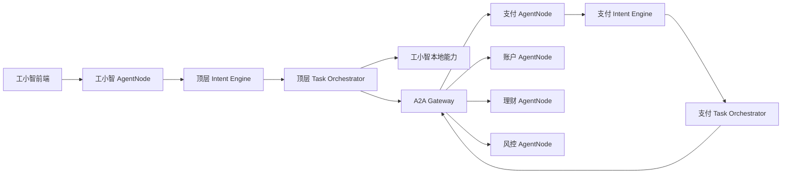

# Agent 平台总体架构草案 v0.5

> 状态：最新讨论稿。
>
> 本文独立记录当前共识，不修改 v0.1-v0.4。旧版本保留作为演进历史。
>
> **落地进度（对照 §17）**：1–3 **已完成**（契约三 API、`intent-engine-default`、
> `agent-runtime-{api,core,starter}`；入口经 `AgentRuntime`）。4–7 仍待做。

## 1. 已确认的产品立场

1. 平台能力必须独立出包，由各 Agent 通过稳定 API、Starter 和 SPI 集成使用。
2. 意图引擎是独立平台能力，不是工小智内部包。
3. 所有 Agent 运行时同构，统一使用 `intent-engine`、`context-engine`、`task-orchestrator`、`response-engine` 和 A2A 能力。
4. 顶层、协调、领域、叶子只是 Agent 在当前调用拓扑中的相对角色，不形成不同的 Java 类型。
5. 不定义 `AgentSupervisor extends AgentNode`，也不增加独立 `coordinator-agent`。
6. 工小智本身是顶层超级智能体，拥有前后端、顶层意图、上下文、任务状态、第一层路由、A2A 委托、结果汇聚和自身领域资产。
7. 支付、理财等领域 Agent 也可以继续委托账户、风控等子 Agent，因此它们在自己的子树中同样承担协调角色。
8. 不同 Agent 之间统一通过 A2A 网关发现和调度，不直接维护彼此地址。
9. PostgreSQL、Redis、OpenSearch、Nacos、模型网关、OpenJiuwen 和 OTel/Jaeger 继续保留，通过平台 SPI 和适配器接入。
10. 平台吸收通用技术能力；Agent 开发以配置和资产为主，仅在存在领域逻辑时增加扩展代码。

## 2. 总体运行关系



运行时有两类调度：

1. Agent 本地中控决定是否委托、委托目标、顺序、条件、确认要求和结果汇聚方式。
2. A2A 网关决定目标 Agent 的版本、实例、投递方式、限流、熔断和回执路由。

A2A 网关不解释用户意图，不拥有业务任务真值，也不代替 Agent 执行护栏。

## 3. 所有 Agent 同构

所有 Agent 都运行在同一个 `AgentRuntime` 模型上：

```text
AgentNode
├── IntentEngine
├── ContextEngine
├── TaskOrchestrator
├── GuardrailChain
├── LocalCapabilityExecutor
├── A2aDispatcher
└── ResponseEngine
```

统一入口：

```java
public interface AgentNode {
    AgentResponse handle(AgentRequest request);
}
```

Agent 的差异只来自：

- AgentCard
- 能力资产
- 意图和路由资产
- 委托策略
- 本地能力实现
- 领域护栏
- 下游系统连接
- 是否提供前端

例如：

| Agent | 当前拓扑角色 | 本地状态 | 可委托范围 |
|---|---|---|---|
| 工小智 | 顶层超级智能体 | 顶层会话、计划和任务 | 全领域 |
| 支付 | 领域协调节点 | 支付任务和支付上下文 | 账户、风控 |
| 账户 | 领域节点 | 账户任务和账户上下文 | 按业务需要 |
| 风控 | 叶子节点 | 风控任务和审计 | 通常无下游 |

角色是相对的，不进入继承体系。

## 4. 工小智定位

工小智是一个完整 Agent 产品，不是只做协议转换的薄入口。

工小智拥有：

- 面向用户的前端
- 后端 AgentNode
- 顶层意图引擎
- 顶层上下文
- 顶层任务状态和多意图计划
- 第一层跨领域路由
- A2A 委托与结果汇聚
- 渠道、路由、聚合、对客和自身领域资产
- 最终用户回复出口

下游 Agent 仍拥有自己的任务真值和本域执行资产。工小智不能直接修改下游 Agent 的任务表，只能通过 A2A 回执推进自己的父任务。

标准链路：

```text
工小智前端
 → 工小智后端 AgentNode
 → 顶层上下文编译
 → 顶层意图识别
 → 顶层任务中控
 → 第一层路由
 → A2A Gateway
 → 领域 Agent
 → 结构化结果回传
 → 工小智汇聚并对客
```

## 5. 平台能力独立出包

### 5.1 公开契约包

公开 API 包保持轻量，不依赖 Spring 和中间件：

```text
agent-api
task-api
a2a-api
intent-engine-api
agent-runtime-api
```

### 5.2 默认实现包

```text
intent-engine-default
context-engine
task-orchestrator
response-engine
agent-runtime-core
```

### 5.3 Spring 集成包

```text
intent-engine-starter
agent-runtime-starter
a2a-client-starter
a2a-server-starter
```

### 5.4 基础设施适配器

```text
persistence-jdbc
cache-redis
search-opensearch
discovery-nacos
model-openai-compatible
openjiuwen
observability-otel
```

依赖方向固定为：

```text
API/SPI
  ↑
平台默认实现
  ↑
基础设施适配器与 Starter
  ↑
Agent 应用
```

Agent 不直接依赖 fastpath/slowpath 内部类、Repository 实现、A2A 网关内部实现或中间件原生客户端。

## 6. 独立意图引擎

对外门面：

```java
public interface IntentEngine {
    IntentResult recognize(IntentRequest request);
}
```

`IntentRequest` 使用引擎自己的稳定类型：

```java
public record IntentRequest(
        IntentScope scope,
        String query,
        IntentContext context,
        ActiveIntentState activeState,
        Map<String, String> attributes
) {}
```

意图引擎负责改写、规则、召回、融合、仲裁、槽位、多意图和计划生成；不负责创建业务任务、生成执行幂等键、调用 A2A 或保存完整会话历史。

fastpath 和 slowpath 可以继续作为内部实现模块，但 Agent 对外只依赖 `intent-engine-starter`，不感知内部拆分。

## 7. 上下文与状态归属

### 7.1 Agent 上下文

每个 Agent 的 `context-engine` 管理本层上下文：

```text
tenantId + agentId + sessionId
```

意图引擎接收编译后的 `ContextLease`，不能直接读取数据库或完整会话历史。

跨 Agent 只传递白名单结构化事实，不传完整聊天历史。

```java
public record ContextLease(
        String agentId,
        String tenantId,
        String sessionId,
        String goal,
        Map<String, Object> confirmedFacts,
        List<PendingItem> pendingItems,
        List<ToolConclusion> recentConclusions,
        long stateVersion,
        boolean trustworthy,
        Instant expiresAt
) {}
```

| 上下文 | 所有者 | 是否跨 Agent 传递 |
|---|---|---|
| 用户会话历史 | 当前 Agent | 默认不传递 |
| 已确认事实 | 当前 Agent | 只传白名单字段 |
| 当前待办和澄清项 | 当前 Agent | 以委托摘要传递 |
| 下游结果 | 下游 Agent 产生 | 以结构化事实返回 |

### 7.2 Agent 业务状态

每个 Agent 的 `task-orchestrator` 管理本层任务真值：

```text
tenantId + agentId + taskId
```

父 Agent 只保存委托摘要和子任务回执，不直接更新子 Agent 状态。

### 7.3 A2A 委托状态

A2A 网关只管理：

```text
delegationId
sourceAgentId
targetAgentId
deliveryStatus
deadline
receipt
retryCount
```

Agent 中控回答“业务进行到哪一步”；A2A 网关回答“委托投递到哪里以及是否有回执”。

典型委托状态：

```text
CREATED → ROUTED → DELIVERED → ACCEPTED → SETTLED
                                      ├→ PARTIAL
                                      └→ UNKNOWN
```

### 7.4 一轮请求的标准顺序

```text
AgentNode 接收请求
 → ContextEngine 读取本 Agent 上下文
 → 编译 ContextLease
 → IntentEngine 识别和规划
 → TaskOrchestrator 创建或恢复本地任务
 → 本地护栏判断
 → 本地执行或 A2A 委托
 → 下游 Agent 创建自己的本地任务
 → 返回结构化事实
 → 父 Agent 保存子任务摘要并推进任务
 → ResponseEngine 生成回复
```

## 8. A2A 网关

生产调用链：

```text
Agent
 → a2a-client
 → a2a-gateway
 → a2a-server
 → 目标 AgentNode
```

支持两种委托：

```text
GOAL：目标 Agent 自己理解、规划和编排
TASK：能力和参数已明确，目标 Agent 执行指定任务
```

跨 Agent 使用“至少一次投递 + delegationId 幂等”，不承诺 exactly-once。有副作用调用结果不确定时必须标记 `PARTIAL/UNKNOWN`，禁止直接重试。

进程内 A2A 仅用于测试和本地演示，必须放在独立 testkit/adapter 中，不能伪装成生产网关。

### 8.1 网关负责

- AgentCard 注册、发现和版本匹配
- 租户级授权、实例选择和健康路由
- 同步、异步和流式投递
- 限流、熔断、deadline 和环路控制
- 委托幂等、状态查询和结果回调
- 跨 Agent trace 和投递审计

### 8.2 网关不负责

- 解释用户意图
- 代替目标 Agent 创建业务任务
- 执行目标 Agent 的护栏
- 修改目标 Agent 的任务状态
- 保存完整业务上下文
- 参与跨 Agent 数据库事务

### 8.3 AgentCard

每个 Agent 自己维护并发布 AgentCard：

```yaml
agentId: payment
version: 1.0.0
protocolVersion: a2a-v1
roles: [domain, routing]
capabilities:
  - capabilityId: cap.payment.transfer
    riskLevel: R2
    sideEffects: true
    inputSchema: payment-transfer-input-v1
    outputSchema: payment-transfer-output-v1
    modes: [sync, async]
```

Nacos 回答“健康实例在哪里”，AgentCard 回答“Agent 能做什么”，A2A 网关回答“这次委托交给哪个版本和实例”。

## 9. 中间件职责

| 中间件 | Agent 内部职责 | A2A 网关职责 |
|---|---|---|
| PostgreSQL | 会话轮次、任务、计划、幂等、审计 | 委托与投递台账 |
| Redis | 缓存、锁、亲和、热点上下文 | 限流、路由缓存、快速去重 |
| OpenSearch | 能力资产 BM25 和向量召回 | 默认不用于实例路由 |
| Nacos | 配置、实例注册、健康发现 | 网关读取可用实例 |
| Model Gateway | embedding、rerank、仲裁、规划 | 网关原则上不调用模型 |
| OpenJiuwen | Agent 内部图、流程和 DeepAgent | A2A/远程 Agent 适配 |
| OTel/Jaeger | Agent 决策和执行 trace | 跨 Agent 链路串联 |

Redis、OpenSearch 和 Workspace 都不是业务任务真值。

所有共享基础设施中的键必须包含 Agent 作用域：

```text
tenantId + agentId + sessionId
tenantId + agentId + taskId
tenantId + agentId + capabilityId
```

- PostgreSQL 使用独立 schema，或至少使用 `agent_id` 复合约束。
- Redis 使用租户和 Agent 前缀。
- OpenSearch 使用 Agent 独立索引或索引前缀。
- Workspace 使用 `agentId/sessionId` 子目录。
- A2A 委托表与 Agent 业务任务表分离。

## 10. 最终目录结构

```text
agent-platform/
├── framework/                         # 平台团队维护，可独立发布
│   ├── agent-bom/
│   ├── agent-stability/
│   ├── agent-observability/
│   ├── contracts/
│   │   ├── agent-api/
│   │   ├── task-api/
│   │   └── a2a-api/
│   ├── intent-engine/
│   │   ├── intent-engine-api/
│   │   ├── intent-engine-default/
│   │   └── intent-engine-starter/
│   ├── capability/
│   │   ├── capability-model/
│   │   └── asset-catalog/
│   ├── runtime/
│   │   ├── context-engine/
│   │   ├── task-orchestrator/
│   │   ├── response-engine/
│   │   ├── agent-runtime-core/
│   │   └── agent-runtime-starter/
│   ├── agent-tck/
│   └── agent-testkit/
│
├── infrastructure/                    # SPI 实现和独立服务
│   ├── a2a/
│   │   ├── a2a-client/
│   │   ├── a2a-client-starter/
│   │   ├── a2a-server/
│   │   ├── a2a-server-starter/
│   │   ├── a2a-gateway-core/
│   │   ├── a2a-gateway-app/
│   │   └── a2a-inprocess-testkit/
│   ├── persistence-jdbc/
│   ├── cache-redis/
│   ├── search-opensearch/
│   ├── discovery-nacos/
│   ├── model-openai-compatible/
│   ├── openjiuwen/
│   └── observability-otel/
│
├── agents/                            # Agent 开发者工作区
│   ├── gongxiaozhi/
│   ├── account/
│   ├── payment/
│   ├── transfer/
│   ├── creditcard/
│   ├── wealth/
│   ├── fund-service/
│   └── insurance-service/
│
├── agent-template/
├── tools/
├── samples/
└── docs/
```

## 11. Agent 开发模式

平台不要求每个 Agent 预建 `entry/intent/orchestration/context/delegation` 等目录。那些通用能力由 Starter 提供，Agent 目录采用配置优先、代码可选的极简形状。

### 11.1 配置型 Agent

```text
agents/benefits-ops/
├── agent.yaml
├── assets/
│   ├── capabilities/
│   ├── rules/
│   ├── templates/
│   └── flows/
├── eval/
├── deploy/
└── README.md
```

由统一 `agent-host` 加载配置和资产即可运行，不写 Java。

### 11.2 扩展型 Agent

```text
agents/payment/
├── agent.yaml
├── assets/
├── extensions/                       # 可选，有代码时才创建
│   ├── pom.xml
│   └── src/main/java/
│       ├── PaymentCapability.java
│       └── PaymentGuardrail.java
├── eval/
├── deploy/
└── README.md
```

扩展代码只实现本地能力、领域护栏、领域指代、下游系统调用或确有必要的 SPI 覆盖。

### 11.3 工小智超级智能体

```text
agents/gongxiaozhi/
├── agent.yaml
├── frontend/
├── assets/
│   ├── capabilities/
│   ├── routing/
│   ├── rules/
│   ├── templates/
│   └── flows/
├── extensions/
│   ├── channel/
│   ├── routing/
│   └── aggregation/
├── eval/
├── deploy/
└── README.md
```

工小智仍使用与其他 Agent 相同的 `AgentRuntime`；前端和更多扩展是产品差异，不是另一套运行时。

## 12. Agent 配置约定

```yaml
agent:
  id: payment
  displayName: 支付智能体
  roles: [domain, routing]

runtime:
  intentEngine: default
  context: enabled
  taskOrchestrator: enabled

a2a:
  inbound: true
  delegation:
    enabled: true
    allowedTargets: [account, risk]

assets:
  path: ./assets

storage:
  namespace: payment
```

`roles` 只用于描述和运维，不改变 AgentNode 类型。

## 13. 平台与 Agent 的职责边界

平台负责：

- Agent 启动、生命周期、协议入口
- 意图、上下文、任务状态机和回复流水线
- A2A 客户端/服务端、幂等、超时和回执
- 中间件接入、观测、配置校验和热更新
- TCK、测试工具和默认安全约束

Agent 负责：

- AgentCard、能力卡、规则、模板和流程
- 领域能力实现和下游业务系统调用
- 领域护栏与领域语义
- 委托范围与领域评测集
- 工小智等产品的前端与产品扩展

必须坚持：平台吸收通用技术能力，但不能为了零代码把具体领域语义和业务执行重新塞回平台。

## 14. 平台扩展与组合机制

平台必须允许业务开发者在不修改平台源码的前提下，按不同粒度复用和调整能力：

| 定制需求 | 推荐方式 |
|---|---|
| 调整阈值、规则、提示词和路由 | 配置与资产 |
| 使用平台中的部分组件 | 面向稳定组件 API 自行组合 |
| 在默认流程增加业务步骤 | 有序 Hook / Processor |
| 替换召回、仲裁、槽位等组件 | 实现对应 SPI |
| 完整流程不适用 | 实现 `IntentEngine`，按需复用平台组件 |

### 14.1 Java 和 Spring 机制

该能力建立在以下机制上：

- Java 接口和多态
- 依赖倒置与组合优于继承
- 策略模式、装饰器模式和责任链模式
- Spring IoC/依赖注入
- `@ConditionalOnMissingBean` 默认实现让位
- `@Order` 管理多扩展点顺序

平台定义 SPI 并提供默认实现：

```java
@Spi
public interface IntentEngine {
    IntentResult recognize(IntentRequest request);
}
```

```java
@Bean
@ConditionalOnMissingBean(IntentEngine.class)
IntentEngine defaultIntentEngine(...) {
    return new DefaultIntentEngine(...);
}
```

业务 Agent 提供同类型 Bean 后，平台默认实现自动让位：

```java
@Bean
IntentEngine paymentIntentEngine(...) {
    return new PaymentIntentEngine(...);
}
```

这不是修改原类或运行时 monkey patch，也不推荐继承平台内部实现。业务代码实现稳定接口，由容器选择实现。

### 14.2 可独立复用的意图组件

平台应选择性公开粒度稳定、可单独组合的组件：

```java
public interface QueryRewriter {
    RewriteResult rewrite(IntentInput input);
}

public interface CandidateRetriever {
    List<IntentCandidate> retrieve(IntentInput input);
}

public interface IntentArbitrator {
    IntentDecision arbitrate(IntentInput input, List<IntentCandidate> candidates);
}

public interface SlotExtractor {
    Map<String, Object> extract(IntentInput input);
}
```

业务方可以复用平台召回、槽位解析等组件，替换自己的仲裁器，并重新组合成一个 `IntentEngine`。只有标记为 `@Api` 或 `@Spi` 的组件属于承诺面；内部流水线状态、具体实现类和中间 DTO 不对外承诺兼容。

### 14.3 默认流程的安全插槽

默认意图流程提供明确的有序扩展点：

```text
IntentPreProcessor
QueryRewriter
CandidateRetriever
CandidatePostProcessor
IntentArbitrator
SlotExtractor
SlotEnricher
IntentDecisionValidator
IntentResultPostProcessor
```

同一扩展点允许多个实现共存，由 Spring 注入为有序列表：

```java
@Component
@Order(200)
final class CustomerLevelCandidateFilter implements CandidatePostProcessor {
    // 只处理本领域候选，不复制整条意图流水线
}
```

Agent Runtime 同样可以提供受控 Hook：

```text
BeforeContextHook
AfterIntentHook
BeforeGuardrailHook
AfterExecutionHook
ResponseEnricher
```

Hook 只能在平台声明的锚点运行，不能任意改变核心状态机顺序。

### 14.4 不可扩展穿透的安全顺序

以下顺序由平台固定，不允许业务扩展重排或绕过：

```text
创建任务
 → 护栏检查
 → 生成幂等键
 → 本地执行或 A2A 委托
 → 保存执行结果
```

业务扩展不得：

- 在护栏前生成可执行凭据
- 绕过本地护栏直接调用下游
- 在结果未知时自行重试有副作用操作
- 直接修改其他 Agent 的任务状态
- 把模型自由文本当作结构化执行事实

### 14.5 扩展契约和兼容性

- 所有公开扩展点标记 `@Spi`，公开输入输出标记 `@Api`。
- 默认实现类、内部包和流水线状态不属于兼容承诺。
- 每个 SPI 提供 TCK；业务自定义实现必须通过对应契约测试。
- 平台升级时使用语义化版本管理 API/SPI 兼容性。
- 架构测试保证 Agent 不直接 import fastpath/slowpath、Repository 和网关内部实现。
- 多实现允许共存时使用注册表或 `@Order`，不得依赖 Bean 名称和扫描顺序碰运气。

### 14.6 扩展点类型与装配规则

平台扩展点分为五类，不能用同一种 Bean 规则处理全部场景：

| 类型 | 数量 | 典型例子 | 装配规则 |
|---|---:|---|---|
| 单实现策略 SPI | 恰好一个 | `IntentEngine`、`IntentArbitrator` | 业务 Bean 存在时默认实现让位 |
| 多实现责任链 | 零到多个 | `CandidatePostProcessor`、`ResponseEnricher` | `@Order` 排序后逐个执行 |
| 装饰器 | 零到多个 | 审计、计时、脱敏 | 平台按顺序包装目标组件 |
| Customizer | 零到多个 | 调整 Builder、注册受支持阶段 | 只在组件构建期运行一次 |
| 注册表型扩展 | 多个，按 key 选择 | `LocalCapability`、模型 Provider | key 唯一，重复即启动失败 |

单实现策略必须由平台默认 Bean 主动让位：

```java
@Bean
@ConditionalOnMissingBean(IntentArbitrator.class)
IntentArbitrator defaultArbitrator(...) {
    return new DefaultIntentArbitrator(...);
}
```

业务方不应依赖 `@Primary` 与默认实现竞争。`@Primary` 会让两个实现同时存在，其他按名称或集合注入的调用点仍可能拿错。正确方式是让默认实现根本不创建。

如果业务方同时提供两个单实现策略，平台应在启动阶段明确失败并列出实现类，不能依赖扫描顺序选一个。

多实现责任链使用 `ObjectProvider.orderedStream()` 或有序 `List<T>`：

```java
List<CandidatePostProcessor> processors =
        provider.orderedStream().toList();
```

业务代码不得依赖默认 Bean 名称。只有被公开契约明确声明的 `@Qualifier` 才能作为兼容面。

### 14.7 部分组件复用与完整流程替换

业务方可以只使用需要的平台组件，自行组合新的引擎：

```java
public final class PaymentIntentEngine implements IntentEngine {

    private final QueryRewriter platformRewriter;
    private final CandidateRetriever platformRetriever;
    private final SlotExtractor platformSlotExtractor;
    private final IntentArbitrator paymentArbitrator;

    public PaymentIntentEngine(QueryRewriter platformRewriter,
                               CandidateRetriever platformRetriever,
                               SlotExtractor platformSlotExtractor,
                               IntentArbitrator paymentArbitrator) {
        this.platformRewriter = platformRewriter;
        this.platformRetriever = platformRetriever;
        this.platformSlotExtractor = platformSlotExtractor;
        this.paymentArbitrator = paymentArbitrator;
    }

    @Override
    public IntentResult recognize(IntentRequest request) {
        IntentInput input = IntentInputs.from(request);
        RewriteResult rewrite = platformRewriter.rewrite(input);
        List<IntentCandidate> candidates = platformRetriever.retrieve(input.with(rewrite));
        IntentDecision decision = paymentArbitrator.arbitrate(input, candidates);
        Map<String, Object> slots = platformSlotExtractor.extract(input);
        return IntentResults.of(request, decision, candidates, slots);
    }
}
```

这里引用的 `IntentInputs`、`IntentResults` 必须是平台明确公开的工厂；如果它们属于内部包，业务方应实现自己的转换，不得通过反射、包名穿透或复制内部 DTO。

业务方完整替换 `IntentEngine` 后，Agent Runtime 仍负责上下文、建档、护栏、幂等、执行和回复。替换意图引擎不等于接管整个 Agent Runtime。

### 14.8 流水线数据模型

扩展链不能共享一个任意可写的 `Map<String, Object>` 作为全局状态。否则任一 Processor 都能删除风险等级、覆盖确认状态或伪造召回证据。

平台应在关键阶段提供不可变的类型化快照：

```text
IntentInput
RewriteResult
CandidateSet
IntentDecisionDraft
SlotSet
ValidatedIntentDecision
IntentResult
```

扩展点接收只读对象并返回新结果：

```java
public interface CandidatePostProcessor {
    CandidateSet process(IntentInput input, CandidateSet candidates);
}
```

不可由普通扩展修改的字段包括：

- `tenantId`、`agentId`、`sessionId`、`traceId`
- 风险等级和副作用标记
- 用户确认事实及其来源
- 护栏结论
- 幂等键
- 父子任务和 delegation 标识
- 绝对 deadline

确实需要修改这些字段的能力必须由更高等级的专用 SPI 承担，并通过独立 TCK 和安全评审。

### 14.9 Agent Runtime 扩展锚点

Agent Runtime 的固定生命周期：

```text
REQUEST_ACCEPTED
 → CONTEXT_COMPILED
 → INTENT_RECOGNIZED
 → TASK_CREATED
 → GUARDRAIL_PASSED
 → IDEMPOTENCY_ATTACHED
 → EXECUTION_FINISHED
 → TASK_SETTLED
 → RESPONSE_RENDERED
```

建议开放的锚点及权限：

| 锚点 | 允许做什么 | 禁止做什么 |
|---|---|---|
| `BeforeContextHook` | 补渠道标签、租户允许的请求属性 | 读取其他租户历史 |
| `AfterContextHook` | 增加本 Agent 的可信事实 | 把不可信事实标成已确认 |
| `AfterIntentHook` | 记录审计、增加不改变风险的业务标签 | 直接执行能力 |
| `BeforeGuardrailHook` | 补充护栏所需证据 | 生成幂等键、下发任务 |
| `AfterExecutionHook` | 结构化结果审计、指标 | 把 PARTIAL 改成 SUCCESS |
| `ResponseEnricher` | 增加展示信息 | 修改任务事实和护栏结果 |

不开放 `AfterGuardrailBeforeIdempotency` 这类任意业务 Hook，避免业务代码在最敏感的安全窗口中插入副作用。

### 14.10 扩展失败、超时和降级

每个扩展点必须声明失败策略，不能统一吞异常：

```java
public enum ExtensionFailurePolicy {
    FAIL_CLOSED,
    SKIP_AND_RECORD,
    FALLBACK_DEFAULT
}
```

建议规则：

| 扩展类型 | 默认失败策略 |
|---|---|
| 风险、护栏、确认校验 | `FAIL_CLOSED` |
| 候选增强、展示增强 | `SKIP_AND_RECORD` |
| 自定义召回、模型仲裁 | `FALLBACK_DEFAULT` 或规则降级 |
| 本地能力执行 | 按 `TaskResult/PARTIAL` 收口，不吞异常 |

扩展执行应纳入当前请求的绝对 deadline，平台记录：

```text
extensionId
extensionVersion
agentId
stage
duration
outcome
fallbackReason
```

扩展超时不能开启无界后台线程；请求结束后仍可能产生副作用的扩展必须按结果未知处理。

### 14.11 装饰器与 Customizer

需要保留默认组件、只增加前后处理时使用装饰器：

```java
public final class AuditedArbitrator implements IntentArbitrator {
    private final IntentArbitrator delegate;
    private final DecisionAudit audit;

    @Override
    public IntentDecision arbitrate(IntentInput input,
                                    List<IntentCandidate> candidates) {
        audit.before(input, candidates);
        IntentDecision decision = delegate.arbitrate(input, candidates);
        audit.after(decision);
        return decision;
    }
}
```

平台应提供显式的 Decorator 注册机制，避免装饰器直接注入同类型 Bean 导致循环依赖。

Customizer 只用于平台允许调整的 Builder 属性：

```java
public interface IntentEngineCustomizer {
    void customize(IntentEngineBuilder builder);
}
```

Builder 不暴露护栏顺序、任务状态机和幂等生成器等安全结构。

### 14.12 业务开发流程

业务开发者按以下顺序选择扩展方式：

1. 先判断配置、规则、能力卡或提示词是否足够。
2. 不足时选择最小粒度的 Processor/SPI，不复制完整流程。
3. 声明业务实现 Bean，确认平台默认实现会让位或按顺序加入责任链。
4. 运行对应 SPI TCK。
5. 运行本 Agent 的资产校验、意图评测和端到端用例。
6. 检查依赖树，确保未引入平台内部实现包或不需要的中间件。
7. 在 AgentCard 和变更记录中声明扩展 ID、版本和影响阶段。

### 14.13 TCK 最低要求

意图组件 TCK 至少验证：

- 同一输入和同一版本下结果满足确定性要求
- 不返回 `null`，输出满足 Schema
- 不修改输入对象和共享状态
- 不执行领域副作用
- 超时和异常按声明策略收口
- 不扩大候选到未授权能力

Agent Runtime Hook TCK 至少验证：

- 无法绕过护栏和幂等顺序
- 无法修改任务身份和租户/Agent 作用域
- PARTIAL/UNKNOWN 不能被提升为 SUCCESS
- 重放同一 `delegationId` 不产生第二次副作用
- Hook 异常不会留下无终态任务

架构 TCK 至少验证：

- Agent 不 import `internal` 包
- Agent 不依赖 fastpath/slowpath 具体实现 artifact
- Agent 不依赖 A2A Gateway 内部实现
- API/SPI 包不传递 Spring、数据库、Redis、OpenSearch 或 OpenJiuwen
- 每个 `@Spi` 都有默认让位或明确的多实现装配规则

平台扩展机制的最终原则：

> 平台提供稳定组件、安全插槽和默认实现；业务方可以配置、复用、增强或替换，但不能依赖内部实现，也不能破坏任务、护栏和幂等边界。

## 15. 现有模块映射与迁移

```text
framework/agent-contracts
  → framework/contracts/agent-api + task-api

framework/intent-engine/intent-engine-api
framework/intent-engine/intent-fastpath
framework/intent-engine/intent-slowpath
  → intent-engine-api + intent-engine-default + intent-engine-starter

framework/runtime/context-engine
  → 保留核心；JDBC/Redis 实现下沉 infrastructure

framework/runtime/task-orchestrator
  → 保留状态机核心；Repository 实现下沉 persistence-jdbc

framework/runtime/response-engine
  → 保留通用回复流水线；业务模板归各 Agent

infrastructure/a2a/*
  → client / server / gateway / inprocess-testkit 边界固定

agents/gongxiaozhi
  → 前端 + 顶层 Agent 配置/资产/扩展，后端统一使用 AgentRuntime

agents/<domain>
  → 配置和资产为主，有代码时只增加 extensions
```

迁移期间可以保留旧 artifactId 做兼容，但 Agent 新代码只依赖 API、Starter 和适配器公开面。

## 16. 必须坚持的边界

1. 意图引擎只产出意图和计划，不执行任务。
2. 每个 Agent 的中控只管理本 Agent 的任务真值。
3. Agent 间只能通过 A2A 网关调用。
4. 每一层 Agent 都重新执行自己的护栏，上游通过不替代本地判定。
5. 幂等键只能在护栏通过后生成。
6. 跨 Agent 不做数据库事务，使用父子任务和委托幂等衔接。
7. 有副作用调用结果不确定时不得自动重试。
8. Agent 间只传结构化事实和受限 ContextEnvelope，不传完整历史和下游自由文本。
9. 业务资产属于具体 Agent；平台只提供 Schema、加载、校验和运行机制。
10. 所有 Agent 同构；拓扑角色不产生新的运行时子类型。
11. 平台吸收通用技术能力，但不得吸收具体领域语义和业务执行。
12. API 包不得依赖 Spring、中间件或具体实现。

## 17. 推进顺序

1. 拆清 `agent-api`、`task-api`、`a2a-api` 和 `intent-engine-api` 的稳定边界。 **已完成**
2. 完成 `intent-engine-default` 与 `intent-engine-starter`，Agent 不再直连 fastpath/slowpath。 **已完成**
3. 完成 `agent-runtime-core` 与 Starter，收口通用 Agent 流水线。 **已完成**
4. 将 JDBC、Redis、OpenSearch、Nacos 依赖移到基础设施适配器。
5. 完成真实 A2A client → gateway → server 链路，进程内实现降为 testkit。
6. 以极简 `agent-template` 验证配置型 Agent，再验证扩展型 Agent。
7. 将工小智前后端、资产和扩展收口在 `agents/gongxiaozhi`，但保持与其他 Agent 相同的后端运行时。

## 18. 验收标准

- 新 Agent 仅凭 `agent.yaml + assets` 可以在统一 Agent Host 中启动。
- 需要编码时，只增加 `extensions`，不复制平台流水线。
- Agent 应用不 import fastpath/slowpath 内部类、中控 Repository 或 A2A 网关实现。
- 删除工小智模块后，平台包仍能独立构建和发布。
- 工小智与领域 Agent 都通过同一个 Agent Runtime TCK。
- 不同 Agent 之间真实经过 A2A 网关。
- 每个 Agent 的上下文、任务、缓存、索引和 Workspace 都包含 `tenantId + agentId` 作用域。
- 父 Agent 不能直接修改子 Agent 任务状态。

## 19. 待定项

- `groupId` 的正式中性命名。
- AgentCard 最终存储在 Nacos、数据库还是专用注册服务。
- A2A 网关是否独立仓库和独立进程部署。
- 异步投递使用哪种行内消息中间件。
- 配置型 Agent 的统一 `agent-host` 是单 Agent 单进程还是支持多 Agent 共 JVM。
- 工小智自身领域资产与下游领域 Agent 资产的精确边界清单。
