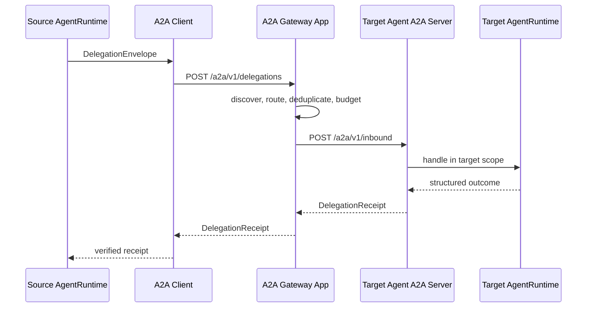

# Agent 平台总体架构草案 v0.6

> 状态：目录重构实施版  
> 包命名空间：`com.huawei.finance`  
> 产品入口：手机银行助手  
> 基线版本：`0.1.0-SNAPSHOT`

## 1. 目标与基本判断

本仓库建设的是可复用 Agent 平台，不是某一个超级 Agent 的源码集合。平台能力必须先形成独立包，再由手机银行助手、领域 Agent 和未来其他产品 Agent 按需集成。

手机银行助手是一个完整超级 Agent，拥有前端、自己的意图识别、中控、上下文、任务状态和产品资产。它负责面客入口的第一层路由、跨域聚合和最终回复，但不拥有其他 Agent 的运行时状态，也不直接调用其他 Agent 的实现类。

领域 Agent 与手机银行助手同构。领域 Agent 也可以有自己的意图引擎、中控、上下文、任务状态和下级 Agent。入口、路由、聚合只是角色，不是另一种技术类型。

v1 采用一个 Agent 一个运行进程。配置型 Agent 也由独立的通用 Host 实例承载，不与手机银行助手共 JVM 运行。

## 2. 最终目录

```text
agent-platform/
├── pom.xml
├── framework/
│   ├── bom/agent-bom/
│   ├── contracts/
│   │   ├── agent-api/
│   │   ├── task-api/
│   │   ├── a2a-api/
│   │   └── stability-api/
│   ├── intent-engine/
│   │   ├── intent-engine-api/
│   │   ├── intent-engine-default/
│   │   ├── intent-engine-starter/
│   │   ├── intent-fastpath/
│   │   └── intent-slowpath/
│   ├── runtime/
│   │   ├── agent-runtime-api/
│   │   ├── agent-runtime-core/
│   │   ├── agent-runtime-starter/
│   │   ├── context-engine/
│   │   ├── task-orchestrator/
│   │   └── response-engine/
│   ├── registry/
│   │   ├── asset-registry/
│   │   └── capability-registry/
│   ├── observability/agent-observability/
│   ├── starters/agent-starter/
│   ├── host/agent-host-app/
│   └── testing/
│       ├── agent-tck/
│       └── a2a-inprocess-testkit/
├── infrastructure/
│   ├── a2a/
│   │   ├── a2a-client/
│   │   ├── a2a-client-starter/
│   │   ├── a2a-server/
│   │   ├── a2a-server-starter/
│   │   ├── a2a-gateway-core/
│   │   └── a2a-gateway-app/
│   ├── persistence/persistence-jdbc/
│   ├── cache/cache-redis/
│   ├── search/search-opensearch/
│   ├── discovery/discovery-nacos/
│   ├── model/model-openai-compatible/
│   ├── workflow/openjiuwen-adapter/
│   └── observability/observability-otel/
├── agents/
│   ├── mobile-banking-assistant/
│   ├── account/
│   ├── payment/
│   └── ...
├── agent-template/
├── samples/agents/
├── dev/local/
├── tools/
├── scripts/
└── docs/
```

根目录不再放产品 `assets`、`console`、`eval` 或 `deploy`。产品内容必须能由所属 Agent 独立带走。

## 3. 三层职责

### 3.1 Framework

Framework 定义可复用的领域无关能力：公开契约、SPI、状态机、默认意图流程、默认编排、上下文算法、响应规划、资产模型、观测语义、Starter 和 TCK。

Framework 不依赖业务 Agent，不知道手机银行菜单、账户话术或某个领域服务地址，也不绑定 JDBC、Redis、OpenSearch、Nacos、模型厂商、OpenJiuwen 或 OTel 的具体实现。

意图引擎作为独立模块存在。Agent 可以只依赖 `intent-engine-api` 实现自己的引擎，也可以引入 `intent-engine-starter` 使用平台默认快慢路径。

### 3.2 Infrastructure

Infrastructure 实现 Framework 暴露的端口，负责技术产品接入：

| 能力 | 实现包 |
| --- | --- |
| 任务、计划、上下文、委托持久化 | `persistence-jdbc` |
| 缓存和分布式锁 | `cache-redis` |
| 召回索引 | `search-opensearch` |
| Agent 注册发现和配置 | `discovery-nacos` |
| OpenAI 兼容模型 | `model-openai-compatible` |
| OpenJiuwen 工作流 | `openjiuwen-adapter` |
| Micrometer 到 OTel/OTLP | `observability-otel` |
| 进程外 Agent 通信 | `a2a-*` |

基础设施包可以替换，但不得改变意图决策、任务状态机或 Agent 状态归属。

### 3.3 Agents

`agents/<agent>/` 是最终业务开发者的工作区。每个 Agent 的标准结构为：

```text
agent.yaml
assets/
backend/       # 可选，需要 Java 扩展时才存在
frontend/      # 可选，拥有独立前端时才存在
eval/
deploy/
README.md
```

目录名统一使用 kebab-case。科技领域码可以继续使用 underscore。A2A `agentId` 必须在 `agent.yaml` 显式声明，不能从目录名推导。

手机银行助手的固定身份为：

```text
displayName: 手机银行助手
directory: mobile-banking-assistant
package: com.huawei.finance.product.mobilebanking
agentId: agent.mobile-banking-assistant
```

## 4. Agent 开发模式

### 4.1 配置型 Agent

业务开发者主要修改：

- `agent.yaml`：身份、角色、领域、运行时和 A2A 开关。
- `assets/`：能力卡、规则、提示词、模板和领域资产。
- `eval/`：该 Agent 自己的评测集。
- `deploy/`：独立进程的环境配置和部署清单。

配置型 Agent 由 `agent-host-app` 加载。Host 读取 `AGENT_HOME/agent.yaml`，设置显式 Agent 身份和资产路径，装配通用 Runtime，并通过 `a2a-server-starter` 暴露本进程 AgentNode。

### 4.2 代码扩展型 Agent

只有声明式资产不足时才创建 `backend/`。允许实现：

- 领域能力和系统调用适配。
- 领域护栏。
- 本 Agent 的路由扩展。
- 意图引擎或 Runtime SPI。
- 产品入口 Controller、DTO 和响应增强。

禁止复制平台中控、上下文引擎或任务状态机到 Agent 目录。Agent 不直接依赖另一个 Agent 的实现模块；跨 Agent 能力只能通过 A2A 契约调用。

新 Agent 可由 `scripts/new-agent.sh <directory> <agent-id> <display-name>` 从 `agent-template` 创建。

## 5. 扩展、覆盖和流程插入

业务开发者可以复用平台的一部分组件，也可以覆盖默认实现或在流程中插入业务步骤。这不是依赖修改源码，而是 Java 多态、组合和 Spring IoC 的共同结果。

### 5.1 整体替换

平台公开接口，例如 `IntentEngine`、`AgentRuntime` 或扩展 SPI，由业务类实现。默认装配使用 `@ConditionalOnMissingBean` 时，业务 Bean 存在即接管默认实现。

```java
@Bean
IntentEngine domainIntentEngine(DomainClassifier classifier) {
    return new DomainIntentEngine(classifier);
}
```

这里使用的是接口多态和依赖注入。调用方依赖接口，不依赖默认实现类。

### 5.2 复用组件重新编排

如果默认意图流程不合适，但召回、规则过滤或仲裁组件有价值，业务实现可以组合这些组件，建立自己的处理顺序。优先使用组合，不通过继承具体实现复制内部状态。

```java
final class DomainIntentEngine implements IntentEngine {
    private final CandidateRetriever retriever;
    private final DomainRuleGate ruleGate;

    // 业务自行定义 recognize 顺序，同时复用平台组件。
}
```

### 5.3 在默认流程中插入步骤

稳定插槽由 SPI 和有序扩展链提供，例如护栏、路由扩展、决策记录、响应增强。多个实现由 Spring 收集，并通过 `@Order` 或明确优先级排序。

这对应策略模式、责任链和模板方法。平台只在确有稳定骨架时提供抽象模板；业务代码不继承普通具体类，因为具体类的内部调用顺序不是稳定契约。

### 5.4 扩展边界

允许替换“怎样识别、怎样扩展、怎样接系统”，不允许绕开以下不变量：

- 任务先建档，再过本 Agent 护栏，再执行。
- R2 等有副作用任务的确认和幂等要求不能被扩展点跳过。
- A2A 回执必须是结构化强制信封。
- 上下文和任务状态按本 Agent 身份隔离。
- 业务扩展不得直接写其他 Agent 的状态库。

## 6. A2A 发现和调用

正式调用固定经过独立 Gateway App：



Gateway 负责发现、路由、委托去重、深度/环路/截止时间校验和跨 Agent 观测。Gateway 不解释用户意图，不替目标 Agent 创建本地任务，不执行目标 Agent 护栏，也不参与跨 Agent 数据库事务。

`AgentEndpointResolver` 位于 `a2a-api`，Nacos 和静态路由实现依赖公开契约。发现基础设施不依赖 Sample。

`agent-starter` 默认只装进程外 A2A Client。进程内 A2A 仅存在于 `a2a-inprocess-testkit`，只能用于测试范围。

## 7. 上下文与任务状态

上下文和任务状态始终属于当前 Agent，而不是 Gateway，也不是全局超级中控。

逻辑隔离键为：

```text
tenantId + agentId + sessionId/taskId
```

当前 Runtime 内部的 `spaceId` 承载租户/空间维度；A2A 入站将信封 `tenantId` 映射到该维度。共享 Redis、数据库和检索设施时，作用域键至少包含 `agentId + tenant/space`。

每层 Agent 都执行自己的流程：加载自己的上下文、识别意图、建立自己的任务、执行自己的护栏、必要时继续委托下级 Agent、落自己的状态并返回结构化事实。上游只保存委托关系和接收到的事实，不复制下游完整状态机。

删除手机银行助手后，Framework、Infrastructure 和通用 Host 仍应独立构建。该约束保证产品不是平台的隐式根节点。

## 8. 配置命名

通用平台配置统一位于：

```text
huawei.finance.agent.*
```

主要配置包括显式 `id`、`assets.path`、Runtime、意图引擎、A2A Client、Nacos、模型和观测参数。

产品专属配置使用：

```text
huawei.finance.mobile-banking.*
```

Sample 配置使用：

```text
huawei.finance.sample.*
```

生产资产路径必须显式配置或由 Host 从 `AGENT_HOME` 解析。生产代码不向上扫描 Git 仓库。

## 9. 依赖方向

```text
Agents -> Starters/APIs -> Framework
Agents -> optional Infrastructure adapters
Infrastructure -> Framework APIs/SPIs
Framework -X-> Infrastructure implementations
Framework/Infrastructure -X-> Business Agents
Agent A -X-> Agent B implementation
```

`agent-bom` 只管理平台和基础设施制品版本，不管理业务 Agent 或 Sample。

无源码兼容壳已移除。当前尚未发布正式版本，所有模块直接依赖明确的 `agent-api`、`task-api`、`a2a-api` 或 `stability-api`，不保留长期双写。

## 10. 验证门禁

`agent-tck` 中的目录与依赖门禁验证：

- 每个 Agent 必须有标准目录、README 和显式 `agent.yaml`。
- Agent 目录名必须为 kebab-case，`agentId` 必须唯一。
- 平台和基础设施不得依赖业务 Agent 或 Sample。
- Agent 的生产依赖不得指向其他 Agent 实现。
- BOM 不纳入业务 Agent 和 Sample。
- 默认 Starter 不得引入进程内 A2A。
- 根目录不得重新出现产品资产目录或已删除的兼容模块。
- 当前源码不得重新出现旧品牌和旧包命名。

A2A 集成测试验证：

```text
HttpA2ADispatcher
  -> /a2a/v1/delegations
  -> A2AGatewayController
  -> HttpRemoteAgentNode
  -> /a2a/v1/inbound
  -> DelegationReceipt
```

构建验收包括全 Reactor 测试、手机银行助手前后端构建、`tools/promptopt` 独立构建，以及排除手机银行助手后的平台构建。

## 11. 本次迁移结论

- 产品资产、前端、评测和部署配置已收口到手机银行助手。
- 27 个 Agent 已统一 `agent.yaml/assets/eval/deploy/README` 结构。
- 代码型 Agent 已使用 `backend/`，配置型 Agent 可由通用 Host 独立承载。
- 意图引擎、Runtime、Registry、Contracts、Testing 和 Host 已形成 Framework 包。
- JDBC、Redis、OpenSearch、Nacos、模型、OpenJiuwen、OTel 和 A2A 已归 Infrastructure。
- A2A Gateway 已形成独立可部署应用，默认 Agent Starter 走远程 Gateway。
- 上下文与任务状态继续由各 Agent 按租户和 Agent 身份隔离。
- 历史 v0.1-v0.5 文档保持不变，v0.6 作为后续开发与评审基线。
