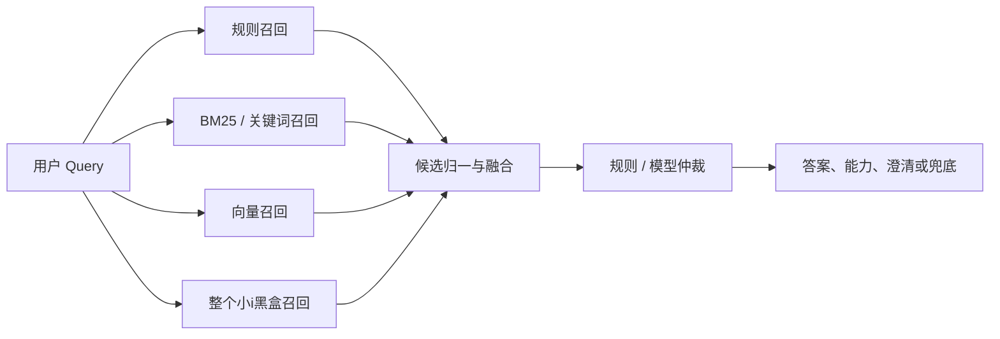
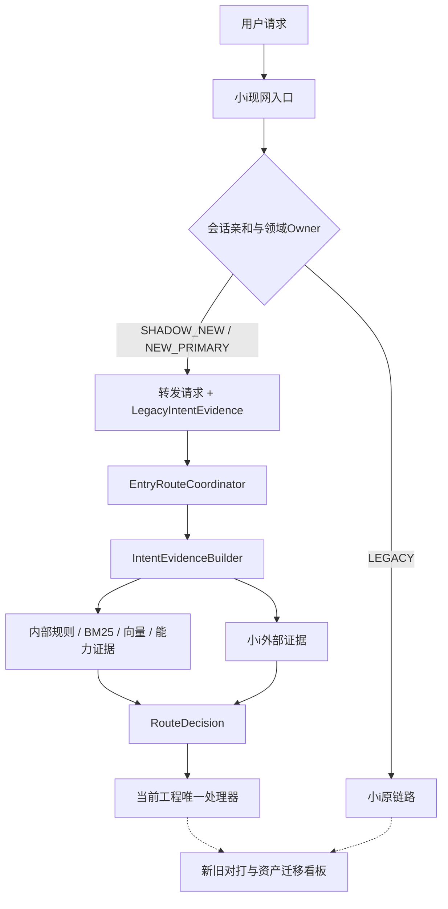

# 小i分阶段消费计划 v0.1

> 日期：2026-08-01
>
> 适用工程：`agent-platform`
>
> 上游文档：`小i知识资产组织与现有意图体系映射设计.md`
>
> 基线：上个版本把整个小i作为多路召回的一路；当前工程已使用完整 `Decision`、`RouteDecision` 和 `EntryRouteCoordinator`。
>
> 核心决策：**迁移期保留小i整路能力，但不再保留“平权候选 + 直接加权”的消费形态。生产上将其改造为随请求转发的外部证据和受控转交能力；同时启动资产级内化，按领域逐步转移知识权威和执行权。**

分析依据：

- `小I_iBot8系统解析与下一步建议 (4).pptx`：小i知识、词类、本体、维度、指令、菜单、服务、素材和发布运行机制；
- `小i真实知识逐图复核A-V完整总表.xlsx`：21 个标准问题、154 条可见记录，其中 145 条带扩展问；
- `小i知识资产组织与现有意图体系映射设计.md`：字段级资产映射和当前工程缺口；
- 当前 `agent-platform` 代码中的 `Decision`、`RouteDecision`、`RouteTarget`、`IntentEvidence`、`IntentEvidenceBuilder`、`EntryRouteCoordinator` 和 `RouteDispatcher`。

样本边界：Excel 是 21 张截图的逐图复核样本，不是小i全库统计，也不能单独证明线上准确率。本文中的全库规模来自 PPT 的约数，只用于判断迁移工作量；消费优先级和上线门槛必须由真实日志与人工标注补齐。

样本对消费方案的直接启示：

| 样本事实 | 规模 | 对消费方案的含义 |
| --- | ---: | --- |
| 带扩展问的记录 | 145 / 154 | 可以作为召回与评测原料，但必须先去重、拆 DSL、分训练集与测试集 |
| 扩展问唯一值 | 100 | 存在重复和继承，不能按行数等价计算意图覆盖 |
| 带指令的记录 | 91 / 154 | 大量知识命中后还有动作引用，小i结果不能只按 FAQ 答案消费 |
| 带标准答案的记录 | 69 / 154 | 答案可能按知识点复用或依赖继承，不能把无答案行直接判成无知识 |
| 测试样例 | 38 / 154 | 可做种子集，无法代替真实日志和独立人工标注集 |
| DSL 括号不完整 | 9 | 标记为 `BLOCKED_SOURCE_REVIEW`，回到原图或原系统确认前禁止自动编译 |
| 带有效期的记录 | 9 / 154 | 可见样本中的生命周期字段不完整，迁移时必须向业务补齐有效期和版本 |

---

## 1. 为什么需要重新制定消费计划

把整个小i作为多路召回的一路，有三个短期价值：

1. 不需要先解析 20 万级扩展问就能接入存量识别能力；
2. 可以快速得到小i命中的知识点、答案和旧系统行为，建立新旧对打基线；
3. 新系统覆盖不足时仍有稳定的现网承接路径。

但它不能成为长期终态：

- 小i分数与 BM25、向量、规则分的统计意义不同，不能直接相加；
- 小i返回的是耦合结果，知识、答案、菜单、服务和素材没有自然拆开；
- 整路接入只能告诉我们“旧系统选了什么”，不能让当前工程治理其来源、维度、风险和执行权限；
- 新旧系统长期同时参与最终决策，会形成两套规则真值和难以归因的冲突；
- 小i进入菜单态、反问态或服务态后有独立会话状态，不能逐轮与新引擎来回切换。

因此，本计划不是取消“小i一路”，而是把它放入明确的生命周期：

```text
黑盒影子证据
  -> 受控回退
  -> 资产级内化
  -> 领域执行权转移
  -> 只读对照
  -> 归档下线
```

### 1.1 上个版本的方案外形

上个版本可抽象为：



它把小i当作一个完整的外部 Expert：输入 Query，输出命中知识、分数、答案或后续动作，再与当前通道一起参与最终判断。这是合理的冷启动方案，但“小i返回的结果”与“普通召回候选”并不是同一种对象。

小i全库约有 1.4 万知识点、20 万扩展问、11 万词类，且大量扩展问带指令。整路消费一次性复用了这些资产；相应地，也一次性继承了其内部耦合和不可见状态。

### 1.2 上个版本方案的优势

| 优势 | 具体价值 | 最适用阶段 |
| --- | --- | --- |
| 接入快 | 只对接一个接口，不需要先完成全量知识解析 | 冷启动、PoC |
| 存量覆盖高 | 直接复用多年积累的问法、词类、模板和规则 | P0/P1 影子 |
| 长尾保底 | 当前能力卡和向量召回未覆盖时，小i仍可能命中 | 迁移早期 |
| 迁移成本可分摊 | 不必等知识、菜单、服务和素材全部迁完才开始验证 | 分领域迁移 |
| 天然对照组 | 同一个真实 Query 可以比较新旧结果 | 评测、冲突发现 |
| 业务连续性好 | 非试点领域和未迁资产仍由现网承接 | 灰度期 |
| 可发现隐藏依赖 | 小i返回菜单、服务或指令时，能暴露“这不是纯 FAQ” | 资产盘点 |
| 回滚简单 | 新领域未达标时可以配置回到小i | 领域灰度 |

其中最大的优势是**先取得运行结果，再逐步理解资产**。如果要求先把 20 万扩展问、菜单、服务和素材全部拆清楚再接入，项目很可能长期停在离线整理阶段。

### 1.3 上个版本方案的结构性劣势

| 问题类别 | 具体问题 | 结果 |
| --- | --- | --- |
| 分数不可比 | 小i相似度、BM25、向量余弦和规则分的定义不同 | 直接加权后阈值失真 |
| 候选粒度不同 | 当前候选通常是 Capability；小i可能返回知识、菜单、服务或默认回复 | 仲裁在比较不同种类的对象 |
| 双重权威 | 小i和当前资产都能定义同一意图、答案和动作 | 同一问题出现两个真值 |
| 黑盒不可解释 | 只看到最终知识 ID 和分数，看不到否定模板、维度、上下文加分等完整原因 | 误命中难归因、难修复 |
| 状态不完整 | 小i的菜单、反问、上下文和服务态存在于其会话中 | 将它当无状态召回会丢失下一轮语义 |
| 维度泄漏 | 小i答案依赖渠道、地区、机构；当前调用若没传同样维度，结果不可比较 | 串渠道答案或错误对打 |
| 执行边界模糊 | 小i命中知识后可能执行指令或服务，而当前系统也可能选择能力 | 产生双执行风险 |
| 延迟叠加 | 每次请求同步增加一次现网调用 | P95/P99 和容量受小i约束 |
| 故障耦合 | 小i超时或不可用会改变融合候选数量与总分 | 一个外部通道故障导致全链路出口漂移 |
| 版本漂移 | 小i配置、索引和当前资产分别发布 | 同一评测结论无法按版本复现 |
| 双重投票 | 已内化的扩展问在当前通道命中，同时小i又因同一资产命中 | 同一证据被计算两次 |
| 评测偏差 | 把“小i命中”当正确标签 | 只能测一致率，不能测真实正确率 |
| 数据合规 | 新引擎回调小i可能重复发送用户、渠道和上下文信息 | 扩大数据流转面和审计面 |
| 退场困难 | 业务习惯依赖“反正还有小i一路” | 内化工作长期没有完成条件 |

### 1.4 具体问题点与问题场景

#### 场景一：知识咨询与执行意图冲突

用户说：“换卡会影响哪些业务？”

- 小i可能命中“储蓄卡换卡换号受影响的业务”，返回知识答案；
- 当前能力召回可能因“换卡”命中 `cap.card.replace`；
- 如果只比较分数，系统可能把信息咨询变成办理换卡并追问卡种。

问题本质：小i候选是 `KNOWLEDGE`，当前候选是 `CAPABILITY`，两者不能放在同一分值榜上直接竞争。应先判断任务类型，再决定 `DIRECT_KNOWLEDGE` 还是 `EXECUTE_CAPABILITY/CLARIFY`。

#### 场景二：同一标准问背后带动作

用户说：“遇到 26023 怎么办？”

- 小i命中“汇款报错：26023”，答案后还可能带 `rq(...)` 相关问指令；
- 上个版本若只消费标准答案，会丢相关问；
- 若把整条小i结果当能力候选，又会把知识问答误认为业务执行。

问题本质：一条小i结果内部同时含知识和动作引用，必须拆成知识答案与 Suggestion/Capability 引用。

#### 场景三：办卡进度到底是 FAQ、菜单还是服务

用户说：“我的银行卡办到哪一步了？”

- 小i可能先开菜单，让用户选借记卡或信用卡；
- 也可能直接调用办卡进度查询服务；
- 当前系统可能召回一个 `cap.card.application.status.query` 查询能力；
- 黑盒只返回“命中办卡进度”时，仲裁无法知道后面是答案、菜单还是服务。

问题本质：候选名称一致不代表处理形态一致。必须携带 `resultType`、动作引用和会话状态。

#### 场景四：负向模板与向量近邻方向相反

用户说：“我不是要换信用卡，是工资卡坏了。”

- 小i可能通过否定模板排除信用卡知识；
- 向量召回会因为“信用卡、工资卡、换卡”语义接近而同时拉高两个候选；
- 如果只拿小i最终分数参与融合，看不到它排除了谁、为什么排除。

问题本质：小i的价值可能来自负向排除，而不是正向相似度。最终分数无法代替负向证据。

#### 场景五：维度不同导致答案看似冲突

用户问：“跨行转账收手续费吗？”

- 小i按手机银行渠道返回一版答案；
- 当前系统按 Web、地区或默认维度取了另一版答案；
- 对打平台把两段文本标为“答案不一致”。

问题本质：如果请求维度和实际命中的 `AnswerVariant` 没进入证据，无法判断是真冲突还是适用范围不同。

#### 场景六：小i原始分数跨模块不可比

专业知识模块第一名 0.86，通用聊天模块第一名 0.92，当前向量候选 0.81。

- 三个分数的阈值、样本和含义不同；
- 直接归一到 0 至 1 后加权，会错误认为 0.92 一定更可靠；
- 小i自己也可能按模块级联，而不是跨模块全局排序。

问题本质：`rawScore` 只能在原模块和校准分桶内解释，不能当统一置信度。

#### 场景七：菜单态中的“2”不是新意图

小i上一轮打开理财菜单，用户回复：“2”。

- 在小i会话中，“2”表示第二个菜单项；
- 把本轮单独送进多路召回，规则、BM25、向量都无法理解；
- 当前模型可能把它判成无意图或金额。

问题本质：小i是有状态对话 Runtime，不是纯函数式召回服务。进入菜单态后必须保持会话 Owner。

#### 场景八：上下文省略依赖两边不同的状态

用户先问：“手机银行怎么转账？”再问：“跨行的呢？”

- 小i利用上一轮对象/属性补全；
- 当前系统可能有自己的 Task/Context 状态；
- 同一轮同时交给两边时，两边携带的历史事实不同，得到不同结果。

问题本质：新旧对打必须冻结并记录各自使用的上下文，不能只比较当前一句。

#### 场景九：新系统失败后回落造成双执行

用户发起转账，新系统实际成功但响应超时，随后自动回落小i。

- 小i使用另一套幂等体系再次提交；
- 用户可能发生重复转账；
- 两边日志都只看到自己的“一次执行”。

问题本质：小i可以做新会话回滚目标，但不能做已开始执行任务的自动重试通道。

#### 场景十：小i默认回复被误认为低置信候选

- 小i接口成功返回默认回复；
- 小i接口超时；
- 小i根本没有被调用；
- 小i明确无匹配。

如果四种状态都映射为 `score=0`，仲裁和看板无法区分业务未覆盖与技术降级。

问题本质：必须显式建模调用状态、匹配状态和结果类型。

#### 场景十一：内化后同一证据双重加权

某条扩展问已经进入 `CapabilityCard.utterances` 和向量索引，但小i仍因同一扩展问命中。

- 当前规则、BM25、向量已经使用一次；
- 小i黑盒又给一次高置信；
- 融合结果看似非常稳定，实质是同一来源重复投票。

问题本质：迁移清单必须标记资产血缘；进入 `NEW_PRIMARY` 后，小i只做一致性对照，不再增加排序权重。

#### 场景十二：入口拓扑形成调用环

生产拓扑是“小i入口在前并转发新引擎”，而新引擎又把小i作为同步召回一路。

```text
小i -> 新引擎 -> 小i -> ...
```

即使接口层阻断递归，也会至少重复调用一次，增加延迟并可能使用不同 sessionId。

问题本质：入口在前时必须使用 `FORWARDED_EVIDENCE`，不能再同步回调。

### 1.5 对上个版本的综合评价

上个版本适合作为**迁移脚手架**，不适合作为**长期融合架构**。

应当保留的部分：

- 整路小i影子调用或随转发证据；
- 新旧对打与冲突发现；
- 非试点领域承接和领域级回滚；
- 小i独有长尾的迁移线索。

应当调整的部分：

- 不把小i rawScore 直接加入融合分；
- 不把小i结果伪装成普通 Capability 候选；
- 将小i证据拆为命中、类型、维度、状态、答案引用和动作引用；
- 先执行 Owner/会话亲和判定，再决定是否允许小i影响路由；
- 已内化资产只做影子对照，禁止双重投票；
- 任何有副作用动作只允许唯一执行方。

### 1.6 上个版本方案处置矩阵

| 上版做法 | 处置 | 迁移期做法 | 终态 | 生效门槛 |
| --- | --- | --- | --- | --- |
| 小i作为存量覆盖和长尾承接方 | **保留** | 非试点领域继续由小i面客，试点领域保留受控转交 | 按领域迁完后关闭在线依赖 | 领域 Owner、白名单和回滚配置齐备 |
| 同一真实请求做新旧对打 | **保留** | 只比较结果、证据、参数、计划和护栏，不让两边同时执行 | 转为发布回归和历史对照 | 固定请求维度、上下文、版本和正确性标签 |
| 小i独有命中用于发现资产缺口 | **保留** | 进入迁移清单并追踪知识、菜单、服务和素材依赖 | 已迁、明确丢弃或转人工 | 可追到稳定 legacy ID 和来源版本 |
| 新引擎每轮同步调用小i | **改造** | 生产使用 `FORWARDED_EVIDENCE`；同步调用只允许离线或影子环境 | 关闭在线调用 | 入口拓扑、调用标记和防环机制验证通过 |
| 小i结果作为普通 Recall Candidate | **改造** | 改成独立 `LegacyIntentEvidence`，保留结果类型、维度和会话态 | 已内化资产走当前知识/能力契约 | Evidence Schema、Provider 和审计字段冻结 |
| 小i rawScore 与 BM25/向量/规则分直接融合 | **移除** | 只用领域校准后的 `confidenceBand` 和一致/冲突关系 | 不恢复直接加权；必要时只作为模型特征试验 | 独立标注集证明校准有效且不增加高风险错路由 |
| 当前无候选时自动执行小i结果 | **改造** | 只能显式 `HANDOFF` 给小i，由会话 Owner 接管 | 领域迁完后由当前安全兜底承接 | 有受控 Legacy Target，且本轮未开始副作用 |
| 新系统失败后自动回落小i | **移除** | 仅允许当前执行方重试、补偿、明确失败或转人工 | 永久禁止跨系统自动重试 | 双执行安全集和幂等审计通过 |
| 新旧两边长期维护同一资产并共同投票 | **移除** | `NEW_PRIMARY` 后小i只读对照，不增加排序权重 | 当前资产库为唯一真值 | 资产血缘、冻结机制和 Owner 切换完成 |
| 每轮重新决定由新系统还是小i处理 | **改造** | 先判断会话 Owner；菜单、反问、服务、Task、Workflow、Plan、Loop 状态保持亲和 | 仅在无活动状态的会话边界切换 | conversationOwner 可持久化、并发更新和恢复 |
| 小i actionRef 直接转当前能力执行 | **移除** | 未映射时整体留在小i；已映射后仍须按 `CapabilityCard` 重新授权 | 只执行当前 Registry 中注册能力 | 槽位、风险、确认、幂等、异常和权限契约齐备 |

一句话结论：**保留小i的覆盖价值和对照价值，改造它的接入与状态模型，移除平权加分、双重投票和跨系统自动执行。**

### 1.7 2026-08-02 已落地基线

首批已完成 6 条审批知识内化、21 条样本迁移台账与 lineage、损坏来源阻断，以及
`XiaoiExternalEvidence` 公共 Schema。在线黑盒 Provider 仍等待真实接口契约；在此之前不模拟调用成功、
不建立公网兜底，也不让小 i actionRef 直接获得 Capability 执行权。

---

## 2. 总体消费模型

小i按三条线并行消费。

### 2.1 线一：在线黑盒消费

把小i视为外部意图与知识提供方，消费其运行结果：

- 领域判断；
- 命中知识 ID、标准问和模块；
- 原始相似度与小i自身置信区间；
- 答案类型、回答引用和适用维度；
- 是否包含菜单、反问、服务或素材动作；
- 小i版本、耗时、Trace 和会话状态。

用途：影子对打、冲突发现、迁移期回退和效果基线。

### 2.2 线二：离线资产消费

把小i导出和日志拆成当前工程可治理的资产：

- 标准问、精选扩展问 -> `supportedIntents`、`utterances`；
- 词类 -> 同义词、关键词、槽位字典；
- 肯定/否定模板 -> 句法模板、规则、负向证据和评测集；
- 标准答案、维度、有效期 -> `KnowledgeEntry` 与 `AnswerVariant`；
- 反问 -> `requiredSlots` 与 `clarify.yaml`；
- 菜单 -> `MenuCatalog`、导航能力和菜单动作；
- 服务 -> `CapabilityCard`、TOOL/WORKFLOW 和领域 Agent；
- 素材 -> 模板、组件和后续 `ContentAsset`；
- 测试样例和真实日志 -> 独立评测集。

用途：逐步消除黑盒依赖，让知识和能力进入统一版本、审核、索引、评测和回滚体系。

### 2.3 线三：执行权迁移

对每个科技领域、知识点和能力维护唯一运行 Owner：

```text
LEGACY      小i负责面客与执行，新系统只影子
SHADOW_NEW  小i负责面客，新系统参与对打
NEW_PRIMARY 新系统负责面客，小i只读对照
NEW_ONLY    新系统唯一运行，小i资产冻结
```

同一业务动作同一时刻只能有一个执行 Owner。禁止小i与新系统同时调用真实服务，以结果是否一致来“对打”。执行类对打只能比较路由、参数、计划和护栏结论，实际副作用只允许 Owner 一侧发生。

---

## 3. 与现网共存拓扑的关系

“谁在入口前面”和“是否消费小i证据”是两个不同问题。

既有实施架构选择：生产共存期由小i入口先承接，再按领域白名单转发给新引擎。上个版本“小i作为召回一路”则更像新引擎先接请求，再同步调用小i。

本计划通过三种接入模式兼容两种拓扑：

| 模式 | 使用场景 | 小i证据来源 |
| --- | --- | --- |
| `FORWARDED_EVIDENCE` | 小i入口在前 | 小i转发请求时随包携带本轮命中证据 |
| `CALL_OUT_SHADOW` | 离线回放、测试或未来新引擎入口在前 | 新引擎异步/旁路调用小i适配器 |
| `DISABLED` | 领域已完成迁移 | 不调用小i，仅保留离线审计数据 |

生产基线优先使用 `FORWARDED_EVIDENCE`。小i已经处理过请求时，新引擎不得再同步回调小i，否则会产生调用环、重复耗时和会话状态不一致。



---

## 4. 小i在线证据契约

### 4.1 不直接复用 RecallResult.Candidate

小i证据不应伪装成普通 `CapabilityCard` 候选，原因是：

- 它可能返回纯知识、菜单、服务或多轮状态，不一定是一张能力卡；
- 原始分数无法与当前融合分比较；
- 小i知识 ID 未必映射到当前 `capabilityId`；
- 小i命中动作不代表当前工程已授权执行。

建议新增独立契约 `LegacyIntentEvidence`，由 `IntentEvidenceBuilder` 消费：

```java
public record LegacyIntentEvidence(
        String provider,
        String providerVersion,
        String requestId,
        LegacyCallStatus callStatus,
        boolean matched,
        String legacyDomain,
        String legacyKnowledgeId,
        String standardQuestion,
        Double rawScore,
        ConfidenceBand confidenceBand,
        LegacyResultType resultType,
        String answerRef,
        List<String> actionRefs,
        Map<String, String> dimensions,
        LegacySessionState sessionState,
        long latencyMs,
        String traceRef) {
}
```

建议枚举：

```text
ConfidenceBand:
  HIGH | MEDIUM | LOW | UNKNOWN

LegacyCallStatus:
  NOT_REQUESTED | SUCCESS | TIMEOUT | ERROR | CIRCUIT_OPEN

LegacyResultType:
  KNOWLEDGE | MENU | CLARIFY | SERVICE | MATERIAL | FALLBACK | NO_MATCH

LegacySessionState:
  NONE | CONTEXT | CLARIFY | MENU | SERVICE
```

约束：

1. `answerRef` 是可审计的内容引用，不在召回契约里复制整段答案；
2. `actionRefs` 只是旧系统引用，未映射到已注册能力前不得执行；
3. `dimensions` 必须包含本次实际使用的渠道、机构、地区等条件，不能只传知识 ID；
4. `confidenceBand` 必须按领域在标注集上校准，不能用全局固定阈值；
5. `providerVersion`、`traceRef` 和 `latencyMs` 为必填观测字段；
6. `callStatus` 与 `resultType` 分开：技术调用是否成功和业务是否命中不能共用一个状态；
7. 小i不可用时返回显式降级，不允许把“未调用”解释为“未命中”。

### 4.2 提供方接口

建议定义端口：

```java
public interface LegacyIntentProvider {
    LegacyIntentEvidence evaluate(LegacyIntentRequest request);
}
```

实现分两类：

- `ForwardedIbotEvidenceProvider`：读取小i入口随转发包携带的证据；
- `IbotShadowClient`：仅在离线、测试或 `CALL_OUT_SHADOW` 模式调用小i接口。

建议将构建接口调整为 `build(IntentResult, LegacyIntentEvidence)` 或等价请求对象，并由入口显式传递证据。禁止把转发证据放在线程变量、静态缓存或自由文本 Header 中隐式读取；这些做法在异步、重试和跨节点时无法保证请求归属。

这不是 `CandidatePostProcessor` 的职责。当前扩展点只允许过滤或重排已有候选，平台会拒绝新增候选和篡改安全事实；把小i塞进该扩展点会绕过候选来源和授权边界。

### 4.3 最小工程改造点

当前代码还不能仅靠配置完成小i在线消费，至少需要以下改造：

| 模块 | 当前状态 | 最小改造 |
| --- | --- | --- |
| `IntentEvidence` | 只包含当前 `RouteDecision`、Recall、Plan、Slots 和模板 | 增加可选 `LegacyIntentEvidence`，不塞入普通候选列表 |
| `IntentEvidenceBuilder` | 只从 `IntentResult` 构建内部证据 | 同时读取 Forwarded Evidence 或 Shadow Provider 结果 |
| `EntryRouteCoordinator` | `routeResolvedGoal` 只接收 `IntentResult` 和 `AssetBundle` | 增加显式入口请求/证据参数，把 forwarded evidence 传给 Builder；不依赖 ThreadLocal |
| `RouteTarget.Type` | 只有 KNOWLEDGE、MENU、CAPABILITY、WORKFLOW、AGENT、TASK、LOOP | 通过 ADR 决定新增 `LEGACY`，或新增独立 `HandoffTarget` 契约 |
| `RouteDispatcher` | `HANDOFF` 统一交给一个 Handler | 区分人工转交与 `LegacyHandoffHandler`，禁止根据自由文本判断目标 |
| 知识回复 | `DIRECT_KNOWLEDGE` 使用当前知识/模板 | 新增 `LegacyAnswerResolver`，按 answerRef、维度和版本取审核答案 |
| 会话状态 | 平台管理当前 Runtime 焦点 | 增加 conversationOwner 或等价的版本化亲和记录 |
| 观测 | 记录当前 Decision、reason、evidence | 增加 provider、legacyKnowledgeId、agreementType、owner 和 providerVersion |

`HANDOFF` 只是路由类型，不足以表达交给谁。进入 P2 前必须有受控目标 ID；否则同一个 `HANDOFF` 既可能被回复层解释成转人工，也可能被网关解释成转小i，行为不可审计。

---

## 5. 路由如何消费小i证据

### 5.1 当前 Decision 对应关系

当前 `Decision` 一共有 13 个出口。本表只列小i在线证据能够直接影响的出口；`STATIC_PLAN`、`DELEGATE_GOAL`、`START_LOOP`、`RESUME_TASK`、`RESUME_LOOP`、`CANCEL` 和 `REJECT` 仍由当前工程的计划、运行时状态和策略契约决定，不能由 legacy actionRef 直接合成。

| 小i结果 | 当前路由 | 条件 |
| --- | --- | --- |
| 固定知识答案 | `DIRECT_KNOWLEDGE` | 答案版本、维度、有效期均可确认 |
| 菜单或页面入口 | `NAVIGATION` | 已映射到正式 `menuId`/导航目标 |
| 查询或办理动作 | `EXECUTE_CAPABILITY` / `START_WORKFLOW` | 已映射到已注册能力且 Owner 为新系统 |
| 小i反问 | `CLARIFY` | 已转换成受控槽位和选项 |
| 小i多轮服务态 | `HANDOFF` | 会话 Owner 为小i，且存在受控 Legacy Handoff 目标，整段会话继续留在小i |
| 小i返回多个动作或开放排查链 | 在线阶段不直接映射 | 未完整恢复动作语义时整体留小i；资产内化并通过当前契约校验后，才可能由当前系统选择 `STATIC_PLAN`、`DELEGATE_GOAL` 或 `START_LOOP` |
| 小i无匹配 | 不直接决定路由 | 只作为弱负证据，当前系统继续判断 |
| 新旧冲突且未裁决 | `CLARIFY` 或 `HANDOFF` | 禁止随机选择或直接融合分数 |

### 5.2 新旧证据决策矩阵

| 小i证据 | 当前证据 | 资产 Owner | 处理 |
| --- | --- | --- | --- |
| 高置信命中 | 同一目标高置信 | `NEW_PRIMARY` | 新系统处理，小i只记一致性 |
| 高置信命中 | 当前低置信/无候选 | `LEGACY/SHADOW_NEW` | `HANDOFF` 给小i；不得伪造当前能力 |
| 低置信/无匹配 | 当前高置信 | `NEW_PRIMARY` | 新系统处理，记录“小i新增覆盖” |
| 高置信命中 A | 当前高置信命中 B | 任意 | 进入冲突清单；未裁决前澄清或留小i |
| 小i返回动作 | 当前映射不存在 | `LEGACY` | 整体 `HANDOFF`，不能直接执行旧 actionRef |
| 小i处于菜单/反问/服务态 | 当前出现新候选 | `LEGACY` | 保持会话亲和，不跨系统抢占 |
| 双方均无匹配 | 无 | 任意 | `HANDOFF` 人工或安全兜底 |

### 5.3 分数使用原则

第一阶段不把小i `rawScore` 加入当前融合公式，只消费：

- 是否命中；
- 领域校准后的 `confidenceBand`；
- 知识/动作类型；
- 与当前候选的一致、补充或冲突关系。

只有完成以下工作后，才允许试验数值融合：

1. 按领域抽取真实日志并人工标注；
2. 拟合小i rawScore 与正确率的可靠性曲线；
3. 证明不同模块、问句长度和模板类型之间可以比较，或分别校准；
4. 在独立验证集比较“规则矩阵”“排序特征”“直接加权”三种方式；
5. 证明加入数值分不会增加高风险错路由。

在此之前，小i是**外部证据**，不是第四个可加权分数。

---

## 6. 会话亲和与执行安全

### 6.1 会话 Owner

每个会话维护：

```text
conversationOwner = IBOT | AGENT_PLATFORM
ownerReason
ownerSince
activeRuntimeRef
version
```

规则：

1. 小i已进入反问、菜单或服务态，Owner 固定为 `IBOT`，直到状态结束；
2. 当前工程已创建 Task、Workflow、Static Plan 或 Agent Loop，Owner 固定为 `AGENT_PLATFORM`；
3. 无活动状态时才能依据领域白名单和灰度策略重新选 Owner；
4. Owner 切换必须显式发生在会话边界，不允许同一轮双执行；
5. 回滚只影响新会话，已有活动任务按上限跑完或安全取消。

### 6.2 禁止自动失败回落执行

新系统开始执行后失败，不得自动把同一业务动作交给小i重试。否则可能发生：

- 新系统已成功但回包超时，小i再次执行；
- 两边幂等体系不共享，无法阻止重复交易；
- 两套会话都认为自己拥有下一轮。

失败后的合法处理只有：重试当前执行方、补偿、明确失败、转人工。小i只可作为下一次新会话的回滚目标。

---

## 7. 分阶段消费计划

### 7.1 阶段总览

| 阶段 | 目标 | 在线小i角色 | 离线资产角色 | 执行 Owner |
| --- | --- | --- | --- | --- |
| P0 基线登记 | 冻结接口、指标和资产边界 | 生产唯一系统 | 建立样本和映射底稿 | `LEGACY` |
| P1 黑盒影子 | 得到真实新旧对打数据 | 外部影子证据 | 开始分型和冲突分类 | `LEGACY` |
| P2 受控消费 | 低风险场景可使用小i证据回退 | 证据 + 显式 `HANDOFF` | 试点知识/能力入库 | 按资产配置 |
| P3 资产内化 | 新体系消费结构化知识与能力 | 试点领域只读对照 | 知识、规则、槽位、能力正式发布 | `NEW_PRIMARY` |
| P4 控制资产迁移 | 接管菜单、反问、服务和素材 | 非试点领域继续承接 | 完成动作网络迁移 | 按领域切换 |
| P5 退场 | 消除在线黑盒依赖 | 只读审计后下线 | 完成归档与追溯 | `NEW_ONLY` |

### 7.2 P0：基线登记

建议周期：T0 至 T0+1 周。

交付物：

- 小i转发/查询接口和字段字典；
- `LegacyIntentEvidence` 契约与 Mock；
- 科技领域映射表；
- 小i知识 ID、菜单 ID、服务 ID 的稳定性验证；
- 21 个标准问题、154 条可见记录（其中 145 条带扩展问）的首批迁移清单；
- 真实日志评测抽样规则；
- 运行时 Owner 与会话亲和配置草案。

退出门槛：

- 返回的知识、版本、维度和 Trace 可以端到端关联；
- 已区分“未调用、超时、未命中、命中默认回复”；
- 试点领域和非试点领域已由业务确认；
- 样本中 9 条截断 DSL 保持阻塞，不进入自动转换。

### 7.3 P1：黑盒影子

建议周期：T0+1 至 T0+3 周。

交付物：

- `FORWARDED_EVIDENCE` 或 `CALL_OUT_SHADOW` 适配器；
- `IntentEvidenceBuilder` 对外部证据的只读接入；
- 新旧结果对打表；
- 一致、当前新增覆盖、小i独有覆盖、冲突、双方未解五类看板；
- 分领域 rawScore 可靠性曲线；
- 延迟、超时、降级和漏转发指标。

影子期不得：

- 改变面客答案；
- 改变当前候选融合排序；
- 触发新系统或小i的双执行；
- 用“小i命中”代替人工正确性标注。

退出门槛：

- 试点领域真实请求覆盖可量化，漏转发有明确分母；
- 高频冲突均能追到知识 ID、当前候选和版本；
- 小i置信区间已按领域完成初步校准；
- 安全集不存在新系统隐式副作用。

### 7.4 P2：受控消费

建议周期：T0+3 至 T0+5 周。

允许范围：

- R0 固定问答；
- 导航；
- 新系统无候选时显式 `HANDOFF` 给小i；
- 小i答案只通过审核引用返回，不由模型改写硬口径。

禁止范围：

- R2 资金类动作依据小i命中直接转成当前能力执行；
- 小i actionRef 未映射时生成 `UnifiedTask`；
- 新系统执行失败后自动回落小i执行；
- 冲突样本以分数高低直接裁决。

退出门槛：

- `DIRECT_KNOWLEDGE`、`NAVIGATION`、`HANDOFF` 三类链路有端到端回归；
- Owner 和会话亲和在并发、超时、回滚下不产生双归属；
- 低风险灰度的任务完成率和投诉方向不劣于小i对照；
- 所有面客答案可追到 answerRef、维度和版本。

### 7.5 P3：资产内化

建议周期：T0+3 起，与 P2 并行，按领域滚动。

每个试点领域按以下批次迁移：

1. **纯知识**：标准问、答案、维度、有效期；
2. **检索资产**：精选扩展问、同义词、关键词、负向边界；
3. **意图与能力**：知识语义归并到 `CapabilityCard`；
4. **澄清**：集合词类、缺失要素和反问；
5. **规则**：强规则、否定模板和互斥关系；
6. **评测**：测试样例和真实日志独立入库。

迁移后状态：

- 新系统是该资产的 `NEW_PRIMARY`；
- 小i仍以影子方式返回结果，用于差异监控；
- 小i侧对应资产冻结，禁止继续独立修改；
- 变更统一在当前资产体系完成，避免双源维护。

单领域退出门槛：

- 标准问题已 100% 完成去向分类；
- 指令引用均已映射或进入明确缺口清单；
- 高风险知识的维度、答案和有效期抽样逐项一致；
- 独立评测集不低于小i基线，新增错误已业务裁决；
- 资产版本、Owner、来源和回滚包齐备。

### 7.6 P4：控制资产迁移

建议顺序：

```text
默认上下文
  -> 反问
  -> 菜单
  -> 相关问/建议问
  -> 查询类服务
  -> 办理类服务
  -> 高风险流程
```

每类资产必须先恢复完整对象，再迁引用。例如看到 `menu(办卡进度)` 时，应先恢复菜单标题、菜单项、层级、退出规则和各项动作；不能只把字符串变成一个按钮。

退出门槛：

- 菜单和服务不存在悬空引用；
- 查询/办理能力均有主体、槽位、风险、确认、幂等和异常契约；
- 素材在目标渠道可渲染且版本可追溯；
- 多轮状态可恢复，不依赖小i会话缓存。

### 7.7 P5：退场

按领域执行：

```text
NEW_PRIMARY + 小i影子
  -> 小i只读对照
  -> 关闭在线调用
  -> 保留日志和迁移映射
  -> 归档
```

退场门槛：

- 连续观测窗口内不再需要小i面客回退；
- 小i独有命中已迁移、明确丢弃或转人工；
- 无活动小i菜单/服务会话；
- 回滚方案从“回到小i”转为“回到当前资产上一版本”；
- 审计、投诉追溯和历史答案查询不依赖在线小i。

---

## 8. 资产消费优先级

建议按价值/风险分四档：

| 优先级 | 资产 | 原因 |
| --- | --- | --- |
| A | 标准问、真实扩展问、测试样例、知识 ID 映射 | 最快提升召回并建立评测闭环 |
| B | 同义词、否定模板、易混对、维度答案 | 决定精度和口径安全 |
| C | 反问、菜单、相关问、查询服务 | 决定任务完成率和用户体验 |
| D | 办理服务、高风险流程、复杂素材 | 迁移成本和风险最高，最后处理 |

首批领域建议选择：

- 有真实量、有明确业务 Owner；
- 以 R0 知识和查询为主；
- 维度数量可控；
- 服务依赖少；
- 能拿到小i完整导出和日志。

不建议首批选择密码、挂失、资金交易或身份认证领域。

---

## 9. 工作包与职责

| 工作包 | 主责 | 关键交付物 |
| --- | --- | --- |
| WP-I1 小i接口与证据契约 | 意图引擎组 | Provider、Evidence Schema、Mock、降级码 |
| WP-I2 转发与会话亲和 | 意图引擎组 + 框架部 | Owner、白名单、亲和、回滚、漏转发指标 |
| WP-I3 资产解析与映射 | 知识平台部 | 迁移清单、去重、DSL解析、来源追溯 |
| WP-I4 业务裁决 | 业务部/客服 | 答案、维度、冲突、Owner 和退场批准 |
| WP-I5 能力与服务接管 | 领域 Agent 团队 | CapabilityCard、接口、Workflow、护栏 |
| WP-I6 新旧评测与数据 | 算法/数据测试 | 标注集、可靠性曲线、对打报告、安全集 |
| WP-I7 观测与发布 | 韧性/环境组 | 看板、告警、版本、灰度、回滚演练 |

责任边界：

- 意图组不裁决业务答案；
- 知识组不调整融合权重；
- 算法组不授予能力执行权限；
- 领域 Agent 不自行解释小i未知指令；
- 业务 Owner 对答案、维度和新旧冲突拥有最终裁决权；
- 安全 Owner 对高风险迁移拥有否决权。

---

## 10. 指标与看板

### 10.1 在线黑盒通道

- 按 `callStatus` 统计小i证据可用率、未调用率、超时率、错误率、熔断率和 P95/P99；
- 命中率、默认回复率、菜单/服务态比例；
- providerVersion、领域和渠道分布；
- 漏转发率和重复调用率；
- 小i状态会话的亲和命中率。

### 10.2 新旧对打

- 一致率；
- 新系统新增正确覆盖率；
- 小i独有正确覆盖率；
- 冲突率和人工裁决结果；
- 双方均错/均未解决比例；
- 按知识 ID、capabilityId、领域、风险和版本分层的正确率。

### 10.3 迁移进度

- 标准问题分类完成率；
- 扩展问清洗与评测入库率；
- 指令解析与目标恢复率；
- 维度答案完整率；
- 菜单、服务和素材悬空引用数；
- `LEGACY -> NEW_PRIMARY -> NEW_ONLY` 资产数量；
- 小i在线调用量与回退量趋势。

### 10.4 安全红线

- 双执行数必须为 0；
- 跨会话/跨用户串扰数必须为 0；
- R2 未确认执行数必须为 0；
- 维度串答和越权答案必须为 0；
- 未映射 legacy actionRef 的执行数必须为 0。

---

## 11. 首个两周迭代清单

### 第 1 周

1. 冻结 `LegacyIntentEvidence` 和 `LegacyIntentProvider`；
2. 确认生产使用 `FORWARDED_EVIDENCE`，测试使用 `CALL_OUT_SHADOW`；
3. 建立小i错误、超时、未命中、默认回复的标准状态码；
4. 把 21 个样本标准问题录入迁移清单；
5. 为每条样本判定 `KNOWLEDGE / CAPABILITY / RULE / MENU / MATERIAL / GAP`；
6. 建立知识 ID 到当前候选/能力 ID 的人工映射底稿；
7. 完成证据日志、版本和 Trace 打点设计。

### 第 2 周

1. 接入影子 Evidence Provider 与 Mock；
2. 打通 `IntentEvidenceBuilder -> RouteDecision` 的只读证据链；
3. 建立五类新旧对打看板；
4. 用 154 条可见记录和一批真实日志生成首版冲突清单；
5. 校准首个领域的 HIGH/MEDIUM/LOW 区间；
6. 选出 3 至 5 条无维度冲突的 R0 标准问答做资产化演练；
7. 完成一次“清空新系统白名单/关闭 Evidence Provider”的回滚演练。

两周迭代只交付影子证据和资产化演练，不打开小i证据对面客路由的影响。

---

## 12. 需要形成 ADR 的决策

以下事项在进入 P2 前必须书面决策：

1. `LegacyIntentEvidence` 是扩展 `RecallResult`，还是作为 `IntentEvidence` 的独立字段；
2. `HANDOFF` 如何表达人工与小i两个不同目标：扩展 `RouteTarget.Type` 还是新增 `HandoffTarget`；
3. 小i入口能否在转发包中提供完整知识 ID、维度、版本和会话状态；
4. `DIRECT_KNOWLEDGE` 使用小i answerRef 的解析与审计方式；
5. 领域白名单、资产 Owner 和会话 Owner 的配置真值放在哪里；
6. 小i高置信区间按模块还是按科技领域校准；
7. P2 是否允许任何同步 `CALL_OUT`，以及其独立延迟预算；
8. 发生新旧冲突时，默认 `CLARIFY` 还是 `HANDOFF`；
9. 小i退场后历史投诉如何查询当时生效的答案与规则。

---

## 13. 最终口径

小i的消费不是单一动作，而是一个逐步改变权威来源的过程：

```text
先消费结果，建立基线；
再消费资产，进入统一治理；
最后迁移执行权，退出在线黑盒。
```

P1/P2 保留的是上个版本所复用的小i覆盖能力，不是“普通候选 + rawScore 直接加权”的实现。其在线承载形态必须改为外部证据和显式受控转交；旧的平权融合形态从 P1 起退出。当前工程的长期真值仍是：知识由知识资产授权，执行由 `CapabilityCard` 授权，最终去向由 `RouteDecision` 明确表达。
