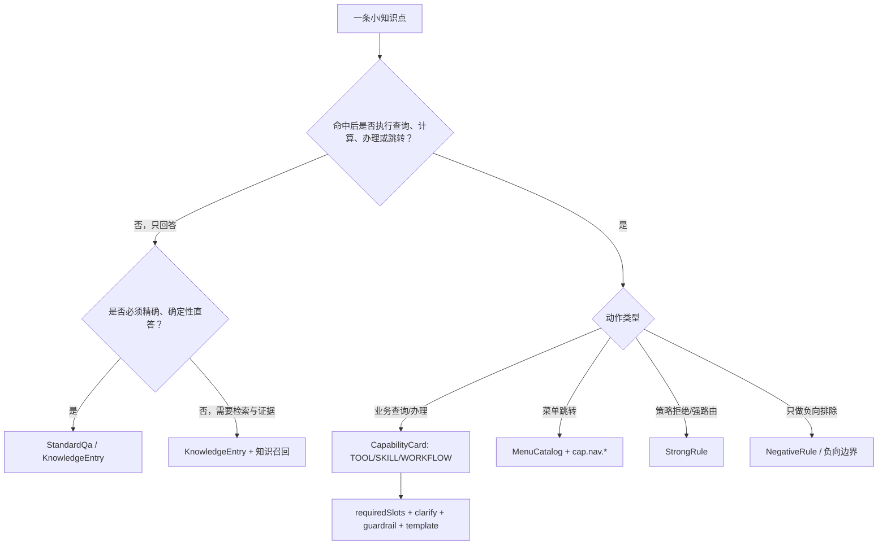
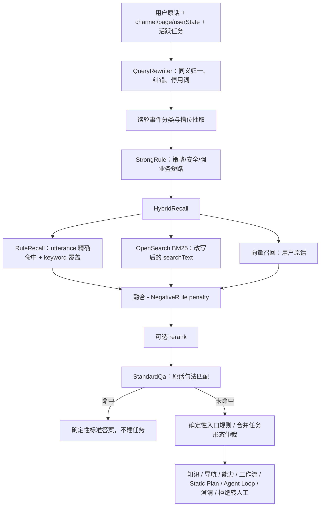

# 小i知识资产组织与现有意图体系映射设计

> 版本：V0.1
>
> 日期：2026-07-30
>
> 适用工程：`agent-platform`
>
> 目标：说明小i知识如何组织，以及这些存量资产如何映射并被当前意图体系消费。
>
> 结论：**执行类意图以 `Capability Registry` 为授权真值；纯知识问答以知识 ID 为真值；小i意图、问法和模板只作为检索、规则、澄清与评测资产，不再单独授予执行权限。**

---

## 1. 文档范围

本文回答四个问题：

1. 小i中的知识点、词类、本体、维度、指令、菜单、服务和素材分别是什么；
2. 小i的一条标准问为什么不能机械地等同于当前工程的一条可执行意图；
3. 小i资产应如何映射到 `CapabilityCard`、标准问答、强规则、负向规则、澄清、菜单、模板和评测集；
4. 这些资产在 `agent-platform` 的快路径、慢路径、中控、领域 Agent 和回复编排中如何被消费。

本文不把截图复核表当成全量资产统计。当前 Excel 是 21 张原始截图形成的样本，共 21 个标准问题、154 条可见记录，其中 145 条带扩展问；它足以验证组织形式和迁移难点，但不能代表全库分布或线上准确率。

参考材料：

- `小I_iBot8系统解析与下一步建议 (4).pptx`；
- `小i真实知识逐图复核A-V完整总表.xlsx`；
- `工小智意图引擎协同设计方案_v0.7.md`；
- `agent-platform/docs/Agent平台总体架构草案_v0.7.md`；
- 当前工程内 `CapabilityCard`、`AssetBundle`、`FastPathSteps`、`HybridRecall` 等实现。

---

## 2. 总体判断

小i不是单一意图分类器，而是以下能力的组合：

```text
知识结构
  + 词法与模板匹配
  + 多轮会话控制
  + 维度化答案
  + 菜单、服务和素材执行
  + 渠道、权限、发布和运维
```

因此，迁移单位不能只是“标准问 + 标准答案”。正确的迁移单位是一个带依赖关系的资产包：

```text
知识语义
  -> 可检索表达
  -> 正负边界
  -> 适用维度
  -> 答案版本
  -> 澄清要求
  -> 动作绑定
  -> 菜单/服务/素材引用
  -> 测试样例与来源
```

在当前工程中，应区分两个权威 ID：

- **可执行事项**：以 `capabilityId` 为唯一授权与路由真值；
- **纯知识问答**：以 `knowledgeId` 为知识真值，不产生可执行凭据。

`supportedIntents`、`utterances`、关键词、模板和同义词只负责“如何找到”，不负责“允许做什么”。模型或规则即使识别出了某个意图，也只能选择已注册的 `CapabilityCard`；不能由自然语言意图直接拼接接口并执行。

---

## 3. 小i的知识组织形式

### 3.1 四层知识骨架

小i知识主体是四层树：

```text
知识库
  -> 多级分类
      -> 业务对象/实例
          -> 属性/知识点
              -> 一行或多行维度化答案
```

各层含义如下：

| 小i对象 | 含义 | 示例 |
| --- | --- | --- |
| 知识库 | 知识集合与根空间 | 专业知识点、基本对话 |
| 分类一至分类五 | 业务目录、继承边界和运营分组 | 个人金融 / 个金通用规定 / 转账汇款 |
| 实例 | 被咨询的业务对象 | 人民币境内跨行汇款、存折、利添利理财协议 |
| 属性 | 对该对象提出的问题类型；通常一条属性就是一条知识点 | 办理方法、报错处理、业务介绍、影响范围 |
| 标准问题 | 知识点的人类可读名称和标准表达 | 汇款报错：26023 |
| 答案行 | 特定维度下的答案、指令和有效期 | 手机银行渠道答案、网银渠道答案 |

小i的“意图”并不是一个单独对象，通常由“实例 + 属性”共同表达。例如：

```text
实例 = 储蓄卡
属性 = 换卡方法
语义 = 用户想办理储蓄卡换卡
```

但“实例 + 属性”也可能只是信息咨询，如“储蓄卡换卡换号受影响的业务”，并不等于系统要执行换卡。

### 3.2 一条知识点的字段组成

结合 PPT 和 A-V 复核表，一条知识点可拆成四组字段：

| 分组 | 主要字段 | 决定什么 |
| --- | --- | --- |
| 身份 | 分类、实例、属性、标准问题 | 这是什么知识 |
| 匹配 | 语义块、辅助/扩展语义块、扩展问、模板类型、词类、本体 | 用户怎样表达时能找到它 |
| 回答 | 维度、标准答案、素材、有效期 | 对谁、在何时、返回什么 |
| 控制 | 推荐/禁用标识、指令、菜单、服务、上下文 | 命中后继续做什么 |

这四组字段必须分开迁移。把它们塞进一张新的“意图表”，会继续复制小i中知识、识别、对话和执行耦合的问题。

### 3.3 问法与模板

小i问法主要包括：

1. **标准问**：知识点的标准名称；
2. **普通扩展问**：完整自然语言表达；
3. **肯定模板**：由词类、可选项、分支和顺序组成的 DSL；
4. **否定模板**：命中后排除某条知识，主要用于切分近邻意图；
5. **本体生成问法**：由属性模板对多个实例批量展开；
6. **测试样例**：用于验证模板是否命中预期知识点。

样本中一个标准问题可以展开成数十条 DSL。例如“储蓄卡换卡换号受影响的业务”有 37 行记录，其中 35 行是扩展问；这说明小i的泛化能力主要来自人工维护的表达式网络。

迁移时不能把全部扩展问无差别塞进 `CapabilityCard.utterances`：

- `utterances` 是能力的代表性检索表达，不是历史 DSL 仓库；
- 重复、截断和过窄表达会污染向量文档与 BM25；
- 测试样例应进入评测集，不能同时进入检索语料，否则评测会泄漏；
- 否定模板必须保留为负向证据，不能转换成正向例句。

### 3.4 词类与本体

小i词类承担四类职责：

- 同义归一，如“转账 / 汇款 / 转钱”；
- 集合枚举，如“行内 / 跨行 / 跨境”；
- 动态识别，如金额、卡号、日期；
- 人工权重和忽略节点，参与召回与相似度计算。

本体承担：

- 同类实例共享属性模板；
- 批量生成标准问与扩展问；
- 为上下文提供统一的问题类型标识。

在新工程中，两者不能整体照搬：

- 同义归一进入 `synonyms.yaml`；
- 代表性业务词进入 `CapabilityCard.keywords`；
- 动态词类转成槽位与实体抽取规则；
- 本体关系转成领域、实体、意图、槽位和能力之间的结构化关系；
- 人工词权重先保留在迁移底稿中，通过离线评测决定是否进入 BM25 词权或规则通道。

### 3.5 维度化答案

小i的维度不只是标签。它决定同一知识点在不同渠道、机构、地区、品牌或客户条件下使用哪一行答案和指令。

```text
知识点：跨行转账手续费
  app      -> 手机银行答案
  web      -> 网银答案
  region=A -> A 地区答案
  default  -> 默认答案
```

维度选择应遵循确定性顺序：

```text
精确匹配 -> 维度组匹配 -> 默认答案 -> 安全兜底
```

当前 `CapabilityCard.domains` 是科技领域，不是答案维度。严禁把渠道、地区和机构塞进 `domains`；否则会把“业务归属”和“答案适用范围”混成一个字段。

### 3.6 独立的控制与执行资产

以下对象虽然被知识点中的指令引用，但本身独立维护：

| 对象 | 含义 | 迁移风险 |
| --- | --- | --- |
| 上下文 | 保存上一轮对象、问题类型和轮次 | 丢失后省略问法无法续接 |
| 反问 | 补充缺失要素，再重新匹配 | 丢失后要么误答，要么频繁兜底 |
| 菜单 | 下一轮只在局部选项中匹配 | 只有 `menu(...)` 引用无法恢复完整菜单 |
| 服务 | 查询、计算或办理的执行定义与流程 | 只有服务指令无法恢复参数、异常和鉴权 |
| 素材 | 图文、附件、富媒体、音视频 | 只搬答案文本会丢展示内容 |
| 指令 | 命中后的动作协议 | 指令是引用，不是被引用对象的全部逻辑 |

因此，小i知识点与菜单、服务、素材之间必须先建立引用图，再执行迁移。

### 3.7 从编辑到生效

小i的知识经历：

```text
编辑 -> 审批 -> 本体/问法生成 -> 同步/建索引 -> 运行
```

当前工程对应：

```text
资产修改
  -> Schema 校验
  -> AssetLint 与冲突扫描
  -> 关联评测回放
  -> 生成不可变 assetVersion
  -> 重建/切换索引
  -> 灰度与观测
  -> 正式发布或回滚
```

---

## 4. 映射到现有意图体系的原则

### 4.1 先判断“知识”还是“能力”

映射一条小i知识前，按以下顺序判断：



这意味着：

- 多条小i标准问可以合并成同一张能力卡的不同 `supportedIntents` 或 `utterances`；
- 一条小i标准问也可能拆成“知识答案 + 关联能力按钮 + 菜单入口”三个资产；
- 纯 FAQ 不得因为有“怎么办”三个字就自动升级为可执行业务意图；
- 只有 `CapabilityCard` 可以承载执行授权、风险、副作用、幂等和 Owner。

### 4.2 完整映射表

| 小i资产/字段 | 新体系落位 | 当前工程路径或对象 | 消费方式 | 迁移说明 |
| --- | --- | --- | --- | --- |
| 分类一至分类五 | 业务分类元数据、科技域映射 | `domains/tech-domains.yaml` + 迁移元数据 | 领域候选、运营筛选 | 不直接生成五层意图 |
| 实例 | 业务对象/实体 | 领域实体字典、主数据引用 | Query 理解、槽位解析 | 不等于 Agent，也不必每个实例建能力 |
| 属性 | 问题类型或操作类型 | `supportedIntents`、知识类型、能力类型 | 召回、图谱、回复 | 与实例共同决定语义 |
| 标准问题 | 规范意图别名或知识标题 | `supportedIntents` / `StandardQa.question` | 运营展示、检索文本 | 不作为执行 ID |
| 普通扩展问 | 代表性正例 | `CapabilityCard.utterances` | 规则满分、BM25、向量 | 去重、去噪、抽样，不全量硬塞 |
| 肯定模板 | 规则或生成正例 | `StandardQa.patterns` 或离线展开后进入检索 | 精确直答或召回 | 小i DSL 与当前句法不同，必须编译转换 |
| 否定模板 | 负向证据 | `negative-rules.yaml`、能力描述负向边界 | 候选打压、仲裁 | 不得转成正向 utterance |
| 测试样例 | 独立评测集 | `agents/*/eval/*.yaml` | 回归、对打 | 禁止同时作为训练/召回样本 |
| 同义词类 | Query 归一表 | `synonyms.yaml` | BM25、规则、缓存键 | 语义向量仍吃原话 |
| 集合词类 | 枚举与澄清选项 | `clarify.yaml`、槽位值映射 | 缺参澄清、事件分类 | 集合成员不应互相归一 |
| 动态词类 | 实体/槽位 | `SlotExtractor`、`requiredSlots` | 抽取、槽位门禁 | 金额、卡号、日期等 |
| 词权重/忽略节点 | 检索配置候选 | BM25、关键词、停用词、规则 | 召回融合 | 先评测，不能整体照搬 |
| 本体类 | 语义关系与模板来源 | 意图图谱候选、能力/实体元数据 | 上下文、Query 理解 | 当前图谱通道权重为 0，需后续接入 |
| 维度 | 答案/能力适用条件 | 建议新增 `ApplicabilityPolicy` / `AnswerVariant` | 召回过滤、答案选择 | 当前一等对象缺失 |
| 标准答案 | 确定性答案或模板 | `standard-qa.yaml` / `templates/*.ftl` | 标准直答、回复编排 | 硬口径不得模型自由生成 |
| 有效时间 | 资产生效窗口 | 建议进入 `KnowledgeEntry` 和变体元数据 | 发布与运行时过滤 | 当前 `StandardQa.Entry` 缺少此字段 |
| 指令 `rq(...)` | 相关知识/建议问引用 | 建议新增 Suggestion 资产 | 回答后推荐 | 当前一等对象缺失 |
| 指令 `menu(...)` | 菜单引用 | `MenuCatalog` + `cap.nav.*` | 菜单/跳转 | 需迁移菜单项与动作，不只迁引用 |
| 服务/内部程序指令 | 能力绑定 | `CapabilityCard` + 领域 Agent/Workflow | `UnifiedTask` 执行 | 参数、鉴权、异常必须在领域契约中 |
| 图文/附件指令 | 内容与组件引用 | 模板、建议新增 `ContentAsset` | 回复编排和前端 | 当前素材库一等对象缺失 |
| 推荐标识 | 建议问策略 | Suggestion 资产 | 相关问/建议问排序 | 不影响执行授权 |
| 禁用标识 | 生命周期状态 | `CapabilityStatus` / 知识状态 | 加载、召回过滤 | 知识与能力分别禁用 |
| 来源、审批、版本 | 治理元数据 | `owner`、`version`、`assetVersion`、迁移清单 | 审计、回滚、归因 | 必须保留 legacyRef 与 sourceHash |

### 4.3 当前体系中的“意图”身份

当前工程没有必要为每条小i标准问再创建独立 `intentId`。建议采用：

| 场景 | 规范身份 | 检索表层 |
| --- | --- | --- |
| 可执行操作 | `capabilityId` | `name`、`supportedIntents`、`utterances`、`keywords` |
| 纯静态问答 | `knowledgeId` | 标准问、patterns、正例、关键词 |
| 策略/安全限制 | `ruleId` | `when`、适用范围、原因码 |
| 菜单跳转 | `menuId` + `cap.nav.*` | 菜单名称、路径、跳转表达 |

`RecallResult.Candidate.candidateType` 已支持 `INTENT`，但当前资产加载与检索实现主要围绕 `CapabilityCard`。在新增一等知识对象前，纯问答只宜进入窄范围的 `StandardQaBank`；不要假装当前系统已经具备完整知识召回层。

当前生产资产中的 `standard-qa.yaml` 已内化首批 6 条经过复核与审批的答案。后续导入仍必须作为正式
资产发布，不得由工程人员填入“示例答案”后默认生效；占位、损坏和缺审批答案继续只留迁移台账。

---

## 5. 当前工程如何消费这些资产

### 5.1 资产加载

入口 Agent 的共享资产位于：

```text
agents/mobile-banking-assistant/assets/
  manifest.yaml
  domains/tech-domains.yaml
  standard-qa.yaml
  synonyms.yaml
  clarify.yaml
  rules/strong-rules.yaml
  rules/negative-rules.yaml
  rules/fusion.yaml
  menus/menu-tree.yaml
  capabilities/nav/nav-menus.yaml
  templates/
```

领域执行能力位于各 Agent 自己的资产目录，例如：

```text
agents/creditcard/assets/capabilities/creditcard.yaml
agents/transfer/assets/capabilities/payment.yaml
```

`AssetLoader` 从共享根目录和领域根目录加载能力卡、规则、同义词、标准问答、领域、菜单和模板，生成不可变 `AssetBundle`。加载时执行 Schema 校验、能力 ID 去重、父 Agent 存在性检查和领域码规范化；`AssetLint` 负责更高层的发布门禁，如 utterance 冲突、标准问模板遮蔽、未知动作能力和无效负向目标。

### 5.2 能力如何进入检索

`CapabilityDocument.from(card)` 将以下字段拼成 BM25 检索正文：

```text
name
+ description
+ supportedIntents
+ utterances
+ keywords
```

向量文档使用 `CapabilityCard.embeddingDocument()`：

```text
name
+ description
+ supportedIntents
+ utterances
```

因此小i资产映射时：

- 标准问适合进入 `supportedIntents`；
- 精选的自然语言扩展问适合进入 `utterances`；
- 业务核心词进入 `keywords`；
- 否定边界必须写入 `description` 或负向规则；
- 小i DSL 原文不应直接进入 embedding 文档。

### 5.3 快路径消费顺序

当前快路径的主要消费顺序是：



几个重要边界：

1. 同义改写只服务 BM25、规则和缓存键；向量召回与模型仲裁仍使用用户原话；
2. 强规则早于标准问答，安全/策略拦截不能被 FAQ 抢走；
3. 标准问答在召回之后、模型仲裁之前判断，保留“它本来会抢走哪个能力”的对照证据；
4. 标准问答命中后直接返回人写答案，不创建 `UnifiedTask`；
5. 能力候选选中后仍要经过缺槽、风险、确认、护栏和幂等检查。

### 5.4 完整路由如何消费小i资产

| 出口 | 小i资产贡献 | 新体系行为 |
| --- | --- | --- |
| `DIRECT_KNOWLEDGE` | 标准问、审核答案 | 直接生成知识回复，不创建平台任务 |
| `NAVIGATION` | 菜单词、服务入口映射 | 解析菜单 ID 并生成结构化导航动作 |
| `EXECUTE_CAPABILITY / START_WORKFLOW` | 扩展问、词类、服务/指令映射 | 选择唯一目标，生成对应 Runtime 任务 |
| `CLARIFY` | 集合词类、反问配置、缺失要素 | 由 `requiredSlots` 和 `clarify.yaml` 只问必要问题 |
| `STATIC_PLAN` | 多意图表达、本体关系、固定条件 | 生成完整 `IntentPlan`，执行期不追加未知能力 |
| `START_LOOP` | 开放排查目标、候选能力关系 | 创建独立 LoopRun，观察真实结果后逐轮规划 |
| `REJECT / HANDOFF` | 策略规则、禁用、高风险固定话术 | 明确拒绝或转人工 |

标准答案、拒绝和转人工现在拥有不同 Decision，不再依赖 reasonCode 反推路由含义。

### 5.5 执行链路

执行类知识最终必须落到：

```text
RouteDecision.candidateIds
  -> CapabilityCard
  -> requiredSlots / riskLevel / sideEffects / idempotency
  -> UnifiedTask
  -> 本地业务 Port 或 A2A 领域 Agent
  -> TaskResult
  -> ResponsePlan
  -> 审核模板与前端组件
```

小i指令只能帮助建立“知识点引用了哪个动作”的迁移线索，不能直接变成 `UnifiedTask`。`UnifiedTask` 的参数、风险、确认、护栏、幂等键和 deadline 必须由新体系按能力契约重新生成。

---

## 6. 三类映射示例

### 6.1 示例一：汇款报错 26023

小i样本包含：

- 标准问：`汇款报错：26023`；
- 多条包含错误码、报错、原因和解决办法的扩展表达；
- 一份确定性处理答案；
- `rq(...)` 相关问指令；
- 多渠道适用维度。

判断：这是**知识问答**，不是执行汇款。建议拆成：

```text
knowledgeId = qa.transfer.error.26023
  -> 标准问与精选 patterns
  -> 维度化答案
  -> relatedKnowledgeIds
  -> relatedCapabilityIds（可选，如汇款明细查询）
```

在当前工程未引入 `KnowledgeEntry` 前，只能将窄范围、答案完全一致的表达放入 `standard-qa.yaml`。若不同渠道答案不同，不应复制多条相互覆盖的 StandardQa，而应等维度化答案对象落地。

### 6.2 示例二：换卡相关知识

小i中“银行卡换卡不换号”“储蓄卡换卡换号受影响的业务”“储蓄卡到期影响”是不同知识点，但执行上都可能关联换卡。

当前工程已存在：

```yaml
capabilityId: cap.card.replace
name: 换卡
domains: [creditcard_service, account]
supportedIntents: [换卡, 补办卡片]
requiredSlots: [cardType]
riskLevel: R1
```

正确映射是：

- “我要换卡”“卡坏了要换”作为 `cap.card.replace.utterances`；
- 信用卡/借记卡作为 `cardType` 的澄清选项；
- “换卡会影响哪些业务”保留为独立 `KnowledgeEntry`，关联 `cap.card.replace`；
- “卡到期有什么影响”保留为独立知识，不因为提到换卡就直接执行；
- 挂失、冻结、销卡等否定边界继续保留在卡描述与负向规则中。

这样可以避免把“咨询影响”误路由为“办理换卡”。

### 6.3 示例三：查询银行卡办卡进度

该知识如果最终需要查询客户自己的实时申请状态，应映射为查询能力，而不是 StandardQa：

```yaml
- capabilityId: cap.card.application.status.query
  name: 查询银行卡办卡进度
  type: TOOL
  granularity: TOOL
  parentCapabilityId: agent.account
  domains: [account, creditcard_service]
  description: 查询本人借记卡或信用卡申请进度。本能力不办理新卡申请、不修改申请资料
  supportedIntents:
    - 查询银行卡办卡进度
    - 查询信用卡申请进度
  utterances:
    - 我的卡办到哪一步了
    - 查一下办卡进度
    - 信用卡申请有结果了吗
  keywords: [办卡进度, 申请进度, 审批进度]
  requiredSlots: [cardType]
  riskLevel: R0
  timeoutMs: 3000
  idempotency: SUPPORTED
  owner: 卡业务领域
  version: "1.0.0"
  status: GRAY
```

该 YAML 是目标映射示意，不代表能力已经实现。正式落地前需要确认父 Agent、领域归属、查询接口、主体权限和 `cardType` 是否确为路由必需槽位。

---

## 7. 当前工程的结构缺口

现有代码已经能消费能力、规则、同义词、标准问答、菜单、澄清和模板，但不足以无损承接全部小i知识。主要缺口如下：

| 缺口 | 当前限制 | 建议 |
| --- | --- | --- |
| 一等知识对象 | `StandardQa.Entry` 只有 question、patterns、answer、slots 和可选 action | 新增 `KnowledgeEntry`，承载来源、有效期、维度、关系和状态 |
| 维度化答案 | 无渠道/地区/机构答案变体 | 新增 `AnswerVariant` + `ApplicabilityPolicy` |
| 相关问/建议问 | `rq(...)` 无正式落位 | 新增 `SuggestionSet`，区分 related/suggested/menu |
| 素材资产 | 模板能渲染，但没有小i素材库对应的一等对象 | 新增 `ContentAsset` 与渠道组件引用 |
| 完整菜单动作 | 当前 `MenuCatalog` 主要是路径与领域映射 | 增加菜单项动作、子菜单、能力/知识目标与状态控制 |
| 知识召回 | OpenSearch 文档当前围绕 Capability | 增加知识索引及 `INTENT/KNOWLEDGE` 候选解析 |
| 本体/图谱 | `fusion.graph` 当前权重为 0 | 先保留关系数据，后接图谱召回，不阻塞首批迁移 |
| 单条知识生命周期 | StandardQa 只有全库 version | 增加条目 status、validFrom/validTo、owner、sourceRef |

建议的最小知识契约：

```yaml
knowledgeId: qa.transfer.error.26023
title: 汇款报错：26023
domains: [transfer]
intentAliases: [汇款报错26023, 26023是什么意思]
utterances: []
source:
  system: ibot8
  legacyKnowledgeId: "待导出"
  sourceHash: "待生成"
answerVariants:
  - variantId: default
    when: {}
    answerTemplateKey: tpl.qa.transfer.error.26023
    validFrom: null
    validTo: null
relatedKnowledgeIds: []
relatedCapabilityIds: []
owner: 转账业务
version: "1.0.0"
status: GRAY
```

设计约束：

- `KnowledgeEntry` 只能提供答案和动作引用，不能直接执行；
- `relatedCapabilityIds` 指向真实能力卡，点击后重新走权限和护栏；
- `when` 只消费白名单上下文字段，如 channel、region、org、brand；
- 变体无法唯一选中时不得随机取一条，必须回退默认答案或安全兜底；
- 知识索引与能力索引可以共用 OpenSearch 集群，但应使用不同文档类型、阈值和效果指标。

---

## 8. 迁移清单与可追溯关系

每条小i知识至少生成一条迁移清单记录：

```yaml
legacySystem: ibot8
legacyKnowledgeId: "..."
legacyQuestion: "..."
targetAssets:
  - type: KNOWLEDGE
    id: qa.transfer.error.26023
    relation: REPLACE
  - type: CAPABILITY
    id: cap.transfer.history.query
    relation: RELATED
sourceHash: "..."
migrationStatus: REVIEWED
businessOwner: "..."
technicalOwner: "..."
knownGaps: []
```

`relation` 取值建议固定为：

- `REPLACE`：新资产完全替代；
- `EXTEND`：保留原资产，新资产补充能力；
- `COEXIST`：灰度期两侧同时存在；
- `RELATED`：仅建立关联，不替代；
- `DROP`：确认无效、重复或过期后下线。

迁移过程：

```text
导出与截图复核
  -> 清洗和稳定 ID
  -> 判断知识/能力/规则/菜单/素材
  -> 建立 legacy -> target 映射
  -> DSL 编译与人工复核
  -> 资产 Schema/AssetLint
  -> 新旧对打
  -> 影子运行
  -> 低风险灰度
  -> 冻结或下线小i资产
```

当前样本中 9 条 DSL 已明确存在截断字符，应标记为 `BLOCKED_SOURCE_REVIEW`，在回到原系统或原图确认之前不得自动转成规则。

---

## 9. 验收标准

### 9.1 资产完整性

- 每个标准问题均被判定为知识、能力、规则、菜单、素材或明确丢弃；
- 每个小i指令都解析出目标类型和目标 ID，无法恢复的进入缺口清单；
- 每个维度答案都有明确的适用条件和默认回退；
- 每个能力引用都指向存在的 `CapabilityCard`；
- 每条迁移资产保留 legacyRef、sourceHash、Owner 和版本。

### 9.2 检索与意图

- 扩展问按知识点分层抽样，分别评估 Top1、TopK、错答和低置信拒答；
- 易混对至少覆盖：查询/办理、开通/取消、借记卡/信用卡、行内/跨行、知识咨询/实际执行；
- 测试样例与召回语料物理分离；
- 向量、BM25、规则和负向过滤分别记录来源分，不只看融合总分；
- 维度过滤前后分别评估召回率，禁止用串维度答案换取高命中率。

### 9.3 执行安全

- 纯知识问答永不生成 `UnifiedTask` 和幂等键；
- R2 能力必须显式确认、护栏通过且具备幂等键后才能执行；
- 小i服务指令不能绕过 `CapabilityCard` 直接调用接口；
- 菜单和相关问中的能力按钮必须重新进入当前运行时校验；
- 新系统不确定时保留 `新系统 -> 小i -> 固定规则 -> 人工` 回退链路。

### 9.4 发布与运营

- `AssetLint` ERROR 为零；WARN 均有评审结论；
- 资产变更生成新的内容摘要版 `assetVersion`；
- 索引与缓存按资产版本切换，不出现新资产配旧索引；
- 灰度看板按 knowledgeId、capabilityId、ruleId 和 assetVersion 归因；
- 每次发布均能回滚到上一不可变版本。

---

## 10. 分阶段落地建议

### 阶段一：不改核心契约，先完成可消费子集

1. 将执行类小i知识归并到现有/新增 `CapabilityCard`；
2. 将代表性标准问和扩展问整理为 `supportedIntents`、`utterances` 和 `keywords`；
3. 将明确的否定模板转换为 `NegativeRule` 或负向边界；
4. 将集合词类和缺失要素写入 `requiredSlots` 与 `clarify.yaml`；
5. 将少量、答案单一、无维度冲突的固定 FAQ 放入 `standard-qa.yaml`；
6. 将截图中的测试样例放入独立 eval 数据集。

阶段一的目标是验证映射口径和运行链路，不追求无损迁移全部知识。

### 阶段二：补齐知识一等对象

在 `framework/registry/asset-registry` 增加：

- `KnowledgeEntry`；
- `AnswerVariant`；
- `ApplicabilityPolicy`；
- `SuggestionSet`；
- 对应 Loader、Schema 与 AssetLint。

在检索与回复侧增加：

- 知识索引；
- 知识候选与能力候选的分型仲裁；
- 维度变体选择；
- 知识答案 `ResponsePlan`；
- 相关问和能力按钮。

### 阶段三：迁移菜单、素材和服务网络

1. 扩展 `MenuCatalog`，承载层级、选项、动作和局部会话态；
2. 建立 `ContentAsset`，迁移图文、附件和渠道组件；
3. 将查询服务映射为 TOOL，将多步办理映射为 WORKFLOW；
4. 按“默认上下文 -> 反问 -> 菜单 -> 查询服务 -> 办理服务 -> 高风险流程”的顺序灰度；
5. 小i依次降级为备用、只读对照、归档，最后下线。

---

## 11. 最终边界

本工程消费小i资产时，应长期坚持以下边界：

1. **意图不是执行许可，能力卡才是。**
2. **知识答案与业务执行分离。** 知识可以引用能力，但不能代替能力契约。
3. **标准问不是一条能力。** 是否生成能力取决于命中后是否真的查询、计算、办理或跳转。
4. **维度不是科技领域。** 渠道、地区、机构和品牌必须作为适用条件单独处理。
5. **测试样例不是召回语料。** 二者混用会造成虚假的评测提升。
6. **指令不是服务定义。** 必须恢复被引用的菜单、服务、素材和流程。
7. **模型负责理解与选择，确定性系统负责答案口径、权限、状态和执行。**

按照这个映射方式，小i存量不会被压扁成一堆 FAQ，也不会继续复制原系统的耦合结构；它会被拆成当前平台能够分别治理、检索、仲裁、执行、呈现和评测的结构化资产。

## 12. 2026-08-02 首批实现状态

- 复核表中的 21 个标准问题全部进入 `assets/xiaoi/migration-ledger.yaml`，每条记录 sourceStatus、
  answerQuality、targetAssetId、blockedReason、lineage 和 migrationStage。
- 首批内化汇款报错 26023、换卡无忧开通/介绍、存折属性、网银存折销户和换卡影响 6 条审批答案。
- 6 条答案均增加真实聊天入口验收：出口固定为 `DIRECT_KNOWLEDGE`，证据引用固定为对应
  `standardQa:<knowledgeId>`，不创建 PlatformTask，也不调用执行能力。
- 7845 占位答案、换卡不换号破损指令、储蓄卡到期损坏 OCR 及其他缺答案记录未进入运行知识。
- 外部运行结果使用 `XiaoiExternalEvidence` Schema；知识、菜单、服务、反问和默认回复分型，rawScore
  不进入当前融合分。尚无真实小 i HTTP 契约，因此本次不伪造在线 Provider，后续联调以该证据契约为边界。
